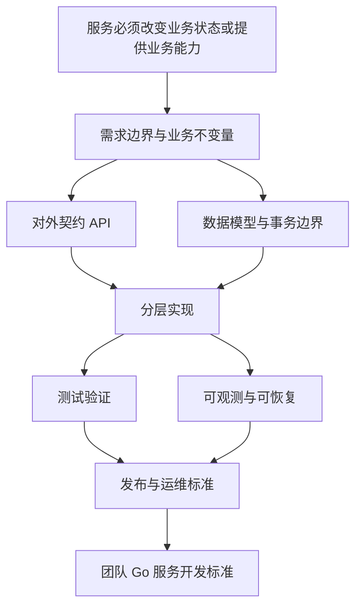

> [!quote] YOU

现在我们要来梳理完成的Go语言服务开发流程

> [!question] Question
> 你希望这次“Go 语言服务开发流程”最终达到什么程度？
>
> 例如：能独立从需求做到上线；建立一套团队标准；重点掌握工程目录、接口设计、数据库、测试、部署；或准备面试/课程笔记。

> [!example] Answer
> 建立一套团队标准；重点掌握工程目录、接口设计、数据库、测试、部署；

> [!question] Quiz
> 如果要为团队建立 Go 服务开发标准，下面哪种顺序最接近一条完整的交付链路？
>
> 先凭已有经验选，不需要查资料。
>
> 1. 目录创建 → 业务编码 → 数据库上线 → API 补齐 → 测试发布
> 2. 框架选型 → 生成代码 → 手工联调 → 发布服务 → 再整理需求
> 3. 需求建模 → API/数据设计 → 分层实现 → 测试验证 → 发布运维
> 4. 数据库设计 → 先写所有接口 → 直接部署 → 按线上问题补测试

> [!success] Quiz — correct ✓
> Your answer: 3. 需求建模 → API/数据设计 → 分层实现 → 测试验证 → 发布运维
> Correct answer: 3
>
> 完整服务交付应先把需求和边界说清，再设计对外契约与数据模型，随后实现并用测试验证，最后进入发布和运维。其他顺序把验证、契约或需求放到了过晚的位置。

> [!question] Quiz
> 在一个典型 Go HTTP 服务中，handler、service、repository 的主要职责应如何划分？
>
> 1. handler 处理协议，service 编排业务，repository 负责持久化
> 2. handler 和 service 处理业务，repository 同时负责协议与持久化
> 3. handler 负责持久化，service 处理协议，repository 编排业务
> 4. handler 编排业务，service 处理协议，repository 负责持久化

> [!success] Quiz — correct ✓
> Your answer: 1. handler 处理协议，service 编排业务，repository 负责持久化
> Correct answer: 1
>
> handler 适配 HTTP 等传输协议；service 承载业务用例和规则；repository 隔离数据库等持久化细节。这样业务不会被 HTTP 或具体数据库绑死。

> [!question] Quiz
> 设计“创建订单”接口时，客户端因超时重试，最需要优先解决哪类问题？
>
> 1. Go 包名与目录名不一致
> 2. 日志文本没有统一颜色
> 3. JSON 字段顺序发生变化
> 4. 重试可能创建多个相同订单

> [!success] Quiz — correct ✓
> Your answer: 4. 重试可能创建多个相同订单
> Correct answer: 4
>
> 创建操作通常会产生副作用；网络超时并不代表服务端没有成功，因此重试可能重复创建。团队标准应明确幂等键、唯一约束或等价机制。

> [!question] Quiz
> 一个“扣库存并创建订单”的用例中，库存扣减成功但订单写入失败时，团队标准最应保证什么？
>
> 1. 两步处于同一事务边界并能回滚
> 2. 把两次数据库操作放进同一个 HTTP handler
> 3. 先提交库存，再异步观察订单结果
> 4. 忽略订单失败，由客户端再次查询

> [!success] Quiz — correct ✓
> Your answer: 1. 两步处于同一事务边界并能回滚
> Correct answer: 1
>
> 如果两步必须保持一致，就需要让它们共享明确的事务边界；任一步失败时回滚，避免库存和订单状态分裂。放在同一个 handler 并不自动形成事务。

> [!question] Quiz
> 为了验证“创建订单”业务规则，同时尽量减少测试脆弱性，哪种测试组合最合理？
>
> 1. 只在生产环境通过日志验证
> 2. 纯业务单元测试加少量真实依赖集成测试
> 3. 只做 handler mock 测试
> 4. 只做完整端到端测试

> [!success] Quiz — correct ✓
> Your answer: 2. 纯业务单元测试加少量真实依赖集成测试
> Correct answer: 2
>
> 业务规则适合用快速、隔离的单元测试覆盖；数据库、HTTP 契约等真实边界再用少量集成测试验证。只测 mock 或只测端到端都会遗漏关键问题，且反馈更慢或更脆弱。

> [!question] Quiz
> 服务已经通过测试，准备上线前，哪项最能体现“可运维性”标准？
>
> 1. 把日志级别全部改成 debug
> 2. 只确认二进制能在开发机启动
> 3. 有健康检查、结构化日志、指标和可回滚发布
> 4. 删除错误处理以减少代码量

> [!success] Quiz — correct ✓
> Your answer: 3. 有健康检查、结构化日志、指标和可回滚发布
> Correct answer: 3
>
> 上线后的核心问题是：活着吗、发生了什么、性能如何、出问题怎么退回。健康检查、结构化日志、指标和可回滚机制分别覆盖这些需要。

> [!question] Quiz
> 一个服务同时使用 PostgreSQL 和消息队列：数据库事务提交成功后，进程在发布消息前崩溃。若要求最终可靠地发布事件，哪种设计最直接？
>
> 1. 在同一数据库事务中写入 outbox，再由 worker 发布
> 2. 捕获 panic 后重新执行整个请求
> 3. 在 handler 返回前 sleep 一段时间
> 4. 先发布消息，再写入数据库事务

> [!success] Quiz — correct ✓
> Your answer: 1. 在同一数据库事务中写入 outbox，再由 worker 发布
> Correct answer: 1
>
> 数据库事务中同时写入业务数据和 outbox 事件，提交成功后 worker 再可靠投递消息；这样不会出现业务已提交但事件记录完全丢失的问题。

> [!question] Quiz
> 要把订单表中的 `status` 从旧值集合迁移到新值集合，并支持滚动发布多个服务实例，最稳妥的策略是什么？
>
> 1. 先只改数据库，再等待应用自然适配
> 2. 先兼容读写新旧值，再迁移数据，最后删除旧逻辑
> 3. 先删除旧值约束，再一次性发布新版本
> 4. 停掉全部实例后直接替换字段和代码

> [!success] Quiz — correct ✓
> Your answer: 2. 先兼容读写新旧值，再迁移数据，最后删除旧逻辑
> Correct answer: 2
>
> 滚动发布期间新旧版本会并存，因此先扩展兼容范围，再迁移存量数据，最后收缩并删除旧逻辑，能避免版本之间互相不认识。

> [!abstract] PI

## 目前的判断

你已经掌握了关键概念：

- 服务开发的完整交付链路
- handler / service / repository 分层
- API 幂等性
- 数据库事务边界
- 单元测试与集成测试的组合
- 健康检查、日志、指标、回滚
- Outbox、滚动发布与 expand–migrate–contract

因此我们不从 Go 语法开始，而是直接建立一套**团队可执行的服务开发标准**。

## 学习路线

我们会按“一个需求如何变成可上线服务”的顺序展开：

1. 需求建模与边界确认
2. 工程目录与模块分层
3. API 契约设计
4. 数据库模型、迁移与事务
5. 业务实现与错误处理
6. 测试策略
7. 配置、日志与可观测性
8. 构建、部署、发布与回滚
9. 最终整理成团队检查清单和模板

核心不是记住目录，而是理解：**每一层到底隔离了什么变化，每一道流程控制了什么风险。**

## 依赖关系图

如果这个范围和顺序符合你的目标，我下一步从第一个根节点开始：**一个服务到底要对什么负责，以及如何把需求转成边界和不变量。**
