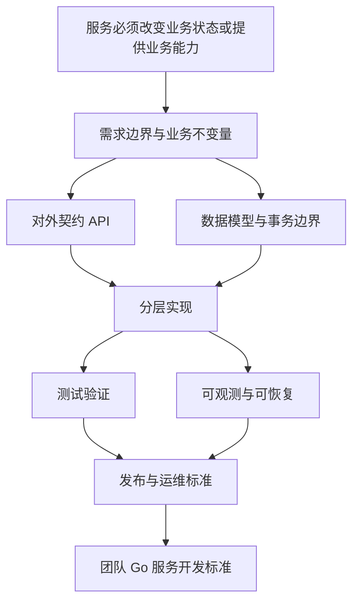

> [!quote] YOU

现在我们要来梳理完成的Go语言服务开发流程


> [!question] Question
> 你希望这次“Go 语言服务开发流程”最终达到什么程度？
>
> 例如：能独立从需求做到上线；建立一套团队标准；重点掌握工程目录、接口设计、数据库、测试、部署；或准备面试/课程笔记。


> [!example] Answer
> 建立一套团队标准；重点掌握工程目录、接口设计、数据库、测试、部署；


> [!question] Quiz
> 如果要为团队建立 Go 服务开发标准，下面哪种顺序最接近一条完整的交付链路？
>
> 先凭已有经验选，不需要查资料。
>
> 1. 目录创建 → 业务编码 → 数据库上线 → API 补齐 → 测试发布
> 2. 框架选型 → 生成代码 → 手工联调 → 发布服务 → 再整理需求
> 3. 需求建模 → API/数据设计 → 分层实现 → 测试验证 → 发布运维
> 4. 数据库设计 → 先写所有接口 → 直接部署 → 按线上问题补测试


> [!success] Quiz — correct ✓
> Your answer: 3. 需求建模 → API/数据设计 → 分层实现 → 测试验证 → 发布运维
> Correct answer: 3
>
> 完整服务交付应先把需求和边界说清，再设计对外契约与数据模型，随后实现并用测试验证，最后进入发布和运维。其他顺序把验证、契约或需求放到了过晚的位置。


> [!question] Quiz
> 在一个典型 Go HTTP 服务中，handler、service、repository 的主要职责应如何划分？
>
> 1. handler 处理协议，service 编排业务，repository 负责持久化
> 2. handler 和 service 处理业务，repository 同时负责协议与持久化
> 3. handler 负责持久化，service 处理协议，repository 编排业务
> 4. handler 编排业务，service 处理协议，repository 负责持久化


> [!success] Quiz — correct ✓
> Your answer: 1. handler 处理协议，service 编排业务，repository 负责持久化
> Correct answer: 1
>
> handler 适配 HTTP 等传输协议；service 承载业务用例和规则；repository 隔离数据库等持久化细节。这样业务不会被 HTTP 或具体数据库绑死。


> [!question] Quiz
> 设计“创建订单”接口时，客户端因超时重试，最需要优先解决哪类问题？
>
> 1. Go 包名与目录名不一致
> 2. 日志文本没有统一颜色
> 3. JSON 字段顺序发生变化
> 4. 重试可能创建多个相同订单


> [!success] Quiz — correct ✓
> Your answer: 4. 重试可能创建多个相同订单
> Correct answer: 4
>
> 创建操作通常会产生副作用；网络超时并不代表服务端没有成功，因此重试可能重复创建。团队标准应明确幂等键、唯一约束或等价机制。


> [!question] Quiz
> 一个“扣库存并创建订单”的用例中，库存扣减成功但订单写入失败时，团队标准最应保证什么？
>
> 1. 两步处于同一事务边界并能回滚
> 2. 把两次数据库操作放进同一个 HTTP handler
> 3. 先提交库存，再异步观察订单结果
> 4. 忽略订单失败，由客户端再次查询


> [!success] Quiz — correct ✓
> Your answer: 1. 两步处于同一事务边界并能回滚
> Correct answer: 1
>
> 如果两步必须保持一致，就需要让它们共享明确的事务边界；任一步失败时回滚，避免库存和订单状态分裂。放在同一个 handler 并不自动形成事务。


> [!question] Quiz
> 为了验证“创建订单”业务规则，同时尽量减少测试脆弱性，哪种测试组合最合理？
>
> 1. 只在生产环境通过日志验证
> 2. 纯业务单元测试加少量真实依赖集成测试
> 3. 只做 handler mock 测试
> 4. 只做完整端到端测试


> [!success] Quiz — correct ✓
> Your answer: 2. 纯业务单元测试加少量真实依赖集成测试
> Correct answer: 2
>
> 业务规则适合用快速、隔离的单元测试覆盖；数据库、HTTP 契约等真实边界再用少量集成测试验证。只测 mock 或只测端到端都会遗漏关键问题，且反馈更慢或更脆弱。


> [!question] Quiz
> 服务已经通过测试，准备上线前，哪项最能体现“可运维性”标准？
>
> 1. 把日志级别全部改成 debug
> 2. 只确认二进制能在开发机启动
> 3. 有健康检查、结构化日志、指标和可回滚发布
> 4. 删除错误处理以减少代码量


> [!success] Quiz — correct ✓
> Your answer: 3. 有健康检查、结构化日志、指标和可回滚发布
> Correct answer: 3
>
> 上线后的核心问题是：活着吗、发生了什么、性能如何、出问题怎么退回。健康检查、结构化日志、指标和可回滚机制分别覆盖这些需要。


> [!question] Quiz
> 一个服务同时使用 PostgreSQL 和消息队列：数据库事务提交成功后，进程在发布消息前崩溃。若要求最终可靠地发布事件，哪种设计最直接？
>
> 1. 在同一数据库事务中写入 outbox，再由 worker 发布
> 2. 捕获 panic 后重新执行整个请求
> 3. 在 handler 返回前 sleep 一段时间
> 4. 先发布消息，再写入数据库事务


> [!success] Quiz — correct ✓
> Your answer: 1. 在同一数据库事务中写入 outbox，再由 worker 发布
> Correct answer: 1
>
> 数据库事务中同时写入业务数据和 outbox 事件，提交成功后 worker 再可靠投递消息；这样不会出现业务已提交但事件记录完全丢失的问题。


> [!question] Quiz
> 要把订单表中的 `status` 从旧值集合迁移到新值集合，并支持滚动发布多个服务实例，最稳妥的策略是什么？
>
> 1. 先只改数据库，再等待应用自然适配
> 2. 先兼容读写新旧值，再迁移数据，最后删除旧逻辑
> 3. 先删除旧值约束，再一次性发布新版本
> 4. 停掉全部实例后直接替换字段和代码


> [!success] Quiz — correct ✓
> Your answer: 2. 先兼容读写新旧值，再迁移数据，最后删除旧逻辑
> Correct answer: 2
>
> 滚动发布期间新旧版本会并存，因此先扩展兼容范围，再迁移存量数据，最后收缩并删除旧逻辑，能避免版本之间互相不认识。


> [!abstract] PI

## 目前的判断

你已经掌握了关键概念：

- 服务开发的完整交付链路
- handler / service / repository 分层
- API 幂等性
- 数据库事务边界
- 单元测试与集成测试的组合
- 健康检查、日志、指标、回滚
- Outbox、滚动发布与 expand–migrate–contract

因此我们不从 Go 语法开始，而是直接建立一套**团队可执行的服务开发标准**。

## 学习路线

我们会按“一个需求如何变成可上线服务”的顺序展开：

1. 需求建模与边界确认
2. 工程目录与模块分层
3. API 契约设计
4. 数据库模型、迁移与事务
5. 业务实现与错误处理
6. 测试策略
7. 配置、日志与可观测性
8. 构建、部署、发布与回滚
9. 最终整理成团队检查清单和模板

核心不是记住目录，而是理解：**每一层到底隔离了什么变化，每一道流程控制了什么风险。**

## 依赖关系图



如果这个范围和顺序符合你的目标，我下一步从第一个根节点开始：**一个服务到底要对什么负责，以及如何把需求转成边界和不变量。**


> [!quote] YOU

继续


> [!abstract] PI

### 第一个节点：服务开发的起点不是目录，而是业务结果

#### 1. 为什么先讲这个？

如果一开始就讨论：

- 用 Gin 还是 Echo
- 目录怎么分
- ORM 还是手写 SQL
- 要不要加 middleware

团队很容易得到一套“看起来统一”的代码，却没有统一地回答：

> 这个服务到底负责什么业务结果？

所以第一条标准应当是：

> **服务的职责，是在明确边界内，可靠地完成业务能力或业务状态变化。**

例如“创建订单”不是“收到一个 POST 请求”，而是：

- 验证用户和商品
- 判断库存是否足够
- 创建订单
- 保证状态一致
- 返回一个可被客户端继续使用的订单标识

HTTP 只是入口，订单状态变化才是业务结果。

#### 2. 从这个原则如何推出需求建模？

面对任何需求，先问四个问题：

1. **谁**发起操作？
2. **对什么对象**操作？
3. **允许什么状态变化**？
4. **什么条件下必须失败？**

以“取消订单”为例：

| 问题 | 示例 |
|---|---|
| 谁 | 下单用户或管理员 |
| 对什么对象 | 某个订单 |
| 状态变化 | `待支付 → 已取消` |
| 失败条件 | 订单已发货、无权限、订单不存在 |

这些内容共同构成业务边界和不变量。

#### 3. 连接到后续节点

因此：

- **需求建模**决定 API 需要表达什么；
- **业务不变量**决定 service 必须保护什么；
- **数据模型**决定哪些状态需要被持久化；
- **测试**决定这些规则能否被自动验证。

目录结构只是这些边界在代码中的投影，不是设计的起点。

请确认这个核心节点：

> 一个 Go 服务首先要对业务结果负责，HTTP、数据库和目录结构都是实现这个结果的手段。


> [!question] Quiz
> 在设计“取消订单”服务时，哪一项最接近真正的业务职责？
>
> 1. 把订单从待支付变为已取消
> 2. 调用 ORM 更新一行记录
> 3. 把请求参数传给数据库
> 4. 接收 POST 请求并返回 JSON


> [!success] Quiz — correct ✓
> Your answer: 1. 把订单从待支付变为已取消
> Correct answer: 1
>
> 业务职责是完成业务状态变化，并保护相关规则；HTTP、JSON、ORM 和数据库调用只是实现这一职责的技术手段。


> [!abstract] PI

### 第二个节点：先写业务不变量，再设计接口

#### 1. 为什么需要不变量？

“取消订单”这个需求如果只写成：

> 提供一个取消订单接口。

实现者仍然不知道：

- 已支付订单能不能取消？
- 已发货订单能不能取消？
- 谁可以取消？
- 重复取消算成功还是失败？
- 取消后库存是否释放？

因此，需求必须进一步变成**不变量**：

> 在任何合法状态下，某些业务事实必须始终成立。

例如：

- 已发货订单不能直接变成已取消；
- 只有订单所有者或管理员可以取消；
- 已取消订单不能再次产生新的取消副作用；
- 订单状态变化必须和库存处理保持一致。

#### 2. 如何从需求发现不变量？

可以沿着这条路径：

```text
业务动作
  ↓
可能改变哪些状态？
  ↓
哪些状态转换是不允许的？
  ↓
哪些动作必须一起成功或一起失败？
  ↓
得到不变量与事务边界
```

所以状态机、权限规则、唯一约束和事务，不是额外的“工程复杂度”，而是把业务规则明确化。

#### 3. 连接到后续节点

不变量会直接决定：

- API 是否幂等；
- service 中有哪些判断；
- 数据库需要哪些约束；
- 事务从哪里开始、在哪里结束；
- 测试必须覆盖哪些失败路径。

团队标准可以规定：

> 每个业务用例在编码前，至少写出状态变化、失败条件和副作用。


> [!question] Quiz
> 下面哪一项最适合被定义为“取消订单”业务不变量？
>
> 1. 取消接口使用 POST 方法
> 2. 订单取消后不能再次扣减库存
> 3. handler 使用 JSON 解码请求
> 4. repository 使用事务数据库连接


> [!success] Quiz — correct ✓
> Your answer: 2. 订单取消后不能再次扣减库存
> Correct answer: 2
>
> 不变量描述业务事实必须持续成立；取消订单后不能再次扣减库存属于业务规则。HTTP 方法、JSON 解码和数据库连接属于技术实现选择。


> [!abstract] PI

### 第三个节点：API 是业务边界的公开契约

#### 1. 为什么现在需要 API 设计？

当业务边界和不变量明确后，客户端需要一个稳定的方式调用它。API 不是把内部函数暴露出去，而是把业务能力表达成外部契约。

契约至少要明确：

- 请求参数
- 身份与权限
- 成功响应
- 业务失败
- 参数错误
- 重试行为
- 幂等性
- 兼容性

#### 2. 如何设计一个“取消订单”接口？

例如：

```http
POST /orders/{orderID}/cancel
Idempotency-Key: abc-123
```

服务端需要定义：

```text
成功：
  订单从可取消状态变成已取消

订单不存在：
  404

无权限：
  403

状态不允许取消：
  409

重复请求：
  返回同一个业务结果，不重复执行副作用
```

这里最重要的是：

> API 不只定义“正常情况返回什么”，还定义失败和重试时系统如何表现。

#### 3. 连接到后续节点

API 契约向外隔离客户端，分层结构向内隔离实现：

```text
HTTP 请求
   ↓
handler：解析协议、认证、映射错误
   ↓
service：执行用例、保护业务不变量
   ↓
repository：读写持久化数据
```

handler 不应该决定“订单是否允许取消”；这个判断属于 service 的业务职责。


> [!question] Quiz
> 客户端因网络超时重试“取消订单”请求时，团队标准最应该让 API 明确什么？
>
> 1. 客户端必须等待更长时间再重试
> 2. 服务端忽略所有重复请求
> 3. 重试不会重复执行取消副作用
> 4. 每次重试都生成新的订单编号


> [!success] Quiz — correct ✓
> Your answer: 3. 重试不会重复执行取消副作用
> Correct answer: 3
>
> 网络超时无法证明服务端是否已成功，因此 API 必须定义幂等行为：重试应得到一致结果，不能重复执行库存、扣款等副作用。


> [!abstract] PI

### 第四个节点：目录结构应体现依赖方向

#### 1. 为什么需要分层？

如果 handler 直接操作数据库：

```text
handler → SQL
```

那么 HTTP 协议、业务规则和数据库细节会混在一起，导致：

- 业务无法脱离 HTTP 测试；
- 更换数据库成本高；
- 一个规则可能散落在多个接口；
- 接口容易绕过统一的业务校验。

因此我们按“变化来源”切分职责。

#### 2. 一种推荐的 Go 服务结构

```text
cmd/
  api/
    main.go              # 组装依赖、启动服务

internal/
  domain/
    order.go             # 领域对象与核心规则
  app/
    order_service.go     # 业务用例
  transport/
    http/
      order_handler.go   # HTTP 适配
  repository/
    order_repository.go  # 持久化接口
    postgres/
      order_repository.go
  config/
  observability/

migrations/
tests/
```

关键不是目录名称，而是依赖方向：

```text
transport → app → domain
              ↓
        repository interface
              ↑
      repository implementation
```

业务层依赖 repository 的抽象，而不是直接依赖 PostgreSQL 实现。

#### 3. 这个结构解决什么问题？

它把变化隔离开：

| 变化 | 主要影响 |
|---|---|
| HTTP 改成 gRPC | transport |
| PostgreSQL 改成其他数据库 | repository 实现 |
| 业务规则变化 | domain / app |
| 日志和指标方案变化 | observability |

所以目录结构不是为了“好看”，而是为了让变化停留在应该停留的边界内。


> [!question] Quiz
> 如果未来把 HTTP 接口改成 gRPC，合理分层应尽量让哪部分保持不变？
>
> 1. HTTP 路由注册逻辑
> 2. HTTP 状态码映射逻辑
> 3. 业务用例与领域规则
> 4. HTTP 请求体解码逻辑


> [!success] Quiz — correct ✓
> Your answer: 3. 业务用例与领域规则
> Correct answer: 3
>
> 业务用例和领域规则不应依赖具体传输协议；更换 HTTP 为 gRPC 时，主要替换 transport 适配层。


> [!abstract] PI

### 第五个节点：数据模型必须服务于业务不变量

数据库不是业务模型的简单镜像，而是帮助系统持久化并保护业务事实的地方。

设计数据模型时至少要回答：

- 哪些字段不能为空？
- 哪些值必须唯一？
- 哪些状态转换需要事务？
- 哪些数据可以删除，哪些只能标记删除？
- 多个写操作必须一起成功吗？

例如创建订单可能包含：

```text
订单记录
库存扣减
订单事件
```

如果这三者必须保持一致，就需要明确事务边界，而不能只把它们“依次调用”。

推荐原则：

> service 决定一个业务用例的事务边界；repository 提供参与事务的持久化操作。

数据库约束和 service 校验应当互相配合：

- service：表达业务语义；
- database：作为最后一道一致性防线。

比如“订单号唯一”不能只依赖代码先查询再插入，还应有数据库唯一约束。


> [!question] Quiz
> 为什么“先查询订单号是否存在，再执行插入”不能单独保证唯一性？
>
> 1. 查询操作不能读取字符串字段
> 2. 数据库不能保存唯一字段
> 3. 插入操作只能在 handler 中执行
> 4. 并发请求可能同时通过查询并插入


> [!success] Quiz — correct ✓
> Your answer: 4. 并发请求可能同时通过查询并插入
> Correct answer: 4
>
> 两个并发请求可能同时查询到“不存在”，随后都执行插入。因此必须结合数据库唯一约束，并正确处理冲突。


> [!abstract] PI

### 第六个节点：测试验证的是不变量，不是代码行数

测试的核心问题不是：

> 这段代码执行过了吗？

而是：

> 业务规则在成功、失败、并发和重试场景下是否仍然成立？

因此测试应按边界分层：

```text
业务单元测试
  ↓
repository / 数据库集成测试
  ↓
HTTP 契约测试
  ↓
少量端到端测试
```

以“取消订单”为例，至少应覆盖：

- 可取消订单能够取消；
- 已发货订单不能取消；
- 无权限用户不能取消；
- 重复取消不会重复产生副作用；
- 数据库写入失败时状态不会部分提交。

单元测试验证业务决策，集成测试验证真实数据库和协议边界。两者不能互相完全替代。


> [!question] Quiz
> 如果 service 单元测试全部通过，仍然最需要用集成测试验证哪一类问题？
>
> 1. 函数是否少于二十行
> 2. Go 变量命名是否符合偏好
> 3. 真实数据库约束和事务行为
> 4. 目录是否按字母排序


> [!success] Quiz — correct ✓
> Your answer: 3. 真实数据库约束和事务行为
> Correct answer: 3
>
> 单元测试通常隔离了真实数据库；唯一约束、SQL 行为、事务提交与回滚等问题必须通过数据库集成测试验证。


> [!abstract] PI

### 第七个节点：上线标准必须覆盖“发现问题”和“恢复问题”

测试通过不等于服务适合生产。生产标准还要回答：

- 服务是否活着？
- 请求是否变慢？
- 错误发生在哪个接口？
- 哪个版本引入了问题？
- 出问题后能否快速回滚？

因此每个服务至少应具备：

- **健康检查**：区分进程存活和依赖可用；
- **结构化日志**：包含 request ID、用户或资源标识、错误信息；
- **指标**：请求量、错误率、延迟、资源使用；
- **超时与取消传播**：避免请求无限占用资源；
- **可回滚发布**：新版本失败时恢复旧版本。

这说明“部署”不是最后执行的一条命令，而是开发流程的一部分。

下一步我们会把前面的节点整理成一条完整的团队 SOP：从需求单、目录模板、接口设计，到测试门禁和发布检查表。

本轮已建立 7 个核心节点：

1. 服务首先对业务结果负责
2. 需求必须明确业务不变量
3. API 是业务边界的公开契约
4. 目录结构体现依赖方向
5. 数据模型保护业务事实
6. 测试验证不变量，而非代码行数
7. 上线必须可观测、可恢复

下一步将把这些原则整理成可直接执行的**团队 Go 服务开发 SOP 与检查清单**。


> [!quote] YOU

继续


> [!abstract] PI

## 第八个节点：团队标准必须表现为“交付门禁”

前面我们建立了原则，但原则如果只停留在文档里，团队仍然会各自发挥。

所以要把流程变成一组**门禁（gates）**：

> 每进入下一阶段，必须满足上一阶段的可验证条件。

### 一条完整的 Go 服务交付链路

```text
需求确认
  ↓
业务设计完成
  ↓
API 与数据设计完成
  ↓
实现完成
  ↓
自动化测试通过
  ↓
预发布验证
  ↓
生产发布
  ↓
观察与复盘
```

每一关都要有明确产物。

| 阶段 | 必须产出 |
|---|---|
| 需求确认 | 用户故事、范围、业务不变量 |
| API 设计 | OpenAPI 或等价接口契约 |
| 数据设计 | 表结构、索引、迁移脚本、事务说明 |
| 实现 | 分层代码、错误处理、配置 |
| 测试 | 单元测试、集成测试、契约测试 |
| 预发布 | 镜像、配置、健康检查、回滚方案 |
| 生产发布 | 版本号、变更记录、监控面板 |
| 发布后 | 指标观察、异常处理、复盘记录 |

### 为什么门禁比“大家注意规范”更可靠？

因为它把抽象要求变成了可检查的问题：

- 不是“注意幂等”，而是“是否定义重试行为？”
- 不是“注意事务”，而是“是否写明事务边界？”
- 不是“做好测试”，而是“失败路径是否有自动化测试？”
- 不是“关注上线”，而是“是否有健康检查和回滚方案？”

这就是从“经验型团队”变成“流程型团队”。

### 连接前面的节点

```text
业务不变量 → API 契约 → 数据模型 → 分层实现
     ↓           ↓           ↓          ↓
  需求门禁     设计门禁     数据门禁    代码门禁
                                      ↓
                              测试与发布门禁
```

团队标准的核心不是规定每个人写出相同的代码，而是规定：

> **每个服务都必须经过相同的风险检查。**


> [!question] Quiz
> 把团队规范变成可执行门禁，最重要的做法是什么？
>
> 1. 增加更多文档但不设置检查条件
> 2. 让资深开发者口头提醒关键事项
> 3. 要求所有人使用完全相同的代码写法
> 4. 为每个阶段定义可验证的产物和通过条件


> [!success] Quiz — correct ✓
> Your answer: 4. 为每个阶段定义可验证的产物和通过条件
> Correct answer: 4
>
> 门禁的价值在于把原则转成可检查的产物和条件，例如接口契约、迁移脚本、测试结果、回滚方案。它不要求所有代码长得一样，而是确保关键风险被验证。


> [!abstract] PI

## 第九个节点：一次变更应当是一条可追踪的链

团队开发中，最小管理单位不应只是“提交了一些代码”，而应是：

```text
需求
  → 设计
  → 实现
  → 测试
  → 发布
  → 结果
```

每个变更都应该能回答：

- 为什么改？
- 改变了哪个业务规则？
- API 或数据库是否变化？
- 如何验证？
- 如何发布？
- 出问题如何回滚？

### 推荐的变更模板

```text
# 变更目标
解决什么业务问题？

# 范围
包含什么？明确不包含什么？

# 业务规则
新增或改变了哪些不变量？

# API 变化
请求、响应、错误码、幂等行为是否变化？

# 数据变化
是否新增字段、索引、迁移或数据修复？

# 测试计划
单元、集成、契约、端到端分别覆盖什么？

# 发布计划
配置、灰度、监控指标、回滚方式是什么？

# 验收结果
哪些检查已经通过？
```

### 为什么这很重要？

因为服务的风险往往不在某一行代码，而在**多个边界同时变化**：

```text
代码变化 + API 变化 + 数据变化 + 发布变化
```

变更模板迫使团队在提交代码前看完整条链，避免“代码写完了才发现数据库无法兼容”或“上线后才发现没有回滚方案”。

这也会成为后续 CI/CD 的输入：很多门禁都可以自动检查。


> [!question] Quiz
> 一个接口新增必填字段时，变更评审最不能遗漏哪项？
>
> 1. 检查客户端兼容性和发布迁移顺序
> 2. 只确认服务端单元测试通过
> 3. 只检查新增代码的格式
> 4. 只更新接口注释不改实现


> [!success] Quiz — correct ✓
> Your answer: 1. 检查客户端兼容性和发布迁移顺序
> Correct answer: 1
>
> 新增必填字段会影响旧客户端；如果服务滚动发布，还要设计兼容顺序，避免新旧版本在发布期间互相无法通信。


> [!abstract] PI

## 第十个节点：自动化门禁应尽量前移

如果所有检查都在上线前人工完成，问题会发现得太晚。应把能自动化的门禁放入 CI：

```text
提交代码
  ↓
格式化与静态检查
  ↓
单元测试
  ↓
构建
  ↓
集成测试
  ↓
安全扫描
  ↓
生成镜像
  ↓
部署预发布
  ↓
契约/冒烟测试
```

### 常见门禁分层

| 门禁 | 目标 |
|---|---|
| `gofmt` / lint | 统一基础质量 |
| `go test ./...` | 验证单元测试 |
| race detector | 发现数据竞争 |
| 集成测试 | 验证数据库与外部边界 |
| 镜像构建 | 确保可交付 |
| 安全扫描 | 发现依赖和镜像风险 |
| 冒烟测试 | 确认部署后的核心路径可用 |

关键原则是：

> 越早发现的问题，修复成本越低；越靠近生产的问题，越应该有明确的阻断条件。

团队不应只规定“必须测试”，而应规定：

- 哪些检查失败时禁止合并；
- 哪些检查失败时禁止发布；
- 哪些检查允许人工确认后继续。

到这里，我们已经从业务原则推导出了完整流程。下一步可以开始写成一份正式的《Go 服务开发规范》，包含目录模板、接口模板、PR 模板和发布清单。

目前已经推导出完整流程：

```text
需求与不变量
  → API / 数据设计
  → 分层实现
  → 自动化测试
  → CI 门禁
  → 预发布验证
  → 生产发布
  → 监控、回滚与复盘
```

下一步进入实操整理：编写一份正式的《Go 服务开发规范》，包括：

- 推荐目录模板
- API 设计规范
- 数据库与迁移规范
- 测试规范
- CI 检查项
- 发布与回滚清单
- Pull Request 模板


> [!quote] YOU

好的 在/Users/hongling/obsidian-second-brain/3-资源目录下编写


> [!abstract] PI

已完成，文件已写入：

`/Users/hongling/obsidian-second-brain/3-资源/Go 服务开发团队规范.md`

内容包含需求建模、工程结构、API、数据库、测试、CI/CD、可观测性、发布回滚、PR 模板和检查清单。
