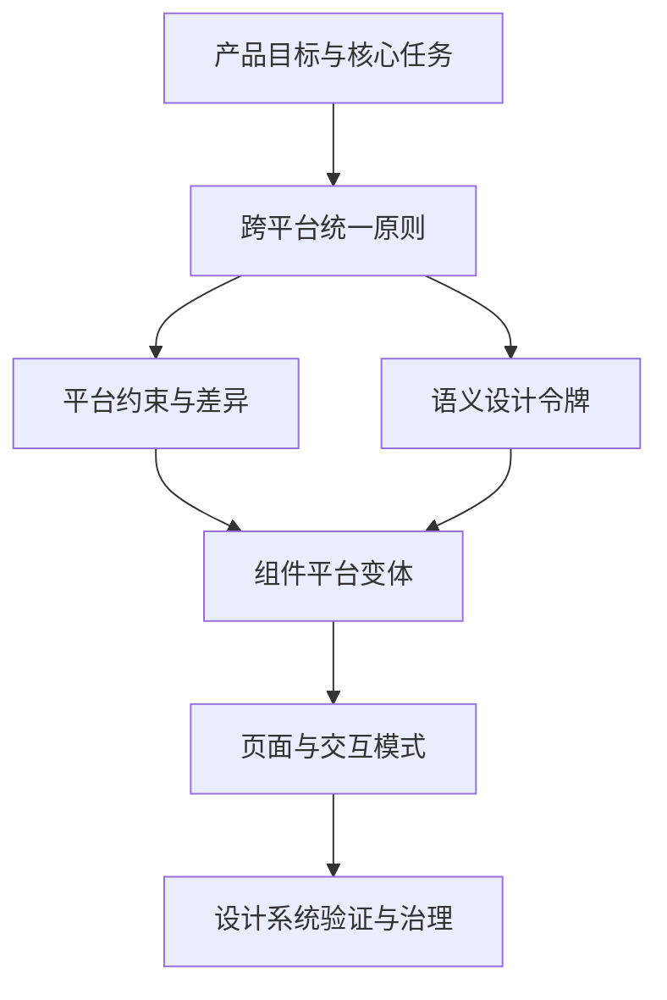
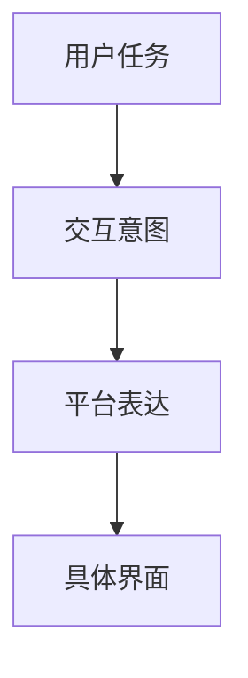

> [!quote] YOU

我们一起来讨论下关于ui的设计规范，包括web 移动端 桌面端


> [!question] Question
> 你希望我们先从哪一种目标开始讨论 UI 设计规范？
>
> 1. 建立一套跨 Web / 移动端 / 桌面端的统一设计系统（推荐）
> 2. 为一个具体产品制定规范
> 3. 对比三端差异与取舍
> 4. 评审或改进现有 UI 规范


> [!example] Answer
> 1. 建立一套跨 Web / 移动端 / 桌面端的统一设计系统（推荐）


> [!abstract] PI

很好。我们可以把目标定为：

> **同一套设计语言，在不同平台上保持一致的产品认知，同时尊重各平台的使用习惯。**

我会按这个顺序和你一起建立规范：

1. **设计原则**：一致性、清晰性、反馈、容错、可访问性  
2. **设计令牌**：颜色、字体、间距、圆角、阴影、动效  
3. **布局系统**：栅格、容器、断点、窗口与屏幕适配  
4. **组件规范**：按钮、输入框、导航、弹窗、表格、列表等  
5. **交互模型**：Web、移动端、桌面端的输入和导航差异  
6. **状态规范**：加载、空状态、错误、禁用、成功、离线  
7. **平台适配**：哪些必须统一，哪些应该分别设计  
8. **落地方式**：F


> [!abstract] PI

很好。我们不把三端做成“像素一致”，而是统一**意图、语义和任务体验**，再让每个平台用自己的方式表达。

建议按这个顺序讨论：

1. **设计系统的目标与边界**：统一什么，不统一什么  
2. **跨平台设计原则**：内容、任务、品牌、可访问性、状态  
3. **Web / 移动端 / 桌面端差异**：输入、导航、布局、系统能力  
4. **基础设计令牌**：颜色、字体、间距、圆角、层级、动效  
5. **组件与交互模式**：按钮、表单、导航、弹层、反馈、空状态  
6. **响应式与自适应**：窗口变化和平台变化分别处理  
7. **工程化与治理**：Figma、代码、版本、测试、废弃机制  
8. **用一个真实任务验证规范**

依赖关系可以先这样理解：



第一条最重要的基础原则是：

> **统一语义，不统一表面。**

例如“删除”这个意图可以统一，但 Web 可能使用确认对话框，移动端可能使用底部操作面板，桌面端可能支持 `Delete` 快捷键和右键菜单。

如果这个讨论路径合适，我们就从第 1 步开始：**设计系统到底应该统一什么、不应该统一什么**。


> [!abstract] PI

已收到。研究结果已经返回，当前子代理卡住不影响后续讨论。

我们可以从第一步开始：**跨三端的设计系统，哪些内容必须统一，哪些内容应该允许平台化差异？**


> [!quote] YOU

继续


> [!abstract] PI

### 第一步：统一的对象是什么？

如果三端都强行做到视觉一致，会出现问题：

- 桌面端失去键盘快捷键、右键、拖放等效率能力
- 移动端控件太小、层级太深，不适合触控
- Web 端可能破坏浏览器的返回、链接和分享习惯

所以设计系统真正应该统一的是：

- **品牌语义**：产品是什么、传达什么气质
- **内容层级**：什么最重要、什么次要
- **核心任务**：用户要完成什么
- **状态模型**：加载、成功、失败、空状态、禁用等
- **交互意图**：创建、编辑、删除、确认、撤销
- **质量底线**：可访问性、反馈、错误恢复

而以下内容可以平台化：

- 导航形态
- 布局结构
- 控件样式
- 输入方式
- 手势、快捷键、右键菜单
- 弹层和系统反馈方式

可以把它压缩成一句话：

> **跨平台统一“用户要完成什么”，平台化表达“用户怎么完成它”。**

这就是后面所有规范的根。



请判断：下面哪一种最符合这个原则？

- A. 三端使用完全相同的导航栏和按钮布局
- B. 三端共享核心任务和交互语义，但根据输入方式调整界面
- C. 移动端缩小桌面端界面，保持视觉一致
- D. 每个平台独立设计，不共享任何交互规则


> [!quote] YOU

B


> [!abstract] PI

✓ 正确。

**B** 的关键是区分：

- **稳定层**：任务、语义、状态、反馈原则
- **变化层**：布局、控件、导航、输入方式

这样既不会让三端各自割裂，也不会为了统一而牺牲平台体验。

---

### 第二步：为什么不能只写“组件规范”？

很多团队一开始就定义：

- 按钮圆角是多少
- 主色是什么
- 卡片间距是多少
- 输入框长什么样

但真实产品还会遇到：

- 数据加载中怎么办？
- 没有数据怎么办？
- 请求失败怎么办？
- 用户没有权限怎么办？
- 用户正在编辑时网络断了怎么办？

因此设计系统不能只是“组件外观库”，还必须描述：

> **组件在不同状态下如何工作。**

例如一个“提交”按钮至少要考虑：

```text
默认 → 点击中 → 成功
              ↘ 失败 → 可重试
```

这会带来第二条原则：

> **规范状态和行为，比规范静态外观更重要。**

请判断：一个合格的跨平台按钮规范，最不能缺少哪一项？

- A. 只规定按钮颜色、圆角和高度
- B. 只规定按钮在设计稿中的位置
- C. 规定按钮的状态、反馈、禁用条件和错误恢复
- D. 规定所有平台使用同一种按钮样式


> [!quote] YOU

c


> [!abstract] PI

✓ 正确。

按钮真正的规范不是“长什么样”，而是：

- 什么时候可用、什么时候禁用
- 点击后如何反馈
- 请求中如何防止重复提交
- 成功或失败后用户怎么办
- 键盘、触控、读屏如何操作

---

### 第三步：为什么要使用语义令牌？

如果直接写：

```text
蓝色 = #2563EB
```

组件就被绑死在某个具体颜色上。换主题、做深色模式或提高对比度时，会很难维护。

更好的方式是：

```text
color.action.primary
color.surface.default
color.text.muted
color.feedback.error
```

组件只关心“这个颜色承担什么职责”，不关心它具体是蓝色、绿色还是其他颜色。

因此：

> **设计令牌应该描述语义，而不是描述原始值。**

关系可以理解为：

```text
语义令牌 → 主题映射 → 平台组件
```

例如：

```text
color.action.primary
       ↓
浅色主题：深蓝
深色主题：亮蓝
高对比主题：高对比蓝
```

请判断，下面哪种命名更适合作为跨平台设计系统的令牌？

- A. `blue-500`
- B. `dark-blue-button`
- C. `primary-action`
- D. `desktop-main-color`


> [!quote] YOU

C


> [!abstract] PI

✓ 正确。

`primary-action` 描述的是**用途和语义**，因此可以在不同主题、平台和无障碍模式下映射成不同的具体颜色。

目前我们已经得到三条基础原则：

1. 统一任务与语义，不强求界面像素一致
2. 规范状态与行为，不只规范静态外观
3. 使用语义令牌，不直接绑定具体颜色值

下一步可以进入三端差异：**同一个任务，为什么 Web、移动端和桌面端需要不同的交互表达。**
