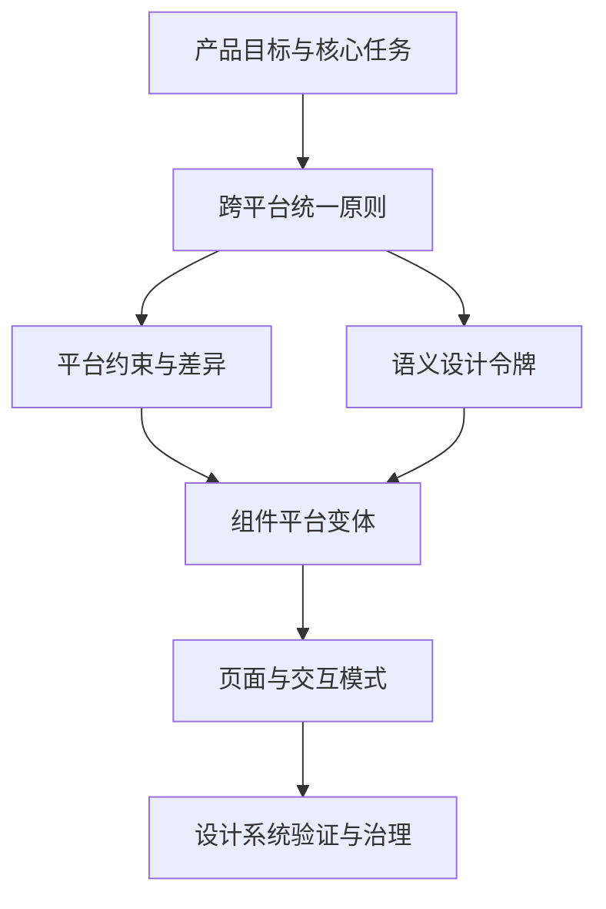
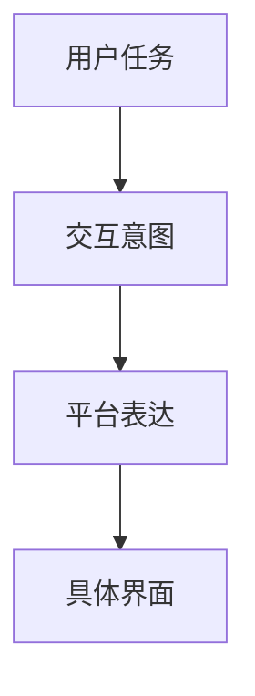
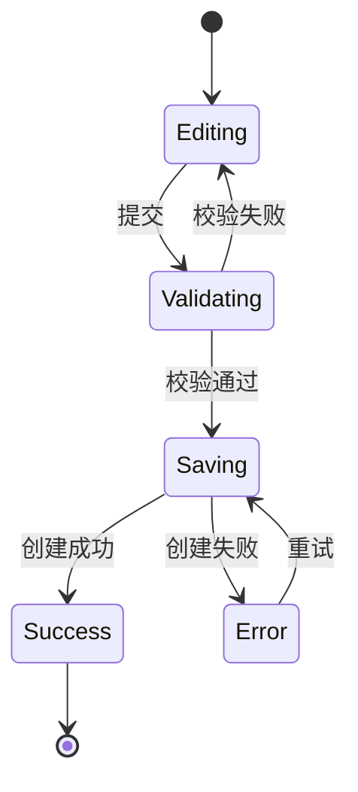

> [!quote] YOU

我们一起来讨论下关于ui的设计规范，包括web 移动端 桌面端


> [!question] Question
> 你希望我们先从哪一种目标开始讨论 UI 设计规范？
>
> 1. 建立一套跨 Web / 移动端 / 桌面端的统一设计系统（推荐）
> 2. 为一个具体产品制定规范
> 3. 对比三端差异与取舍
> 4. 评审或改进现有 UI 规范


> [!example] Answer
> 1. 建立一套跨 Web / 移动端 / 桌面端的统一设计系统（推荐）


> [!abstract] PI

很好。我们可以把目标定为：

> **同一套设计语言，在不同平台上保持一致的产品认知，同时尊重各平台的使用习惯。**

我会按这个顺序和你一起建立规范：

1. **设计原则**：一致性、清晰性、反馈、容错、可访问性  
2. **设计令牌**：颜色、字体、间距、圆角、阴影、动效  
3. **布局系统**：栅格、容器、断点、窗口与屏幕适配  
4. **组件规范**：按钮、输入框、导航、弹窗、表格、列表等  
5. **交互模型**：Web、移动端、桌面端的输入和导航差异  
6. **状态规范**：加载、空状态、错误、禁用、成功、离线  
7. **平台适配**：哪些必须统一，哪些应该分别设计  
8. **落地方式**：F


> [!abstract] PI

很好。我们不把三端做成“像素一致”，而是统一**意图、语义和任务体验**，再让每个平台用自己的方式表达。

建议按这个顺序讨论：

1. **设计系统的目标与边界**：统一什么，不统一什么  
2. **跨平台设计原则**：内容、任务、品牌、可访问性、状态  
3. **Web / 移动端 / 桌面端差异**：输入、导航、布局、系统能力  
4. **基础设计令牌**：颜色、字体、间距、圆角、层级、动效  
5. **组件与交互模式**：按钮、表单、导航、弹层、反馈、空状态  
6. **响应式与自适应**：窗口变化和平台变化分别处理  
7. **工程化与治理**：Figma、代码、版本、测试、废弃机制  
8. **用一个真实任务验证规范**

依赖关系可以先这样理解：



第一条最重要的基础原则是：

> **统一语义，不统一表面。**

例如“删除”这个意图可以统一，但 Web 可能使用确认对话框，移动端可能使用底部操作面板，桌面端可能支持 `Delete` 快捷键和右键菜单。

如果这个讨论路径合适，我们就从第 1 步开始：**设计系统到底应该统一什么、不应该统一什么**。


> [!abstract] PI

已收到。研究结果已经返回，当前子代理卡住不影响后续讨论。

我们可以从第一步开始：**跨三端的设计系统，哪些内容必须统一，哪些内容应该允许平台化差异？**


> [!quote] YOU

继续


> [!abstract] PI

### 第一步：统一的对象是什么？

如果三端都强行做到视觉一致，会出现问题：

- 桌面端失去键盘快捷键、右键、拖放等效率能力
- 移动端控件太小、层级太深，不适合触控
- Web 端可能破坏浏览器的返回、链接和分享习惯

所以设计系统真正应该统一的是：

- **品牌语义**：产品是什么、传达什么气质
- **内容层级**：什么最重要、什么次要
- **核心任务**：用户要完成什么
- **状态模型**：加载、成功、失败、空状态、禁用等
- **交互意图**：创建、编辑、删除、确认、撤销
- **质量底线**：可访问性、反馈、错误恢复

而以下内容可以平台化：

- 导航形态
- 布局结构
- 控件样式
- 输入方式
- 手势、快捷键、右键菜单
- 弹层和系统反馈方式

可以把它压缩成一句话：

> **跨平台统一“用户要完成什么”，平台化表达“用户怎么完成它”。**

这就是后面所有规范的根。



请判断：下面哪一种最符合这个原则？

- A. 三端使用完全相同的导航栏和按钮布局
- B. 三端共享核心任务和交互语义，但根据输入方式调整界面
- C. 移动端缩小桌面端界面，保持视觉一致
- D. 每个平台独立设计，不共享任何交互规则


> [!quote] YOU

B


> [!abstract] PI

✓ 正确。

**B** 的关键是区分：

- **稳定层**：任务、语义、状态、反馈原则
- **变化层**：布局、控件、导航、输入方式

这样既不会让三端各自割裂，也不会为了统一而牺牲平台体验。

---

### 第二步：为什么不能只写“组件规范”？

很多团队一开始就定义：

- 按钮圆角是多少
- 主色是什么
- 卡片间距是多少
- 输入框长什么样

但真实产品还会遇到：

- 数据加载中怎么办？
- 没有数据怎么办？
- 请求失败怎么办？
- 用户没有权限怎么办？
- 用户正在编辑时网络断了怎么办？

因此设计系统不能只是“组件外观库”，还必须描述：

> **组件在不同状态下如何工作。**

例如一个“提交”按钮至少要考虑：

```text
默认 → 点击中 → 成功
              ↘ 失败 → 可重试
```

这会带来第二条原则：

> **规范状态和行为，比规范静态外观更重要。**

请判断：一个合格的跨平台按钮规范，最不能缺少哪一项？

- A. 只规定按钮颜色、圆角和高度
- B. 只规定按钮在设计稿中的位置
- C. 规定按钮的状态、反馈、禁用条件和错误恢复
- D. 规定所有平台使用同一种按钮样式


> [!quote] YOU

c


> [!abstract] PI

✓ 正确。

按钮真正的规范不是“长什么样”，而是：

- 什么时候可用、什么时候禁用
- 点击后如何反馈
- 请求中如何防止重复提交
- 成功或失败后用户怎么办
- 键盘、触控、读屏如何操作

---

### 第三步：为什么要使用语义令牌？

如果直接写：

```text
蓝色 = #2563EB
```

组件就被绑死在某个具体颜色上。换主题、做深色模式或提高对比度时，会很难维护。

更好的方式是：

```text
color.action.primary
color.surface.default
color.text.muted
color.feedback.error
```

组件只关心“这个颜色承担什么职责”，不关心它具体是蓝色、绿色还是其他颜色。

因此：

> **设计令牌应该描述语义，而不是描述原始值。**

关系可以理解为：

```text
语义令牌 → 主题映射 → 平台组件
```

例如：

```text
color.action.primary
       ↓
浅色主题：深蓝
深色主题：亮蓝
高对比主题：高对比蓝
```

请判断，下面哪种命名更适合作为跨平台设计系统的令牌？

- A. `blue-500`
- B. `dark-blue-button`
- C. `primary-action`
- D. `desktop-main-color`


> [!quote] YOU

C


> [!abstract] PI

✓ 正确。

`primary-action` 描述的是**用途和语义**，因此可以在不同主题、平台和无障碍模式下映射成不同的具体颜色。

目前我们已经得到三条基础原则：

1. 统一任务与语义，不强求界面像素一致
2. 规范状态与行为，不只规范静态外观
3. 使用语义令牌，不直接绑定具体颜色值

下一步可以进入三端差异：**同一个任务，为什么 Web、移动端和桌面端需要不同的交互表达。**


> [!quote] YOU

继续


> [!abstract] PI

### 第四步：平台差异不是“实现细节”

同一个任务，在不同平台上有不同的输入能力和使用情境。

以“选择一个文件”为例：

- **Web**：文件选择器、拖放、可分享链接
- **移动端**：系统文件选择器、相册、相机、触控
- **桌面端**：文件选择器、拖放、路径输入、快捷键

如果只追求界面一致，就会浪费平台本来提供的能力。

可以把平台差异分成四类：

| 维度 | Web | 移动端 | 桌面端 |
|---|---|---|---|
| 输入 | 鼠标、键盘、触控 | 触控、传感器 | 鼠标、键盘、拖放 |
| 空间 | 浏览器窗口 | 小屏、单手 | 大屏、多窗口 |
| 导航 | URL、浏览器返回 | 系统返回、底部导航 | 侧栏、菜单、窗口 |
| 工作方式 | 页面/链接 | 短时、碎片化 | 长时、高密度 |

所以我们需要区分：

- **响应式**：同一平台内，布局适应窗口尺寸
- **自适应**：根据平台能力和使用情境改变交互方式

例如：

```text
窗口变窄 → 响应式：三列变一列
从桌面切到移动端 → 自适应：侧栏变底部导航
```

这条原则是：

> **尺寸变化用响应式解决，能力和情境变化用自适应解决。**

请判断：

一个桌面端侧栏在移动端变成底部导航，这主要属于哪种变化？

- A. 颜色主题变化
- B. 响应式变化
- C. 自适应变化
- D. 字体缩放变化


> [!quote] YOU

B


> [!abstract] PI

✗ 不正确，正确答案是 **C：自适应变化**。

这里不是单纯因为空间变窄，而是因为移动端的：

- 触控输入
- 单手操作
- 屏幕高度与宽度比例
- 导航使用习惯

都不同，所以侧栏被重新表达为底部导航。

区分方法：

- **同一平台，窗口变窄**：响应式
- **平台或使用情境改变**：自适应

再确认一次：

桌面浏览器窗口从 1440px 缩到 800px，侧栏从展开状态变成折叠状态，这主要属于哪一种？

- A. 响应式变化
- B. 自适应变化
- C. 品牌语义变化
- D. 内容状态变化


> [!quote] YOU

A


> [!abstract] PI

✓ 正确。

同一个 Web 平台内，窗口尺寸变化导致布局调整，这是**响应式**。

到目前为止：

```text
核心任务与语义
        ↓
状态与行为
        ↓
语义设计令牌
        ↓
响应式 + 自适应
```

下一层是组件设计：我们可以讨论**一个组件如何同时拥有跨平台共性和平台变体**。

例如按钮：

- 共性：主操作、次操作、危险操作
- Web 变体：悬停、键盘焦点
- 移动端变体：触控尺寸、按压反馈
- 桌面端变体：快捷键、右键或工具栏集成

核心原则是：

> **组件 API 统一语义，组件外观和交互允许平台化。**

#### 小测验

下面哪种设计最适合作为跨平台按钮组件？

- A. 三端共享完全相同的 DOM 和视觉尺寸
- B. 三端各自定义完全不同的按钮语义
- C. 三端共享操作语义与状态，但允许平台适配输入和反馈
- D. 只统一按钮颜色，其他内容交给开发者决定


> [!quote] YOU

C


> [!abstract] PI

✓ 正确。

跨平台组件最合理的结构是：

```text
共享语义
  ├─ 共享状态
  ├─ 共享可访问性要求
  └─ 平台化表达
      ├─ Web：悬停、键盘焦点
      ├─ 移动端：触控、手势
      └─ 桌面端：快捷键、拖放
```

不要把“跨平台组件”理解成一份代码或一套 CSS，而应理解成一份**共享契约**。

---

### 第五步：组件应该从哪里开始？

不要先把所有组件都做一遍。更好的顺序是：

1. 找出产品最高频、最关键的任务
2. 找出这些任务反复出现的交互
3. 抽象组件和模式
4. 在三端验证
5. 再决定是否沉淀为通用规范

例如一个任务型产品，优先级可能是：

```text
登录 → 搜索 → 创建 → 编辑 → 保存 → 删除 → 错误恢复
```

对应的组件和模式可能是：

- 表单
- 搜索框
- 筛选器
- 编辑器
- 保存反馈
- 确认流程
- 错误提示
- 空状态

这比一开始制作几十个视觉组件更可靠，因为它们来自真实任务，而不是抽象猜测。

核心原则：

> **先抽象任务模式，再抽象视觉组件。**

小测验：

为什么不建议一开始就建立一个包含上百个组件的完整组件库？

- A. 组件数量越多，视觉越不统一
- B. 真实场景尚未验证，抽象容易脱离任务
- C. 设计工具无法承载大量组件
- D. 平台差异会自动消失


> [!quote] YOU

B


> [!abstract] PI

✓ 正确。

真实任务还没验证时，过早抽象通常会导致：

- API 复杂
- 组件难以组合
- 平台变体被硬塞进同一个组件
- 规范看似完整，实际没人愿意使用

所以设计系统应该是：

```text
真实任务
  → 重复模式
    → 组件抽象
      → 跨平台验证
        → 纳入正式规范
```

---

### 第六步：规范如何保持可维护？

设计系统不是一次性交付，而是持续变化的产品。至少需要定义：

- 谁可以新增或修改规范
- 设计稿和代码如何对应
- 组件如何发布版本
- 旧组件如何废弃
- 如何验证无障碍和响应式
- 如何衡量团队是否真正采用

因此，完整设计系统包含：

```text
设计原则
+ 设计令牌
+ 组件与模式
+ 代码实现
+ 文档
+ 测试
+ 治理流程
```

下一步最适合做一个实际练习：选定一个具体任务，例如“创建一条记录”或“登录”，然后分别设计它在 Web、移动端和桌面端的表达。


> [!quote] YOU

选择一个任务


> [!question] Question
> 我们用哪个真实任务来做 Web、移动端、桌面端的对照设计？
>
> 1. 创建一条记录（推荐）
> 2. 登录
> 3. 搜索与筛选
> 4. 编辑一份文档


> [!example] Answer
> 1. 创建一条记录（推荐）


> [!abstract] PI

好，我们选择 **“创建一条记录”**。

为了不被具体行业绑住，先把它抽象成一个通用任务：

```text
用户填写必要信息
→ 提交创建
→ 系统反馈结果
→ 用户继续查看或修改
```

这里第一件事不是画页面，而是定义三端都必须一致的**任务契约**：

### 共享部分

- 用户知道自己正在创建什么
- 必填字段明确
- 输入错误能够定位和修复
- 提交过程有明确反馈
- 创建成功后知道记录在哪里
- 创建失败后可以重试，不丢失内容

### 平台化部分

| 平台 | 可能的表达 |
|---|---|
| Web | 页面表单、URL、浏览器返回 |
| 移动端 | 分步表单、底部操作区、键盘避让 |
| 桌面端 | 多栏编辑、快捷键、拖放、自动保存 |

所以，我们首先统一的是：

> **创建记录的生命周期，而不是表单的长相。**



第一步先确定一个核心决策：

> 创建记录时，用户是否应该可以离开页面后继续编辑？

如果答案是“可以”，就需要草稿、自动保存和恢复机制；如果答案是“不可以”，流程可以更短，但离开时必须明确提醒。

请判断：对于一个可能填写较多内容的创建表单，哪种默认设计更稳妥？

- A. 离开页面时直接丢弃未提交内容
- B. 自动保存草稿，并允许用户恢复
- C. 禁止用户离开页面
- D. 只有提交成功后才保存任何内容


> [!quote] YOU

B


> [!abstract] PI

✓ 正确。

长表单中，**自动保存草稿并支持恢复**更稳妥，因为它降低了用户因误操作、网络问题或临时离开造成的损失。

但要注意：自动保存必须让用户知道状态，例如：

```text
正在保存…
已保存
保存失败，点击重试
```

否则用户无法判断内容是否安全。

---

## 把同一个任务拆成三端表达

### Web

适合：

- 单页表单
- 清晰的 URL
- 浏览器返回
- 桌面宽度下的双栏布局
- 页面顶部或底部的保存操作

示意：

```text
页面标题
├── 主内容：表单字段
└── 辅助区域：预览 / 帮助 / 状态
```

### 移动端

适合：

- 单列布局
- 分组或分步填写
- 底部固定主操作
- 触控友好的字段
- 键盘弹出时保证当前字段可见

示意：

```text
顶部：返回 + 标题
中部：当前表单内容
底部：保存 / 下一步
```

### 桌面端

适合：

- 多栏布局
- 快捷键
- 拖放
- 边编辑边预览
- 持续显示保存状态

示意：

```text
左侧：导航 / 字段目录
中间：编辑区
右侧：预览 / 属性 / 辅助信息
```

这里没有哪个平台“更正确”。它们只是围绕同一个任务契约做了不同优化：

```text
Web：可访问、可分享
移动端：快速、顺手、不丢失
桌面端：高效、连续、高密度
```

下一步我们可以继续拆解这个任务最重要的部分：**表单字段、校验和错误反馈应该如何跨平台统一。**


> [!quote] YOU

继续


> [!abstract] PI

## 表单校验：统一规则，适配反馈方式

先区分两件事：

- **校验规则**：三端应尽量一致
- **错误呈现**：可以根据平台调整

例如“标题必填”：

```text
共享规则：标题不能为空
Web：字段下方显示错误文本
移动端：滚动到错误字段并聚焦
桌面端：字段错误 + 快捷键导航
```

### 校验的三个时机

1. **输入时**：尽早发现明显错误，但不要打扰用户
2. **离开字段时**：检查当前字段是否完整
3. **提交时**：检查整个表单，不能只依赖前端校验

### 错误信息应包含三部分

```text
发生了什么
为什么不对
如何修复
```

差的提示：

```text
输入无效
```

好的提示：

```text
标题不能为空，请输入记录名称
```

错误设计还要满足：

- 错误靠近对应字段
- 不只用颜色表达
- 保留用户已经输入的内容
- 多个错误时提供整体概览
- 错误消失后，状态要明确更新

关键原则：

> **统一“什么算错误”和“如何修复”，平台化“错误如何被用户看到”。**

小测验：用户点击“创建”时，表单有三个错误。最合理的处理是什么？

- A. 只显示顶部“提交失败”
- B. 清空表单并要求用户重新填写
- C. 保留输入，显示整体错误概览，并定位到具体字段
- D. 只给错误字段加红色边框，不显示文字


> [!quote] YOU

C


> [!abstract] PI

✓ 正确。

多个错误时需要同时解决两个问题：

- 用户知道表单整体为什么不能提交
- 用户能快速找到每个具体问题

所以应：

```text
整体概览
+ 字段级错误
+ 自动定位或提供跳转
+ 保留已填写内容
```

---

## 创建过程中的状态设计

“点击创建”不是一个瞬间，而是一段状态变化：

```text
可提交
→ 提交中
→ 创建成功
或
→ 创建失败
```

### 提交中

必须避免：

- 用户重复点击
- 用户误以为没有反应
- 当前输入被清空

可以表现为：

- 主按钮进入加载状态
- 暂时阻止重复提交
- 保留表单内容
- 显示“正在创建…”

### 成功后

成功反馈需要回答：

1. 创建成功了吗？
2. 创建的记录在哪里？
3. 接下来可以做什么？

例如：

```text
记录已创建
[查看记录] [继续创建]
```

### 失败后

失败反馈需要回答：

1. 失败原因是什么？
2. 内容还在吗？
3. 如何恢复？

例如：

```text
保存失败，可能是网络连接中断
内容已保留
[重试]
```

三端可有不同表达：

- Web：页面内提示或通知条
- 移动端：底部提示或页面状态
- 桌面端：状态栏、内联错误、快捷键重试

但状态语义必须一致。

小测验：创建请求失败后，哪种行为最符合设计规范？

- A. 清空表单并返回上一页
- B. 保留内容，说明失败原因，并提供重试
- C. 只显示一个红色图标
- D. 自动重复请求，不告诉用户当前状态


> [!quote] YOU

B


> [!abstract] PI

✓ 正确。

失败不是终点，而是一个需要恢复的状态：

```text
失败 → 保留用户内容 → 解释原因 → 提供重试
```

这就是“状态完整性”在真实任务中的体现。

---

## 把任务沉淀成组件契约

现在可以定义一个跨平台的 `CreateRecordForm` 契约：

### 共享 API / 语义

```text
fields
validationRules
draftState
savingState
successState
errorState
onSave
onRetry
onCancel
```

### 共享行为

- 必填项校验
- 错误定位
- 草稿恢复
- 防止重复提交
- 成功反馈
- 失败重试
- 键盘与读屏可用

### 平台变体

```text
Web
├─ URL / 浏览器返回
├─ 键盘焦点
└─ 页面内错误提示

移动端
├─ 单列或分步表单
├─ 底部主操作
└─ 键盘避让与触控反馈

桌面端
├─ 多栏编辑
├─ 快捷键
├─ 拖放
└─ 持续保存状态
```

这说明一个重要边界：

> **共享组件契约，不代表共享组件外观。**

如果未来要把它写进设计系统文档，可以按这四层组织：

```text
1. Purpose：这个组件解决什么任务
2. Anatomy：由哪些部分组成
3. States：有哪些状态
4. Platform behavior：各平台如何表达
```

小测验：下面哪一项最适合放进跨平台组件的共享契约？

- A. Web 端按钮必须位于页面右下角
- B. 移动端必须使用底部固定按钮
- C. 保存失败后保留用户内容并支持重试
- D. 桌面端必须使用三栏布局


> [!quote] YOU

C


> [!abstract] PI

✓ 正确。

`C` 描述的是**任务行为和恢复能力**，三端都应该遵守；其余选项都是具体平台的布局选择。

目前“创建记录”已经形成了跨平台设计契约：

```text
任务一致
状态一致
校验一致
恢复一致
布局和输入方式平台化
```

## 下一层：布局不按设备分类，而按任务空间变化

不要只写：

```text
手机 < 768px
桌面 ≥ 768px
```

更合理的是观察内容什么时候开始变得拥挤：

```text
空间充足 → 表单 + 预览并列
空间不足 → 预览移到下方
更窄 → 只保留表单
```

也就是说，断点应该由**内容和任务需要**决定，而不是由某个具体设备型号决定。

对于“创建记录”：

```text
宽空间：编辑区 + 预览区 + 属性区
中等空间：编辑区 + 可折叠预览
窄空间：单列编辑 + 底部操作
```

这比简单地把桌面页面缩小到手机上更可靠。

下一步我们可以具体设计这三个版本的页面结构和交互流程。


> [!quote] YOU

继续


> [!abstract] PI

## 三端页面结构

### Web：页面优先，兼顾分享与返回

```text
┌────────────────────────────────────┐
│ 返回   创建记录                     │
├──────────────────┬─────────────────┤
│                  │                 │
│   表单编辑区      │   预览 / 帮助区   │
│                  │                 │
├──────────────────┴─────────────────┤
│                取消      创建        │
└────────────────────────────────────┘
```

特点：

- 表单可以直接通过 URL 进入
- 使用浏览器返回时要保护未保存内容
- 宽屏时可以同时显示表单和预览
- 主要操作保持明确，但不必固定在屏幕底部

### 移动端：单手操作优先

```text
┌─────────────────┐
│ ‹   创建记录     │
├─────────────────┤
│                 │
│    表单字段      │
│                 │
│                 │
├─────────────────┤
│       创建       │
└─────────────────┘
```

特点：

- 单列布局
- 字段分组或分步
- 主操作靠近拇指可达区域
- 键盘出现时，当前输入必须可见
- 离开页面时处理草稿和未保存提醒

### 桌面端：持续工作效率优先

```text
┌────────┬──────────────────┬────────┐
│ 字段目录 │    编辑区域       │ 预览区  │
│          │                  │        │
│          │                  │        │
└────────┴──────────────────┴────────┘
```

特点：

- 支持多栏和高信息密度
- 支持键盘移动、快捷键和拖放
- 保存状态可以持续显示
- 适合长时间编辑和反复修改

### 三端的共同底线

无论布局怎么变化，都不能丢失：

- 当前编辑对象的明确标题
- 必填字段提示
- 错误定位
- 保存状态
- 取消或返回路径
- 成功后的下一步
- 未保存内容保护

所以响应式设计不是：

> 把同一个页面压缩成三种尺寸

而是：

> 在不同空间中，重新安排任务优先级。

小测验：当移动端空间不足时，最不应该被隐藏的是什么？

- A. 非必要的装饰插图
- B. 次要的帮助说明
- C. 当前任务的主要操作和错误反馈
- D. 预览区域的全部细节


> [!quote] YOU

C


> [!abstract] PI

✓ 正确。

在空间不足时，装饰和次要信息可以折叠，但不能牺牲：

- 主要操作
- 错误反馈
- 当前任务上下文
- 用户恢复路径

---

## 可访问性：跨平台的共同底线

可访问性不是某个平台的附加功能，而是共享设计契约的一部分。

“创建记录”至少要保证：

### 视觉

- 不只用颜色表示错误
- 文本与背景有足够对比
- 焦点状态清晰
- 信息层级明确

### 输入

- Web 支持键盘操作
- 移动端控件适合触控
- 桌面端支持快捷键和精确操作
- 所有操作都有可见反馈

### 认知

- 字段标签清楚
- 错误信息说明如何修复
- 不让用户依赖记忆完成流程
- 离开、取消、删除等危险操作有明确后果

### 辅助技术

- 字段与标签正确关联
- 状态变化能被读屏感知
- 错误可以定位
- 加载状态不会让用户误以为界面失灵

核心原则：

> **同一个任务，不论用户通过视觉、键盘、触控还是辅助技术完成，都应该拥有可理解、可恢复的路径。**

小测验：下面哪种错误提示设计最不可靠？

- A. 字段旁显示“标题不能为空”
- B. 页面顶部显示错误列表，并可跳转到字段
- C. 只把错误字段边框改成红色
- D. 错误字段获得焦点，并保留已输入内容


> [!quote] YOU

C


> [!abstract] PI

✓ 正确。

只用红色边框不可靠，因为：

- 色觉差异用户可能无法识别
- 读屏用户可能完全感知不到
- 用户不知道具体出了什么问题
- 用户不知道如何修复

错误必须同时具备：

```text
视觉提示 + 文本说明 + 可定位 + 可恢复
```

到这里，“创建一条记录”已经完成了第一轮跨平台建模：

```text
共享
├─ 任务目标
├─ 生命周期
├─ 校验规则
├─ 错误恢复
├─ 保存状态
└─ 可访问性底线

平台化
├─ 页面结构
├─ 导航方式
├─ 输入方式
├─ 操作位置
└─ 反馈表达
```

下一步可以把它正式整理成一份小型设计规范，包括：

1. 设计原则
2. 页面结构
3. 组件清单
4. 状态矩阵
5. 三端差异表
6. 验收标准


> [!quote] YOU

继续


> [!abstract] PI

## “创建记录”跨平台设计规范 v0.1

### 1. 任务目标

用户可以填写信息、保存草稿、提交创建，并在失败时恢复。

### 2. 页面组成

| 区域 | 作用 | 是否跨平台保留 |
|---|---|---|
| 页面标题 | 说明正在创建什么 | 必须 |
| 表单区 | 输入记录信息 | 必须 |
| 状态区 | 显示保存、错误、成功状态 | 必须 |
| 主操作 | 创建或保存 | 必须 |
| 辅助区 | 预览、帮助、字段目录 | 可平台化 |
| 取消 / 返回 | 离开当前流程 | 必须 |

### 3. 状态矩阵

| 状态 | 用户看到什么 | 用户可以做什么 |
|---|---|---|
| 初始 | 空表单、字段提示 | 开始填写 |
| 编辑中 | 已输入内容、草稿状态 | 修改、离开、保存 |
| 校验失败 | 字段错误、整体概览 | 修复、重新提交 |
| 保存中 | 加载状态 | 等待或取消 |
| 保存成功 | 成功反馈、记录入口 | 查看、继续创建 |
| 保存失败 | 原因、内容保留 | 重试、继续编辑 |
| 离线 | 网络状态提示 | 本地编辑或稍后重试 |

### 4. 组件清单

最小版本不需要几十个组件，只需要：

- `PageHeader`
- `FormField`
- `FieldError`
- `FormSummary`
- `SaveStatus`
- `PrimaryAction`
- `DraftRecovery`
- `SuccessFeedback`
- `RetryFeedback`
- `UnsavedChangesGuard`

### 5. 平台差异表

| 能力 | Web | 移动端 | 桌面端 |
|---|---|---|---|
| 主布局 | 单页或双栏 | 单列或分步 | 多栏 |
| 保存 | 页面内状态 | 底部操作区 | 持续保存 / 快捷键 |
| 返回 | 浏览器返回 | 系统返回 | 窗口关闭 / 快捷键 |
| 错误 | 字段旁 + 汇总 | 自动滚动定位 | 字段错误 + 快捷键导航 |
| 辅助功能 | URL、链接 | 相机、通知、离线 | 拖放、多窗口 |

### 6. 验收标准

这个任务只有在以下条件都满足时才算完成：

- 用户始终知道自己在创建什么
- 用户知道哪些字段有问题以及如何修复
- 提交过程中不会重复创建
- 失败后输入内容不会丢失
- 成功后用户能找到新记录
- 三端共享同一套任务语义
- 每个平台都使用适合自己的输入和布局方式
- 键盘、触控和辅助技术都能完成任务

最后一条原则：

> **设计规范不是规定“页面长什么样”，而是规定“任务必须可靠地完成”。**

小测验：下面哪项最适合作为设计系统的最终验收标准？

- A. 三端截图看起来完全相同
- B. 所有组件都使用相同的圆角和间距
- C. 用户能在各平台可靠完成任务，并能处理异常状态
- D. Figma 中所有组件都已经建立完成
