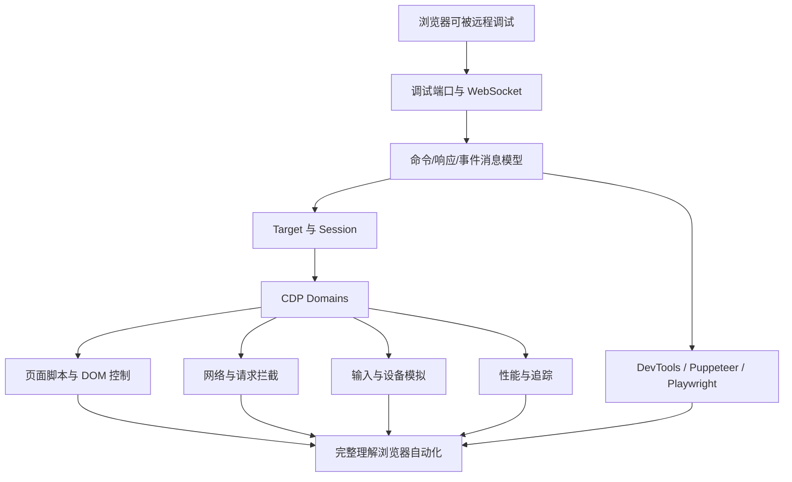

> [!quote] YOU

我想详细了解cdp是如何控制浏览器的


> [!question] Quiz
> 你目前对 CDP 的理解更接近哪一项？
>
> 选最符合你当前把握的一项，不确定可以选“我不知道”。
>
> 1. 它主要是一个独立浏览器自动化框架，浏览器只负责执行它生成的脚本
> 2. 它主要是浏览器扩展注入网页脚本的一套标准，不负责调试浏览器本身
> 3. 它主要是操作系统层面的鼠标键盘模拟工具，不依赖浏览器内部接口
> 4. 它主要是浏览器提供的一组远程调试接口，客户端通过协议发送命令并接收事件


> [!success] Quiz — correct ✓
> Your answer: 4. 它主要是浏览器提供的一组远程调试接口，客户端通过协议发送命令并接收事件
> Correct answer: 4
>
> CDP（Chrome DevTools Protocol）的核心是浏览器暴露的远程调试协议：客户端通过调试连接发送结构化命令，浏览器返回结果，并主动推送事件。它可以被自动化框架使用，但自身不是某个框架，也不等同于操作系统级鼠标键盘模拟。


> [!question] Question
> 你想把 CDP 学到什么深度、用于什么场景？
>
> 这会决定我重点讲协议底层、浏览器内部架构，还是实际自动化与调试。
>
> 1. 理解原理：从连接、消息、浏览器进程到事件流
> 2. 能手写客户端：用 WebSocket 直接发送 CDP 命令
> 3. 掌握自动化：理解 Playwright/Puppeteer 如何借助 CDP 控制浏览器
> 4. 调试与观测：网络、性能、页面运行时、设备模拟和抓包
> 5. 全部系统掌握


> [!example] Answer
> 5. 全部系统掌握


> [!abstract] PI

我会按“从底层机制到实际控制”的顺序系统讲：

1. **CDP 是什么**：协议、客户端、浏览器三者关系  
2. **如何连接**：调试端口、HTTP 元信息、WebSocket  
3. **消息模型**：命令、响应、事件、`id`、`sessionId`  
4. **浏览器内部对象**：Browser、Target、Page、Frame、Execution Context  
5. **核心 Domains**：`Page`、`Runtime`、`DOM`、`Network`、`Fetch`、`Input`、`Emulation` 等  
6. **一次操作的完整链路**：点击、执行 JavaScript、监听网络请求  
7. **DevTools、Puppeteer、Playwright 如何使用 CDP**  
8. **手写 WebSocket 客户端**：直接发送 CDP 命令  
9. **高级能力**：性能分析、Tracing、覆盖率、网络拦截、设备模拟  
10. **限制、安全风险与常见误区**

知识依赖关系如下：



我会先确认一些版本相关的细节和容易混淆的地方，然后从第一个核心节点开始讲。


> [!quote] YOU

先简单介绍cdp


> [!abstract] PI

## CDP 是什么？

**CDP（Chrome DevTools Protocol，Chrome 开发者工具协议）**是一套让外部程序控制和观测 Chromium 浏览器的通信协议。

Chrome DevTools、Puppeteer、部分 Playwright 功能，本质上都可以通过它与浏览器通信。

基本结构是：

```text
控制程序
   ↓ WebSocket + JSON
浏览器调试接口
   ↓
页面、JavaScript、DOM、网络、性能等模块
```

## 它能做什么？

CDP 可以让程序：

- 打开、刷新、关闭页面
- 执行页面 JavaScript
- 读取和修改 DOM
- 模拟鼠标、键盘、触摸操作
- 监听和拦截网络请求
- 修改 User-Agent、视口、地理位置
- 获取页面截图和 PDF
- 分析性能、内存和加载过程
- 监听控制台日志和 JavaScript 异常

## 它如何通信？

客户端通过 WebSocket 发送 JSON 命令：

```json
{
  "id": 1,
  "method": "Runtime.evaluate",
  "params": {
    "expression": "document.title"
  }
}
```

浏览器返回响应：

```json
{
  "id": 1,
  "result": {
    "result": {
      "type": "string",
      "value": "页面标题"
    }
  }
}
```

除了响应，浏览器还会主动推送事件，例如：

```json
{
  "method": "Console.messageAdded",
  "params": {
    "message": {}
  }
}
```

因此 CDP 的核心通信模型是：

```text
客户端发送命令 → 浏览器返回结果
浏览器发生变化 → 主动推送事件
```

## CDP 的模块化结构

CDP 把能力分成许多 **Domain**：

- `Page`：页面导航、截图、生命周期
- `Runtime`：执行 JavaScript
- `DOM`：操作 DOM
- `Network`：监听网络请求
- `Fetch`：拦截和修改请求
- `Input`：模拟鼠标键盘
- `Emulation`：模拟设备和环境
- `Performance`：获取性能指标
- `Debugger`：断点和调试脚本

可以把它理解成：

> **CDP 是浏览器内部各种能力对外暴露的一组远程控制接口。**

它不是 Puppeteer，也不是 Playwright；后两者是更高级的封装，而 CDP 是它们可能使用的底层通信协议。


> [!abstract] PI

补充两个关键点：

1. **WebSocket 是常用传输方式，不是 CDP 本身**  
   CDP 定义的是消息格式、命令、事件和对象模型；WebSocket 只是传输这些 JSON 消息的通道。

2. **CDP 控制的不是“网页脚本”，而是浏览器调试层**  
   因此它不仅能执行 JavaScript，还能控制网络、页面生命周期、截图、性能追踪和设备模拟。

可以把 CDP 暂时记成：

> **浏览器提供的一套远程调试协议，客户端通过命令控制浏览器，并通过事件观察浏览器。**

它的基本流程是：

```text
启动带调试接口的 Chromium
        ↓
获取 WebSocket 地址
        ↓
建立 CDP 连接
        ↓
发送命令 / 接收响应与事件
        ↓
控制页面、网络、脚本和性能
```

另外，CDP 权限很高。只要连接上调试端口，通常就能读取页面数据、执行 JavaScript，甚至接触浏览器中的登录状态，所以调试端口不能暴露给不可信网络。


> [!quote] YOU

Chromium支持远程创建嘛


> [!question] Question
> 你说的“远程创建”具体是指哪一种？
>
> 1. 远程启动一个新的 Chromium 浏览器进程
> 2. 连接到已运行的 Chromium，并创建新的页面/标签页
> 3. 创建隔离的 BrowserContext（类似无痕环境）
> 4. 在远程机器上创建并控制 Chromium


> [!example] Answer
> 1. 远程启动一个新的 Chromium 浏览器进程


> [!abstract] PI

可以，但要区分：

> **CDP 不能负责启动 Chromium 进程；它只能连接已经启动并开启调试接口的 Chromium。**

典型流程：

```text
远程机器启动 Chromium
        ↓
开启 CDP 调试接口
        ↓
本地程序通过 WebSocket 连接
        ↓
控制远程浏览器
```

远程机器上：

```bash
chromium \
  --headless \
  --remote-debugging-port=9222 \
  --user-data-dir=/tmp/chromium-cdp
```

然后客户端连接：

```text
ws://远程机器地址:9222/devtools/browser/...
```

更安全的方式是使用 SSH 隧道，而不是直接暴露端口：

```bash
ssh -L 9222:127.0.0.1:9222 user@remote-host
```

之后本地连接：

```text
http://127.0.0.1:9222/json/version
```

获取其中的 `webSocketDebuggerUrl`。

如果希望由代码负责“启动并连接”，可以使用：

- **Puppeteer** 的 `launch()`
- **Playwright** 的 `chromium.launch()`
- 自己通过 SSH、Docker 或进程管理器启动 Chromium，再使用 CDP 连接

所以分工是：

```text
进程管理工具：启动/停止 Chromium
CDP：连接后控制 Chromium
```

CDP 连接建立后，可以调用 `Browser.close` 关闭浏览器，但不能通过 CDP 本身创建一个尚未运行的 Chromium 进程。
