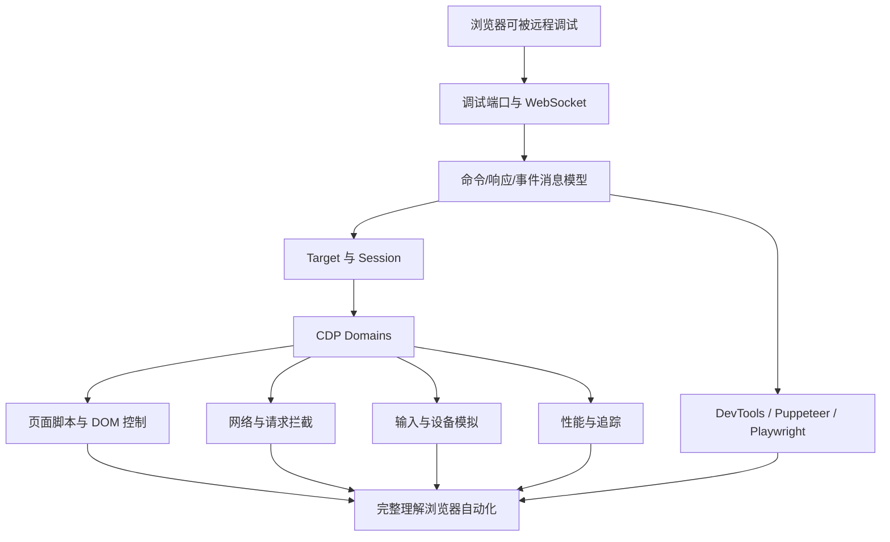

> [!quote] YOU

我想详细了解cdp是如何控制浏览器的


> [!question] Quiz
> 你目前对 CDP 的理解更接近哪一项？
>
> 选最符合你当前把握的一项，不确定可以选“我不知道”。
>
> 1. 它主要是一个独立浏览器自动化框架，浏览器只负责执行它生成的脚本
> 2. 它主要是浏览器扩展注入网页脚本的一套标准，不负责调试浏览器本身
> 3. 它主要是操作系统层面的鼠标键盘模拟工具，不依赖浏览器内部接口
> 4. 它主要是浏览器提供的一组远程调试接口，客户端通过协议发送命令并接收事件


> [!success] Quiz — correct ✓
> Your answer: 4. 它主要是浏览器提供的一组远程调试接口，客户端通过协议发送命令并接收事件
> Correct answer: 4
>
> CDP（Chrome DevTools Protocol）的核心是浏览器暴露的远程调试协议：客户端通过调试连接发送结构化命令，浏览器返回结果，并主动推送事件。它可以被自动化框架使用，但自身不是某个框架，也不等同于操作系统级鼠标键盘模拟。


> [!question] Question
> 你想把 CDP 学到什么深度、用于什么场景？
>
> 这会决定我重点讲协议底层、浏览器内部架构，还是实际自动化与调试。
>
> 1. 理解原理：从连接、消息、浏览器进程到事件流
> 2. 能手写客户端：用 WebSocket 直接发送 CDP 命令
> 3. 掌握自动化：理解 Playwright/Puppeteer 如何借助 CDP 控制浏览器
> 4. 调试与观测：网络、性能、页面运行时、设备模拟和抓包
> 5. 全部系统掌握


> [!example] Answer
> 5. 全部系统掌握


> [!abstract] PI

我会按“从底层机制到实际控制”的顺序系统讲：

1. **CDP 是什么**：协议、客户端、浏览器三者关系  
2. **如何连接**：调试端口、HTTP 元信息、WebSocket  
3. **消息模型**：命令、响应、事件、`id`、`sessionId`  
4. **浏览器内部对象**：Browser、Target、Page、Frame、Execution Context  
5. **核心 Domains**：`Page`、`Runtime`、`DOM`、`Network`、`Fetch`、`Input`、`Emulation` 等  
6. **一次操作的完整链路**：点击、执行 JavaScript、监听网络请求  
7. **DevTools、Puppeteer、Playwright 如何使用 CDP**  
8. **手写 WebSocket 客户端**：直接发送 CDP 命令  
9. **高级能力**：性能分析、Tracing、覆盖率、网络拦截、设备模拟  
10. **限制、安全风险与常见误区**

知识依赖关系如下：



我会先确认一些版本相关的细节和容易混淆的地方，然后从第一个核心节点开始讲。


> [!quote] YOU

先简单介绍cdp


> [!abstract] PI

## CDP 是什么？

**CDP（Chrome DevTools Protocol，Chrome 开发者工具协议）**是一套让外部程序控制和观测 Chromium 浏览器的通信协议。

Chrome DevTools、Puppeteer、部分 Playwright 功能，本质上都可以通过它与浏览器通信。

基本结构是：

```text
控制程序
   ↓ WebSocket + JSON
浏览器调试接口
   ↓
页面、JavaScript、DOM、网络、性能等模块
```

## 它能做什么？

CDP 可以让程序：

- 打开、刷新、关闭页面
- 执行页面 JavaScript
- 读取和修改 DOM
- 模拟鼠标、键盘、触摸操作
- 监听和拦截网络请求
- 修改 User-Agent、视口、地理位置
- 获取页面截图和 PDF
- 分析性能、内存和加载过程
- 监听控制台日志和 JavaScript 异常

## 它如何通信？

客户端通过 WebSocket 发送 JSON 命令：

```json
{
  "id": 1,
  "method": "Runtime.evaluate",
  "params": {
    "expression": "document.title"
  }
}
```

浏览器返回响应：

```json
{
  "id": 1,
  "result": {
    "result": {
      "type": "string",
      "value": "页面标题"
    }
  }
}
```

除了响应，浏览器还会主动推送事件，例如：

```json
{
  "method": "Console.messageAdded",
  "params": {
    "message": {}
  }
}
```

因此 CDP 的核心通信模型是：

```text
客户端发送命令 → 浏览器返回结果
浏览器发生变化 → 主动推送事件
```

## CDP 的模块化结构

CDP 把能力分成许多 **Domain**：

- `Page`：页面导航、截图、生命周期
- `Runtime`：执行 JavaScript
- `DOM`：操作 DOM
- `Network`：监听网络请求
- `Fetch`：拦截和修改请求
- `Input`：模拟鼠标键盘
- `Emulation`：模拟设备和环境
- `Performance`：获取性能指标
- `Debugger`：断点和调试脚本

可以把它理解成：

> **CDP 是浏览器内部各种能力对外暴露的一组远程控制接口。**

它不是 Puppeteer，也不是 Playwright；后两者是更高级的封装，而 CDP 是它们可能使用的底层通信协议。


> [!abstract] PI

补充两个关键点：

1. **WebSocket 是常用传输方式，不是 CDP 本身**  
   CDP 定义的是消息格式、命令、事件和对象模型；WebSocket 只是传输这些 JSON 消息的通道。

2. **CDP 控制的不是“网页脚本”，而是浏览器调试层**  
   因此它不仅能执行 JavaScript，还能控制网络、页面生命周期、截图、性能追踪和设备模拟。

可以把 CDP 暂时记成：

> **浏览器提供的一套远程调试协议，客户端通过命令控制浏览器，并通过事件观察浏览器。**

它的基本流程是：

```text
启动带调试接口的 Chromium
        ↓
获取 WebSocket 地址
        ↓
建立 CDP 连接
        ↓
发送命令 / 接收响应与事件
        ↓
控制页面、网络、脚本和性能
```

另外，CDP 权限很高。只要连接上调试端口，通常就能读取页面数据、执行 JavaScript，甚至接触浏览器中的登录状态，所以调试端口不能暴露给不可信网络。


> [!quote] YOU

Chromium支持远程创建嘛


> [!question] Question
> 你说的“远程创建”具体是指哪一种？
>
> 1. 远程启动一个新的 Chromium 浏览器进程
> 2. 连接到已运行的 Chromium，并创建新的页面/标签页
> 3. 创建隔离的 BrowserContext（类似无痕环境）
> 4. 在远程机器上创建并控制 Chromium


> [!example] Answer
> 1. 远程启动一个新的 Chromium 浏览器进程


> [!abstract] PI

可以，但要区分：

> **CDP 不能负责启动 Chromium 进程；它只能连接已经启动并开启调试接口的 Chromium。**

典型流程：

```text
远程机器启动 Chromium
        ↓
开启 CDP 调试接口
        ↓
本地程序通过 WebSocket 连接
        ↓
控制远程浏览器
```

远程机器上：

```bash
chromium \
  --headless \
  --remote-debugging-port=9222 \
  --user-data-dir=/tmp/chromium-cdp
```

然后客户端连接：

```text
ws://远程机器地址:9222/devtools/browser/...
```

更安全的方式是使用 SSH 隧道，而不是直接暴露端口：

```bash
ssh -L 9222:127.0.0.1:9222 user@remote-host
```

之后本地连接：

```text
http://127.0.0.1:9222/json/version
```

获取其中的 `webSocketDebuggerUrl`。

如果希望由代码负责“启动并连接”，可以使用：

- **Puppeteer** 的 `launch()`
- **Playwright** 的 `chromium.launch()`
- 自己通过 SSH、Docker 或进程管理器启动 Chromium，再使用 CDP 连接

所以分工是：

```text
进程管理工具：启动/停止 Chromium
CDP：连接后控制 Chromium
```

CDP 连接建立后，可以调用 `Browser.close` 关闭浏览器，但不能通过 CDP 本身创建一个尚未运行的 Chromium 进程。


> [!quote] YOU

好的 继续深入


> [!abstract] PI

## 第一层：CDP 不负责启动浏览器

这是理解 CDP 的第一个关键边界：

```text
操作系统 / Docker / SSH / Puppeteer
              ↓ 启动进程
Chromium 浏览器进程
              ↓ 开启调试接口
CDP 客户端
              ↓ 发送协议命令
页面、网络、JavaScript、性能模块
```

### 1. 启动 Chromium

例如：

```bash
chromium \
  --headless \
  --remote-debugging-port=9222 \
  --user-data-dir=/tmp/cdp-profile
```

这里有三个重要参数：

- `--headless`：无界面运行
- `--remote-debugging-port=9222`：开启 CDP 调试端口
- `--user-data-dir=...`：使用独立用户目录

独立用户目录很重要，因为 Chromium 通常不允许多个进程同时使用同一个用户目录，也不应该随便把日常登录配置暴露给自动化程序。

### 2. 发现浏览器地址

CDP 客户端先访问：

```text
http://127.0.0.1:9222/json/version
```

返回内容大致类似：

```json
{
  "Browser": "HeadlessChrome/...",
  "Protocol-Version": "1.3",
  "webSocketDebuggerUrl":
    "ws://127.0.0.1:9222/devtools/browser/abc..."
}
```

这个 `webSocketDebuggerUrl` 是**浏览器级连接地址**。

也可以访问：

```text
http://127.0.0.1:9222/json/list
```

查看已有页面，每个页面可能有自己的：

```text
ws://127.0.0.1:9222/devtools/page/...
```

### 3. 两种连接层级

```text
浏览器级 WebSocket
        ↓
管理多个 Target、创建页面、监听浏览器事件

页面级 WebSocket
        ↓
直接控制某个页面
```

现代客户端通常更偏向浏览器级连接，因为它可以统一管理多个页面、iframe、Worker 和浏览器上下文。

### 4. 远程机器场景

远程 Chromium 并不等于 CDP 必须暴露到公网。更安全的结构是：

```text
本地程序
   ↓ SSH 隧道
远程机器的 127.0.0.1:9222
   ↓
远程 Chromium
```

例如：

```bash
ssh -L 9222:127.0.0.1:9222 user@remote-host
```

本地访问：

```text
http://127.0.0.1:9222/json/version
```

实际上会被转发到远程机器。

### 这一层的核心结论

> **CDP 的第一步不是“发送命令”，而是先找到一个已经运行的 Chromium 调试端点。**

接下来才是：

```text
发现 WebSocket 地址
→ 建立 WebSocket
→ 发送 JSON 命令
→ 接收响应和事件
```

接下来我们可以进入最核心的消息模型：`id`、`method`、`params`、`result`、`error` 和事件。先检查这一层是否理解到位：


> [!quote] YOU

不同chromium进程有什么区别


> [!abstract] PI

“不同 Chromium 进程”有两层含义，先区分：

## 一、一个 Chromium 实例内部的多个 OS 进程

你启动一次 Chromium，通常不是只得到一个进程，而是一组协作进程：

```text
Browser Process
├── Renderer Process
├── GPU Process
├── Network Service
├── Utility Process
└── Other Service Processes
```

### 1. Browser Process

浏览器的总协调者，负责：

- 窗口和标签页管理
- 创建、销毁其他进程
- 浏览器级权限和安全策略
- Target 管理
- CDP 调试接口

通常可以把 CDP 的入口理解为连接到了 Browser Process，再由它把命令路由到具体页面。

### 2. Renderer Process

负责真正渲染网页：

- 执行 JavaScript
- 构建 DOM
- 计算 CSS
- 绘制页面
- 执行页面脚本

`Runtime.evaluate`、DOM 操作、页面布局等能力，最终主要作用于 Renderer 中的页面环境。

但要注意：

> 一个标签页不一定对应一个 Renderer Process。

Chromium 会根据站点隔离、iframe、资源策略等因素决定进程分配：

```text
一个 Renderer Process 可能承载多个 frame
一个页面也可能涉及多个 Renderer Process
```

### 3. GPU Process

负责：

- GPU 加速
- 合成页面图层
- WebGL
- 部分图像和视频处理

### 4. Network Service

负责网络相关工作：

- DNS
- HTTP 请求
- Cookie
- 缓存
- 代理
- 网络安全策略

所以 CDP 的 `Network` Domain 虽然由客户端调用，但网络请求并不一定发生在 Renderer Process 中。

### 5. Utility Process

承载一些隔离的辅助服务，例如：

- 音频
- 数据解码
- 文件处理
- 特定设备或系统服务

---

## 二、多个独立 Chromium 实例

如果你启动两次 Chromium：

```bash
chromium --remote-debugging-port=9222 --user-data-dir=/tmp/profile-a
chromium --remote-debugging-port=9223 --user-data-dir=/tmp/profile-b
```

你得到的是两个独立的浏览器实例：

```text
实例 A
├── Browser Process A
├── Renderer Process A1
└── Renderer Process A2

实例 B
├── Browser Process B
├── Renderer Process B1
└── Renderer Process B2
```

它们通常有不同的：

- 浏览器级状态
- Cookie 和 LocalStorage
- 缓存
- 扩展
- 页面集合
- CDP 端口
- 用户配置目录

因此可以用不同实例模拟不同用户：

```text
实例 A：用户 Alice
实例 B：用户 Bob
```

## CDP 连接的是哪一层？

CDP 同时存在不同作用范围：

```text
Browser 级命令
    ↓
Target / Page 级命令
    ↓
Frame / JavaScript Execution Context
```

例如：

- `Browser.close`：关闭整个浏览器实例
- `Target.createTarget`：创建新页面
- `Page.navigate`：导航某个页面
- `Runtime.evaluate`：在某个 JavaScript 上下文执行代码

## 最重要的区别

| 概念 | 含义 |
|---|---|
| Chromium 实例 | 一次启动得到的完整浏览器 |
| Browser Process | 该实例的总协调进程 |
| Renderer Process | 渲染网页和执行 JS 的进程 |
| Target | CDP 中可调试的逻辑对象 |
| Page | 常见的一种 Target |
| Session | CDP 客户端附着到 Target 后的通信会话 |

最容易犯的错误是：

```text
一个标签页 = 一个 Chromium 进程
```

更准确的是：

```text
一个 Chromium 实例 = 多个 OS 进程
一个标签页 = 一个或多个 CDP Target / Frame
Target 与 OS 进程不是一一对应关系
```

下一步的核心就是理解：**CDP 如何通过 Target 和 Session，把命令路由到正确的页面或执行环境。**


> [!quote] YOU

指纹浏览器也是一样嘛


> [!abstract] PI

大体上是一样的：**大多数指纹浏览器基于 Chromium 或 Chromium 的修改版**，仍然采用多进程架构：

```text
Browser Process
├── Renderer Process
├── GPU Process
├── Network Service
└── Utility Processes
```

区别在于，指纹浏览器在 Chromium 外面增加了“环境隔离”和“指纹修改”层。

## 普通 Chromium

```text
一个用户目录
→ Cookie、缓存、LocalStorage、指纹环境
```

## 指纹浏览器

```text
Profile A
→ Cookie A
→ 指纹配置 A
→ 代理 A

Profile B
→ Cookie B
→ 指纹配置 B
→ 代理 B
```

它通常会修改或隔离：

- User-Agent
- 屏幕尺寸和设备像素比
- 时区和语言
- Canvas、WebGL、Audio 指纹
- 字体列表
- WebRTC 网络信息
- GPU 信息
- Cookie、LocalStorage、IndexedDB
- 代理和网络出口

## 指纹配置不等于 OS 进程

这是关键：

```text
指纹 Profile ≠ Chromium OS Process
```

一个指纹配置可能对应：

- 一个独立 Chromium 实例
- 一个独立用户目录
- 一个 BrowserContext
- 一个厂商自定义的隔离环境

具体取决于产品实现。

有些指纹浏览器为每个账号启动独立 Chromium 进程：

```text
账号 A → Chromium 实例 A
账号 B → Chromium 实例 B
```

有些则由一个管理器统一调度多个浏览器实例。

## CDP 能否控制指纹浏览器？

如果它提供 CDP 端点，通常可以使用：

- `Page`
- `Runtime`
- `Network`
- `Input`
- `Target`
- `Emulation`

等 CDP Domain。

但要注意：

1. **不一定完全兼容标准 CDP**  
   厂商可能修改 Chromium 或封装自己的 API。

2. **不同 Profile 通常有不同调试地址**  
   可能是不同端口，也可能由管理器返回 WebSocket 地址。

3. **CDP 控制的是浏览器，不自动等于修改指纹**  
   指纹配置通常在启动实例或创建 Profile 时设置。

4. **CDP 本身权限很高**  
   能执行 JavaScript、读取页面内容和控制网络，因此调试端点必须受保护。

可以这样理解：

```text
指纹浏览器 = Chromium
            + 多 Profile 隔离
            + 指纹环境修改
            + 代理管理
            + 启动/调度 API
```

所以底层仍然是 Chromium 的进程模型，但它在“用户环境隔离”和“浏览器暴露给网页的特征”上做了额外改造。
