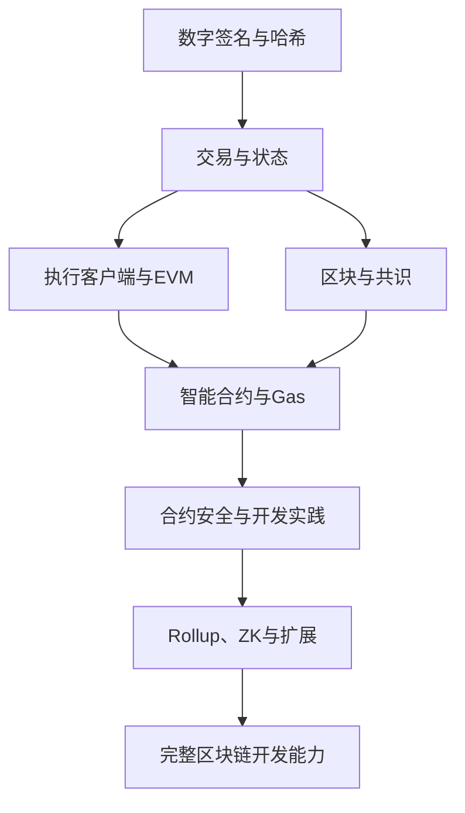
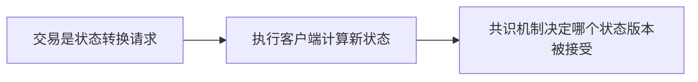

> [!quote] YOU

我先深入学习区块链相关知识


> [!question] Question
> 你希望用哪种方式学习区块链？
>
> 1. 深度研究（推荐）
> 2. 快速建立心智模型
> 3. 边学边写成文章
> 4. 权威完整参考


> [!example] Answer
> 1. 深度研究（推荐）


> [!abstract] PI

🥷 已开始深度研究，并先收集了 14 份一手资料，存放在：

`blockchain-research/sources/`

我会按“问题 → 密码学 → 账本与共识 → 执行与合约 → 安全经济学 → 扩展与隐私 → 动手验证”的依赖顺序推进，而不是从术语表开始背。接下来我需要先确定你的学习终点：


> [!question] Question
> 你深入学习区块链，最希望最终具备哪种能力？
>
> 1. 理解底层原理（推荐）
> 2. 成为区块链开发者
> 3. 研究协议与扩展性
> 4. 评估项目与应用


> [!example] Answer
> 2. 成为区块链开发者


> [!question] Quiz
> 在以太坊中，用户发起一笔普通交易后，哪个组件最终负责执行交易并计算状态变化？
>
> 先凭现有理解回答，不需要查资料。
>
> 1. 钱包界面
> 2. 共识客户端
> 3. 执行客户端
> 4. 区块浏览器


> [!failure] Quiz — incorrect ✗
> Your answer: 2. 共识客户端
> Correct answer: 3
>
> 执行客户端负责验证交易、执行 EVM 代码并计算状态变化；共识客户端负责区块传播、验证共识消息和 fork choice 等。钱包创建并签名交易，但不负责全网执行。


> [!question] Quiz
> 以太坊 PoS 节点收到一个新区块时，最关键的验证流程是哪一个？
>
> 1. 钱包验证签名后，区块就自动被全网接受
> 2. 共识客户端执行所有合约，执行客户端只转发区块
> 3. 区块浏览器先确认区块，再通知节点写入状态
> 4. 执行客户端重新执行交易，共识客户端检查区块共识信息


> [!failure] Quiz — incorrect ✗
> Your answer: 3. 区块浏览器先确认区块，再通知节点写入状态
> Correct answer: 4
>
> 节点会由执行客户端重新执行交易，检查状态转换是否有效；共识客户端验证区块提议、见证、分叉选择等共识信息。两者协作，不能互换。


> [!abstract] PI

🥷 你的目标是成为区块链开发者。根据刚才的测试，你目前最需要先建立：

- 执行层 vs 共识层的区别
- 交易如何变成状态变化
- 钱包、节点、客户端、区块浏览器各自做什么

学习路线：



我会先从“用户签名一笔交易后，交易如何经过钱包、节点、执行客户端、共识客户端，最终写入链上状态”开始，再逐步进入 Solidity 和实际开发。

如果这个路线符合你的目标，我下一步就开始第一课。


> [!quote] YOU

好的


> [!abstract] PI

🥷## 第一课：区块链开发者真正操作的对象——状态

### 1. 先问：一笔交易到底是什么？

用户点击“转账”时，钱包并没有直接修改区块链余额。

它做的是：

1. 组织一条请求：谁要做什么、给谁、多少、支付多少 Gas
2. 用私钥签名
3. 把签名后的交易广播给节点
4. 节点验证后，执行这条交易
5. 执行结果改变链上的状态

所以：

> **交易是“请求改变状态的指令”，不是状态本身。**

可以把以太坊抽象成一个状态转换函数：

$$
S_{t+1} = F(S_t, T)
$$

- $S_t$：当前链上状态
- $T$：交易
- $F$：执行规则
- $S_{t+1}$：交易执行后的新状态

例如：

```text
原状态：
Alice = 10 ETH
Bob   = 2 ETH

交易：
Alice 给 Bob 转 3 ETH

新状态：
Alice = 7 ETH
Bob   = 5 ETH
```

### 2. 钱包、执行客户端、共识客户端分别做什么？

```text
钱包
  └─ 创建交易 + 私钥签名

执行客户端
  └─ 验证交易 + 执行 EVM + 计算状态变化

共识客户端
  └─ 参与区块提议、投票、分叉选择、最终性

区块浏览器
  └─ 读取链上数据并展示给人看
```

最容易混淆的一点：

> **执行客户端决定“这笔交易执行后状态变成什么”；共识客户端决定“哪个区块被网络接受为链的一部分”。**

两者不是竞争关系，而是分工关系。

### 3. 第一条依赖关系



因此，开发智能合约时，你主要关心：

- 交易输入是什么
- 合约代码如何执行
- 状态变量如何变化
- Gas 为什么消耗
- 执行失败时状态是否回滚

先检查这一层是否真正落地：


> [!question] Quiz
> 如果 Alice 给 Bob 转账的交易已经签名，但还没有被任何区块收录，那么 Bob 的链上余额会怎样？
>
> 1. 已经增加，因为签名就是状态更新
> 2. 已经增加，但只有钱包看得到
> 3. 还没有增加，因为交易尚未执行并写入被接受的状态
> 4. 由区块浏览器决定是否增加


> [!warning] Quiz — cancelled
> (user skipped)


> [!abstract] PI

没关系，刚才的小测取消了，不影响学习。

本节只需记住：

> **签名 ≠ 状态更新。**  
> 签名只是授权；交易被节点执行并收录进网络接受的区块后，状态才改变。

下一步我们会沿着这条链路拆解：

```text
钱包签名
→ 节点验证
→ 执行客户端执行
→ 共识客户端确认区块
→ 链上状态更新
```

你回复“继续”后，我讲交易从钱包到区块的完整生命周期。


> [!quote] YOU

继续刚刚的测试


> [!question] Quiz
> 如果 Alice 给 Bob 转账的交易已经签名，但还没有被任何区块收录，那么 Bob 的链上余额会怎样？
>
> 这是刚才中断的测试，选择最符合链上状态定义的一项。
>
> 1. 已经增加，但只有钱包看得到
> 2. 由区块浏览器决定是否增加
> 3. 还没有增加，因为交易尚未执行并写入被接受的状态
> 4. 已经增加，因为签名就是状态更新


> [!success] Quiz — correct ✓
> Your answer: 3. 还没有增加，因为交易尚未执行并写入被接受的状态
> Correct answer: 3
>
> 签名只证明交易由 Alice 授权，并不会直接改变链上状态。交易必须被节点执行，并包含在被网络接受的区块中，状态才会更新。


> [!abstract] PI

很好。现在把“交易不是状态”继续展开成完整生命周期。

## 一笔以太坊交易的旅程

```text
1. 钱包创建交易
       ↓
2. 私钥签名
       ↓
3. 广播到节点的 mempool
       ↓
4. 执行客户端验证并执行
       ↓
5. 验证者把交易放进区块
       ↓
6. 其他节点重新执行验证
       ↓
7. 共识机制接受该区块
       ↓
8. 状态更新
```

### 关键区分

**Mempool 不是区块链。**

交易进入 mempool，只表示：

> 某个节点暂时认为这笔交易有效，并准备传播或打包。

它还可能：

- 被替换
- 被丢弃
- 因 Gas 太低而长期等待
- 因 nonce 冲突而无法执行
- 根本没有进入最终区块

只有交易进入被网络接受的区块，才成为链状态的一部分。

### 为什么其他节点要“重新执行”？

因为区块生产者可能撒谎。

如果提议者声称：

```text
Alice 给 Bob 转了 100 ETH
```

其他节点不能只相信它，而要使用相同的规则重新计算：

```text
旧状态 + 这笔交易 = 新状态？
```

如果计算结果不一致，区块就会被拒绝。

这就是区块链开发中的核心思想：

> **共识不是相信某个节点，而是让节点独立运行同一套确定性规则，检查是否得到同一个结果。**

接下来检查你是否区分了 mempool 和区块链状态：


> [!question] Quiz
> 一笔交易进入 Ethereum mempool，最准确的含义是什么？
>
> 1. 交易已经永久写入区块链
> 2. 交易已经通过最终性确认
> 3. 交易已经改变所有节点的状态
> 4. 某个节点暂存并传播它，等待后续执行和打包


> [!success] Quiz — correct ✓
> Your answer: 4. 某个节点暂存并传播它，等待后续执行和打包
> Correct answer: 4
>
> mempool 是节点保存待处理交易的区域。交易还没有进入被网络接受的区块，因此尚未成为确定的链上状态，也没有最终性。


> [!abstract] PI

很好，下一层是执行客户端与共识客户端的边界。

## 两层协作

### 执行客户端：回答“算出来是什么状态”

它负责：

- 验证交易签名、余额、nonce
- 执行 EVM 指令
- 执行智能合约
- 计算 Gas
- 得到状态变化
- 管理交易池

### 共识客户端：回答“哪个区块算数”

它负责：

- 接收和传播区块
- 验证验证者签名与 attestations
- 运行 fork choice
- 参与最终性判断
- 决定本地应该跟随哪条链

可以把它们类比成：

```text
执行客户端 = 计算器
共识客户端 = 投票与选举规则
```

但要注意：共识客户端不会盲目接受执行结果。新区块到达时，执行客户端会重新执行交易；如果状态根不匹配，共识流程也不能把它当成有效区块。

### 这一层的开发者意义

以后你调用 JSON-RPC：

```text
eth_call
eth_sendRawTransaction
eth_getBalance
```

你通常是在和执行层交互。

而当你研究：

- 验证者
- Slot / Epoch
- Attestation
- Finality
- Fork choice

你是在研究共识层。

现在做边界测试：


> [!question] Quiz
> 智能合约执行后，某个账户余额从 10 ETH 变成 7 ETH，这个状态变化主要由哪个组件计算？
>
> 1. 区块浏览器
> 2. 执行客户端
> 3. 钱包客户端
> 4. 共识客户端


> [!success] Quiz — correct ✓
> Your answer: 2. 执行客户端
> Correct answer: 2
>
> 余额变化是交易执行产生的状态转换，由执行客户端执行 EVM 和交易规则后计算。共识客户端负责验证区块在共识层是否应被接受。


> [!abstract] PI

本轮你已经掌握了三个关键节点：

1. **签名不等于状态更新**
2. **mempool 不等于区块链**
3. **执行客户端计算状态，共识客户端决定区块是否被接受**

核心模型：

```text
交易
→ 执行客户端计算状态变化
→ 验证者打包区块
→ 其他节点重新执行验证
→ 共识层接受区块
→ 链上状态更新
```

下一节进入开发者最重要的对象：**账户模型、nonce、交易执行和智能合约状态**。


> [!quote] YOU

继续


> [!abstract] PI

🥷## 第二课：账户、Nonce 与状态

上一课说“交易改变状态”。现在问：**状态里到底存了什么？**

以太坊的状态可以先简化成一张表：

```text
地址  → 账户数据
```

账户分两类：

### 1. 外部拥有账户（EOA）

由私钥控制，通常是用户钱包。

```text
EOA:
- nonce
- balance
- address
```

它能主动发起交易。

### 2. 合约账户

由合约代码控制，没有私钥。

```text
Contract:
- balance
- contract code
- storage
```

它不能自己主动发起交易，只能被交易或其他合约调用。

---

## Nonce 为什么存在？

假设 Alice 发出两笔交易：

```text
交易 A：给 Bob 转 1 ETH
交易 B：给 Bob 转 2 ETH
```

如果网络先收到 B，再收到 A，节点需要知道它们的顺序。

因此 Alice 的交易带有递增的 nonce：

```text
交易 A：nonce = 7
交易 B：nonce = 8
```

Nonce 同时解决两个问题：

1. **排序**：确定同一账户交易的执行顺序
2. **防重放**：同一笔签名交易不能被无限重复执行

可以把它理解为账户发出的“序号”。

```text
nonce = 7 的交易执行成功
→ 下一笔通常必须是 nonce = 8
```

这也是为什么一笔低 nonce、卡住的交易，可能阻塞同一账户后面的交易。

### 开发者视角

调用：

```text
eth_getTransactionCount(address, "pending")
```

就是在查询账户当前应使用的交易 nonce。

而合约内部也有自己的状态存储，但合约状态不是由 nonce 排序，而是由 EVM 按调用逻辑读写。

先检查账户分类：


> [!question] Quiz
> 关于以太坊账户，哪一项正确？
>
> 1. EOA 由私钥控制，合约账户由代码控制
> 2. 两类账户都必须由私钥直接控制
> 3. EOA 由代码控制，合约账户由私钥控制
> 4. 两类账户都不能持有余额


> [!success] Quiz — correct ✓
> Your answer: 1. EOA 由私钥控制，合约账户由代码控制
> Correct answer: 1
>
> EOA 的控制权来自私钥签名；合约账户的行为由部署到链上的代码决定。两者都可以持有余额，但只有 EOA 能主动发起交易。


> [!question] Quiz
> 如果同一个 EOA 发出的 nonce=7 交易一直没有被打包，nonce=8 交易通常会怎样？
>
> 1. nonce=8 与 nonce=7 完全无关，可以独立执行
> 2. nonce=8 会自动改成 nonce=7
> 3. nonce=8 一定先执行，因为数字更大
> 4. nonce=8 通常会等待，因为同一账户交易需要按 nonce 顺序执行


> [!success] Quiz — correct ✓
> Your answer: 4. nonce=8 通常会等待，因为同一账户交易需要按 nonce 顺序执行
> Correct answer: 4
>
> 同一账户的交易按 nonce 顺序执行。nonce=8 不能跳过 nonce=7，因此常会停留在 pending，直到 nonce=7 被打包、替换或取消。


> [!abstract] PI

再补一个开发中非常实用的区别：**读取合约**和**改变合约状态**。

### `eth_call`

```text
读取状态
不广播交易
通常不消耗用户 Gas
不改变链上状态
```

例如读取代币余额。

### `eth_sendRawTransaction`

```text
发送已签名交易
进入 mempool
由节点执行
可能改变链上状态
需要支付 Gas
```

例如转账、授权、调用 `swap()`。

同一个 Solidity 函数也可能因为调用方式不同而产生不同结果：

```text
view 函数 + eth_call
→ 只读取

改变状态的函数 + sendRawTransaction
→ 真实执行并写入状态
```

这里的关键不是函数名字，而是：

> **是否产生一笔被网络执行和收录的交易。**

例如：

```solidity
function balanceOf(address user)
    external
    view
    returns (uint256)
```

适合读取。

```solidity
function transfer(address to, uint256 amount)
    external
    returns (bool)
```

会改变余额，需要交易。

最后检查这一点：


> [!question] Quiz
> 用户查询 ERC-20 代币余额时，通常最适合使用哪种方式？
>
> 1. 等待验证者主动询问用户余额
> 2. eth_sendRawTransaction，因为所有合约函数都要发交易
> 3. eth_call，因为只读取状态，不需要发送交易
> 4. 直接修改本地钱包数据


> [!success] Quiz — correct ✓
> Your answer: 3. eth_call，因为只读取状态，不需要发送交易
> Correct answer: 3
>
> 读取型函数通常通过 eth_call 在节点本地模拟执行，不广播交易，也不改变链上状态。真正改变状态的操作才需要签名并发送交易。


> [!abstract] PI

本节你掌握了：

- EOA：私钥控制，可主动发起交易
- 合约账户：代码控制，不能主动发起交易
- Nonce：保证同一账户交易顺序并防止重放
- `eth_call`：读取状态，不上链
- `eth_sendRawTransaction`：发送交易，可能改变状态

核心判断：

> **是否改变链上状态，取决于是否产生并执行一笔真实交易。**

下一节进入 **EVM 与 Gas：合约代码究竟如何执行，以及为什么每一步都要收费**。


> [!quote] YOU

继续


> [!abstract] PI

🥷## 第三课：EVM 与 Gas

上一节已经知道：交易最终要由执行客户端计算状态变化。

现在的问题是：

> 如果每个节点都要重新执行合约，谁来保证执行不会无限循环、拖垮所有节点？

答案是两个设计：

1. **EVM**：所有节点运行同一种确定性虚拟机
2. **Gas**：每一步计算都有成本

---

## 1. EVM 是什么？

EVM 可以理解为：

> **一台所有以太坊节点都能复现的确定性虚拟机。**

同一笔交易、同一个旧状态、同一套 EVM 规则，必须得到同一个结果：

$$
F(S, T) = S'
$$

不能出现：

```text
节点 A：余额变成 7 ETH
节点 B：余额变成 8 ETH
```

否则网络无法形成共同账本。

所以智能合约不能依赖：

- 当前机器时间
- 随机数生成器
- 外部网络请求
- 节点本地文件
- 不同节点可能不同的环境

---

## 2. Gas 为什么存在？

假设有人部署：

```solidity
while (true) {
    // 永远循环
}
```

如果执行免费，所有节点都可能永远卡住。

因此每条 EVM 指令都有 Gas 成本：

```text
读取存储：消耗 Gas
写入存储：消耗 Gas
哈希计算：消耗 Gas
调用其他合约：消耗 Gas
```

交易会设置一个 Gas limit：

```text
Gas limit = 允许这笔交易最多消耗多少 Gas
```

如果执行过程中 Gas 用完：

- 交易执行失败
- 状态变化通常回滚
- 已消耗的 Gas 不退还
- 区块本身仍可能包含这笔失败交易

Gas 的本质是：

> **把全网共享的计算资源变成有上限、有价格的资源。**

---

## 3. Gas 费用的基本公式

传统表达可以写成：

$$
\text{交易费} = \text{实际消耗 Gas} \times \text{Gas Price}
$$

现代以太坊的费用进一步拆成：

$$
\text{Gas Price} = \text{Base Fee} + \text{Priority Fee}
$$

- **Base Fee**：由网络拥堵程度决定，并被销毁
- **Priority Fee**：给验证者的小费，用来提高打包意愿

注意：

```text
Gas limit ≠ 实际费用
```

Gas limit 是“最多允许消耗多少”；实际费用取决于交易真正执行了多少指令。

---

## 4. 一个重要后果

写入链上存储通常比读取昂贵，因为：

```text
读取：节点临时计算即可
写入：所有节点都要长期保存并复制
```

所以智能合约开发者会关心：

- 减少不必要的 storage 写入
- 避免重复计算
- 限制循环规模
- 防止外部调用带来的不可控 Gas
- 设计清晰的失败和回滚逻辑

这也是“区块链程序”和普通后端程序的根本差异：

> 普通程序主要优化一台服务器；智能合约要优化所有节点共同重复执行的成本。

现在检查核心概念：


> [!question] Quiz
> 为什么智能合约执行需要消耗 Gas？
>
> 1. 保证交易一定会成功执行
> 2. 让区块浏览器能够显示合约源码
> 3. 限制计算资源滥用，避免无限循环拖垮节点
> 4. 让钱包能够生成私钥


> [!success] Quiz — correct ✓
> Your answer: 3. 限制计算资源滥用，避免无限循环拖垮节点
> Correct answer: 3
>
> Gas 为计算和存储设定成本与上限，防止攻击者用无限循环或高成本操作耗尽所有节点资源。Gas 并不保证交易成功；交易也可能因耗尽 Gas 或其他原因失败。


> [!abstract] PI

再补上一个容易误解的点：**交易失败不等于没有发生任何链上记录。**

例如合约执行时：

```solidity
require(balance >= amount, "insufficient balance");
```

如果余额不足：

1. 交易仍可能被打包进区块
2. 节点执行到 `require`
3. 状态变化回滚
4. 交易标记为失败
5. 已消耗的 Gas 仍然支付
6. 区块链上会留下这笔失败交易的记录

因此：

```text
交易被收录 ≠ 交易执行成功
```

开发者需要分别查看：

- 交易是否上链
- `status` 是否成功
- `revert reason`
- 实际 Gas 使用量
- 事件日志是否产生

核心心智模型：

```text
交易记录：发生过一次执行尝试
状态变化：这次尝试是否成功改变了状态
```

这两个概念必须分开。


> [!question] Quiz
> 一笔交易因合约 `require` 失败而被打包进区块，通常会发生什么？
>
> 1. 验证者自动修改参数后重新执行
> 2. 交易完全从区块链消失，不产生任何记录
> 3. 状态变化保留，但交易状态显示失败
> 4. 交易记录存在，但状态变化回滚，已消耗的 Gas 仍支付


> [!warning] Quiz — cancelled
> (user skipped)


> [!abstract] PI

刚才的小测又被取消了，结论是：

> **合约执行失败时，交易记录仍可能上链；状态变化回滚，但已消耗的 Gas 仍需支付。**

本节核心：

- EVM：所有节点共同运行的确定性虚拟机
- Gas：限制计算资源滥用
- `Gas limit`：最多允许消耗量，不等于实际费用
- 交易被收录：不代表执行成功
- 失败交易：状态回滚，但会留下链上记录

下一节进入 **Solidity 合约、storage/memory/calldata，以及状态变量如何真正存储**。


> [!quote] YOU

继续


> [!abstract] PI

🥷## 第四课：合约数据到底存在哪里？

Solidity 里最重要的成本区别之一，是数据位置。

### 1. `storage`：永久链上状态

```solidity
uint256 public totalSupply;
mapping(address => uint256) public balances;
```

这些变量属于合约状态，会被写入链上。

特点：

- 交易结束后仍然存在
- 所有节点都要保存
- 写入通常昂贵
- 修改它会改变合约状态

可以把 `storage` 看成数据库。

---

### 2. `memory`：本次执行的临时内存

```solidity
function sum(uint256 a, uint256 b)
    external
    pure
    returns (uint256)
{
    uint256 result = a + b;
    return result;
}
```

`result` 只在本次调用期间存在。

特点：

- 执行结束后消失
- 不会永久写入链上
- 通常比 storage 便宜
- 适合临时计算

可以把 `memory` 看成函数运行时的内存。

---

### 3. `calldata`：交易带来的只读输入

```solidity
function greet(string calldata name)
    external
    pure
    returns (string memory)
{
    return name;
}
```

`name` 来自调用者发送的交易数据。

特点：

- 属于本次调用的输入
- 只读
- 执行结束后不成为合约状态
- 外部函数常用它接收参数

---

## 一张表

| 位置 | 是否持久化 | 是否可修改 | 类比 |
|---|---:|---:|---|
| `storage` | 是 | 是 | 数据库 |
| `memory` | 否 | 是 | 临时内存 |
| `calldata` | 否 | 否 | 请求参数 |

这三者的区别，本质上仍然来自上一课：

> **只有写入状态的操作，才会改变链上世界；临时数据只服务于本次执行。**

例如：

```solidity
function transfer(address to, uint256 amount) external {
    balances[msg.sender] -= amount; // 修改 storage
    balances[to] += amount;         // 修改 storage
}
```

这里真正改变链上状态的是 `balances`，而不是函数参数 `to` 和 `amount`。

---

## 为什么开发者必须关心？

因为错误的数据位置会导致：

- Gas 浪费
- 数据修改不了
- 以为保存了数据，实际执行完就消失
- 合约逻辑产生严重漏洞

先做一个关键判断：


> [!question] Quiz
> 如果合约需要在今天的交易结束后，仍然记住某个用户的余额，这个余额应该放在哪里？
>
> 1. calldata
> 2. storage
> 3. memory
> 4. stack-only


> [!success] Quiz — correct ✓
> Your answer: 2. storage
> Correct answer: 2
>
> 只有 storage 是持久化的合约状态，会在交易执行结束后保留下来，并由所有节点共同维护。memory、calldata 和栈数据都只服务于当前执行。


> [!abstract] PI

再补一个经常被误用的概念：**事件日志不是合约状态。**

```solidity
event Transfer(address indexed from, address indexed to, uint256 amount);
```

执行：

```solidity
emit Transfer(msg.sender, to, amount);
```

事件的作用是：

- 给前端和区块浏览器读取
- 记录“发生过什么”
- 方便索引和查询

但事件不能替代：

```solidity
balances[user]
```

因为合约代码不能像读取 storage 那样，把历史事件当作当前状态使用。

所以：

```text
storage = 合约未来执行时可以读取的状态
event   = 给链下应用查询的历史日志
```

例如转账函数通常需要两者：

```solidity
balances[from] -= amount;
balances[to] += amount;
emit Transfer(from, to, amount);
```

- 前两行改变真实余额
- 最后一行通知前端发生了转账

检查这一点：


> [!question] Quiz
> 为什么 ERC-20 转账通常既要修改 `balances`，又要 `emit Transfer`？
>
> 1. 修改 balances 会自动产生所有标准事件
> 2. 两者作用完全相同，只是写法不同
> 3. 余额供合约读取，事件供链下应用索引和展示
> 4. 事件保存余额，balances 只用于前端展示


> [!success] Quiz — correct ✓
> Your answer: 3. 余额供合约读取，事件供链下应用索引和展示
> Correct answer: 3
>
> balances 是合约可读取的持久化状态；Transfer 事件是链下应用、钱包和浏览器读取转账历史的重要接口。修改状态不会自动替代事件。


> [!abstract] PI

本节掌握了 Solidity 数据的三种位置：

- `storage`：持久化链上状态
- `memory`：本次执行的临时数据
- `calldata`：只读的调用输入
- `event`：供链下应用索引的日志，不是合约状态

核心区别：

```text
合约未来要读取 → storage
本次计算暂时用 → memory
外部调用传进来 → calldata
通知前端发生了什么 → event
```

下一节进入 **ABI、函数选择器与合约调用：前端到底如何调用一个 Solidity 函数**。


> [!quote] YOU

> [!note] SKILL loaded: visualize

可视化的总结到目前为止的内容


> [!abstract] PI

🥷 我会把目前内容压缩成一张“交易 → 执行 → 共识 → 状态”的结构图，包含：

- 钱包签名
- mempool
- 执行客户端与 EVM
- 区块与验证者
- 共识客户端
- `storage` 状态
- `event` 日志

图会先渲染并检查正确性，再嵌入课程笔记。
