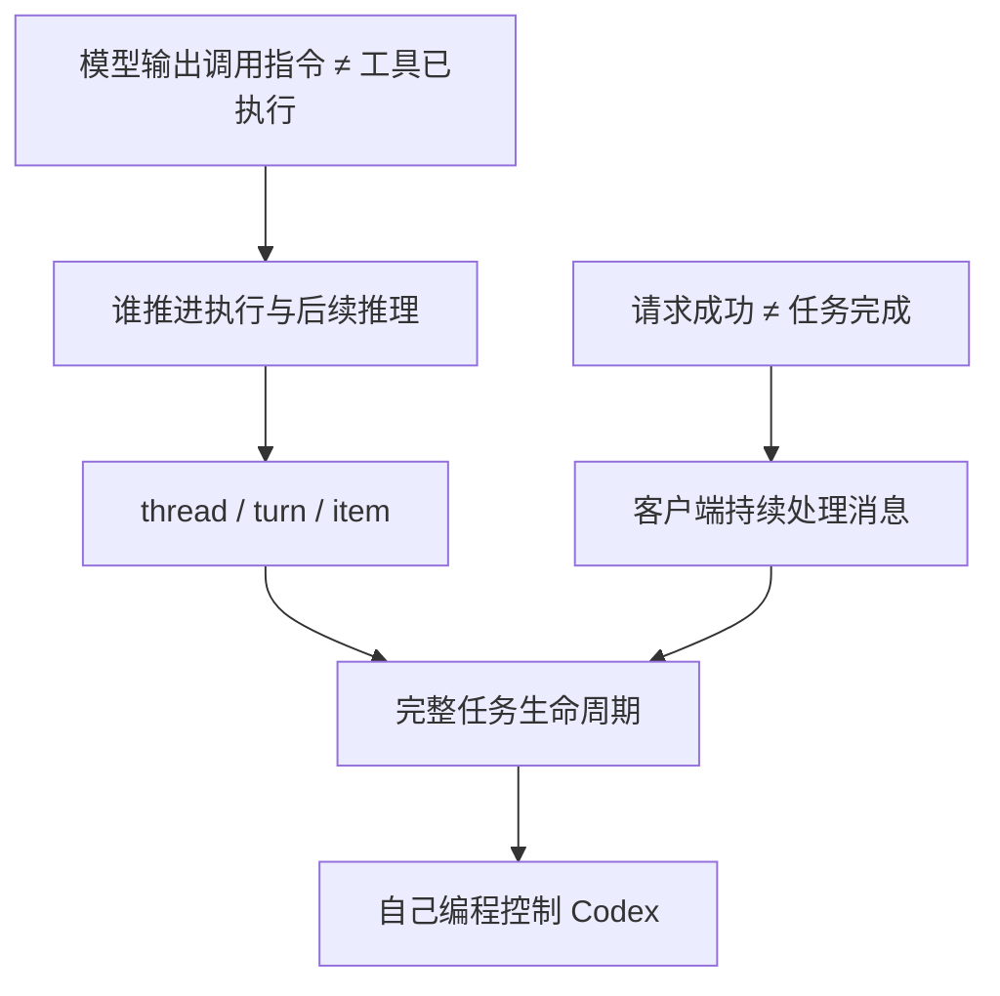

> [!quote] YOU

我想搞明白如何程序化的使用codex app server, 里面有哪些核心概念，而不是仅仅会使用codex客户端


> [!abstract] PI

可以，我们把目标放在**能自己写程序驱动 Codex**，而不是记住客户端的操作步骤。具体协议和概念我会核对官方资料，避免把不同版本或 SDK 的接口混在一起。

先确定一个实际落点，再摸清你对进程通信、异步事件这些基础的熟悉程度。


> [!question] Question
> 你最希望学完后，能用 Codex app-server 做出什么？
>
> 1. 写一个最小控制程序，真正弄懂运行机制（Recommended）
> 2. 把 Codex 接入自己的产品
> 3. 构建自动化任务系统
> 4. 先理解整体架构与核心概念


> [!example] Answer
> 4. 先理解整体架构与核心概念


> [!question] Quiz
> 先定位你已有的理解：一个模型接口返回了“调用 shell 执行 npm test”的工具调用。在这个时刻，实际发生了什么？
>
> 1. 模型已经执行了命令，接入它的程序只需要显示结果。
> 2. 模型把命令交给了操作系统，接入它的程序只需要等待。
> 3. 模型产出了调用指令，接入它的程序还需要执行命令。


> [!success] Quiz — correct ✓
> Your answer: 3. 模型产出了调用指令，接入它的程序还需要执行命令。
> Correct answer: 3
>
> 工具调用是模型生成的结构化指令，不是命令已经执行的证明。接入模型的程序需要安排执行，并把结果送回模型。这是区分“模型”与“agent 运行时”的关键。


> [!question] Quiz
> 再往程序化接入走一步：你的程序向 app-server 发送 turn/start，收到成功响应后，应该怎样判断这次任务完成了？
>
> 1. 继续接收过程消息，以 turn/completed 判断任务结束。
> 2. 成功响应就代表任务完成，读取响应里的最终答案。
> 3. 继续接收文本消息，以最后一段文本判断任务结束。


> [!success] Quiz — correct ✓
> Your answer: 1. 继续接收过程消息，以 turn/completed 判断任务结束。
> Correct answer: 1
>
> turn/start 的成功响应表示这一轮任务已建立，不表示执行完毕。后续工作通过异步消息报告；turn/completed 才表示这一轮结束，结束状态还可能是失败或被中断。


> [!question] Quiz
> 如果执行过程中需要用户批准一条命令，app-server 与你写的客户端之间如何配合？
>
> 1. 服务端发出带 id 的请求；客户端用对应 id 返回审批结果。
> 2. 服务端发出普通进度通知；客户端发送新的 turn/start 表达批准。
> 3. 服务端在原来的 turn/start 响应中询问；客户端重新提交该请求表达批准。


> [!success] Quiz — correct ✓
> Your answer: 1. 服务端发出带 id 的请求；客户端用对应 id 返回审批结果。
> Correct answer: 1
>
> 这是双向 RPC：app-server 也能充当请求发起方，等待客户端回答。审批不是普通进度通知，也不是一次新的用户任务；客户端需要识别服务端请求，并返回对应的响应。


> [!question] Quiz
> 假设 Codex 在一个会话里收到“修复测试”，随后读文件、改代码、跑了两次测试，最后回复用户。这些动作与 thread / turn / item 的关系，哪种描述正确？
>
> 1. 每次工具执行属于一个 thread，整次修复工作合起来形成一个 turn。
> 2. 每次模型调用属于一个 turn，命令执行和消息等分别形成 item。
> 3. 这次请求及后续工作属于一个 turn，命令执行和消息等分别形成 item。


> [!failure] Quiz — incorrect ✗
> Your answer: 2. 每次模型调用属于一个 turn，命令执行和消息等分别形成 item。
> Correct answer: 3
>
> thread 是会话；turn 是一次用户请求及其引发的 agent 工作；item 是其中的具体输入或输出单元。一个 turn 可以包含多次模型调用与工具执行，并不等于模型只回答一次。


> [!question] Quiz
> 沿着刚才的边界再确认一下：你写自己的客户端接入 app-server。模型决定读文件，读完后还需要继续推理。正常情况下，谁负责把工具结果交回模型、继续这轮工作？
>
> 1. 你的客户端负责推进，每次工具完成后再发一个 turn/start。
> 2. app-server 背后的 Codex 运行时负责推进，客户端处理交互。
> 3. 上游模型服务负责推进，直接读取本地工具的执行结果。


> [!question] Quiz — I don't know
> Your answer: I don't know
> Correct answer: 2
>
> app-server 暴露的是 Codex agent 的能力，而不只是模型调用的转发。正常的工具执行与后续模型调用由 Codex 运行时推进；你的客户端不需要为每一步重新发起 turn。


> [!abstract] PI

定位到了：你已经理解**模型产出工具调用、任务异步完成、服务端可以反向请求审批**。现在缺的不是通信基础，而是：

**一次用户任务中，谁负责持续推进工作？这段工作又如何对应 thread / turn / item？**

我们围绕这个缺口讲，不从 JSON-RPC 入门重来。

计划按三个步骤：
1. **划清职责**：你的程序、app-server 背后的 Codex 运行时、模型服务，分别做什么。
2. **推导核心概念**：从“修复一个测试”的完整过程理解 thread、turn、item，特别是为什么一次 turn 不等于一次模型调用。
3. **落到程序控制**：把任务映射成启动、事件、审批、结束与恢复，理解你的程序实际要管理什么。



接口细节已核对[官方文档](https://developers.openai.com/codex/app-server/)，讲解时会区分协议概念和内部实现。

按这个路线开始，可以吗？


> [!quote] YOU

好的 按这个路线来


> [!abstract] PI

先看一个具体任务：**你在自己写的网页里输入“修复


> [!abstract] PI

先解决第一个问题：**你写的程序，要接管多少工作？**

假设用户要求：“修复这个项目里失败的测试。”

你已经知道，模型输出“执行 `npm test`”，**不代表测试已经执行**。因此，要完成任务，模型之外必须有程序负责：

1. 调用模型，得到下一步指令。
2. 执行指令，例如运行测试、读取文件。
3. 把执行结果交回模型。
4. 继续上述过程，直到结束，或需要外部介入。

这就是这里说的 **agent loop（智能体执行循环）**。一次任务可以经过很多次模型调用。

### app-server 的关键边界

如果你直接接模型 API，这个循环需要你自己实现，或交给某个框架。

**接 Codex app-server，则已有 Codex 运行时负责推进这个循环。** app-server 把这套能力暴露给你的程序，而不是只帮你转发一次模型请求。

三方职责因此分开：

| 角色 | 在“修复测试”中负责什么 |
|---|---|
| **你的程序：客户端** | 提交任务、显示进度、收集并回复审批决定 |
| **Codex 运行时，经 app-server 暴露** | 组织模型调用、安排工具执行、处理结果并继续工作 |
| **模型服务** | 根据当前上下文，产出消息或下一步工具调用 |

这里的“客户端”不一定是界面：你写的 Python 脚本也可以是客户端。

**所以，你不是在编程控制每一次模型调用，而是在编程驱动一个已经具备执行循环的 Codex agent。**

这也解释了一个刚才容易混淆的点：模型读完文件后需要继续推理，通常不需要你的程序再发起一轮任务；那仍然是 Codex 在完成原来的任务。


> [!quote] YOU

好的 继续


> [!question] Quiz
> 假设你的客户端已提交“修复测试”，也已经处理了必要审批。Codex 跑测试后发现仍然失败，需要读文件再修改。正常情况下，下一步由谁推进？
>
> 1. 模型服务自行读取本地文件，继续执行修改命令。
> 2. Codex 运行时把失败结果交给模型，继续当前任务。
> 3. 客户端把失败结果交给模型，重新发起下一轮任务。


> [!success] Quiz — correct ✓
> Your answer: 2. Codex 运行时把失败结果交给模型，继续当前任务。
> Correct answer: 2
>
> 客户端提交的是一项交给 Codex 完成的任务，不是一次孤立的模型调用。测试失败可以成为当前执行循环的下一份输入，由 Codex 运行时继续推进；遇到审批等交互时才需要客户端配合。


> [!abstract] PI

接下来理解 **thread / turn / item**。它们不是三个要硬记的名词，而是三个不同尺度的问题。

### 1. Thread：我们在接着哪段对话？

你先说“修复测试”，完成后又说“给这次修改补上注释”。

第二句话需要前面的上下文。因此，需要一个对象把这段持续的会话关联起来，这就是 **thread（会话）**。

它不是操作系统的线程。

### 2. Turn：这一轮委托完成了吗？

“修复测试”可能经历：

运行测试 → 发现失败 → 读文件 → 修改 → 再测试 → 回复。

这些都是为了完成**同一次用户请求**，所以属于一个 **turn（任务轮次）**，而不是每调用一次模型就新开一轮。

之后你说“补上注释”，才发起下一个 turn。

**turn 划分的是用户委托的轮次，不是模型调用的次数。**

### 3. Item：这一轮里具体发生了什么？

只知道“正在修复”不够，你还需要知道它执行了什么命令、改了哪些文件、说了什么。

这些具体的输入或输出单元，就是 **item**。例如用户消息、命令执行、文件变更、agent 消息。

```text
Thread：这段开发会话
│
├─ Turn 1：修复测试
│  ├─ Item：用户消息“修复测试”
│  ├─ Item：命令执行 npm test
│  ├─ Item：读取文件的命令执行
│  ├─ Item：文件变更
│  ├─ Item：命令执行 npm test
│  └─ Item：agent 消息“已修复……”
│
└─ Turn 2：补上注释
   ├─ Item：用户消息“补上注释”
   ├─ Item：文件变更
   └─ Item：agent 消息“已补充……”
```

这是简化示例，不是固定执行顺序。

把它们压缩成三个问题：

- **Thread：接着哪段会话？**
- **Turn：完成哪一轮委托？**
- **Item：这一轮具体输入、输出了什么？**

注意：**item 也不等于一个流式消息包**。一条 agent 回复是一个 item，但它的文本可以分很多次增量消息传给你。


> [!quote] YOU

item是怎么生成的


> [!question] Quiz
> 先确认你想厘清的这个边界：模型分三段输出同一条回复的文本，这是否意味着产生了三个 item？
>
> 1. 是；每收到一段文本都会创建一个新 item。
> 2. 不是；三段文本可以是同一个 item 的增量。


> [!success] Quiz — correct ✓
> Your answer: 2. 不是；三段文本可以是同一个 item 的增量。
> Correct answer: 2
>
> item 是逻辑上的输入或输出单元，传输消息则是在报告这个单元的进展。同一条回复可以对应一个 item，而它的文本通过多条增量通知逐步到达。


> [!abstract] PI

**item 是 Codex 在处理输入、生成回复和执行工具时，通过 app-server 暴露出来的结构化工作记录。不是客户端自己划分的，也不全是模型直接生成的。**

为什么需要它？因为客户端看不到服务端内部执行过程，需要一种统一表示来知道“发生了什么”。

### 谁提供内容，谁形成 item？

| 工作来源 | 暴露的 item 类型 |
|---|---|
| 你通过 `turn/start` 提交用户输入 | `userMessage` |
| 模型生成回复 | `agentMessage` |
| Codex 安排执行 shell 命令 | `commandExecution` |
| Codex 执行文件修改 | `fileChange` |
| Codex 调用 MCP 工具 | `mcpToolCall` |

因此要区分：**模型可能决定“应该运行测试”，而 Codex 运行时把命令执行这件事表示为 item，并更新它的执行状态。**

### 一个 item 如何逐渐形成？

以执行 `npm test` 为例，下面是简化的事件过程：

```text
Codex 准备执行 npm test
  ↓
item/started
  item = { id: "cmd_1", type: "commandExecution", ... }
  ↓
item/commandExecution/outputDelta
  itemId = "cmd_1"，新增输出：“Running tests…”
  ↓
item/commandExecution/outputDelta
  itemId = "cmd_1"，新增输出：“2 tests failed”
  ↓
item/completed
  item = { id: "cmd_1", ..., exitCode: 1, ... }
```

这里**只产生了一个命令执行 item**。后续消息通过相同的 `itemId` 报告它的进展；最终的 `item/completed` 给出完整最终状态。不同类型的 item 不一定都有增量消息。

你的客户端通常只需要：

- 收到 `item/started`：登记这个 item。
- 收到增量消息：按 `itemId` 更新显示。
- 收到 `item/completed`：用最终状态收尾。

**一句话：item 是被观察的工作单元，事件是这个工作单元随时间发生的更新。**

另外，命令 item 完成不代表整个 turn 完成——测试失败后，Codex 还可能继续修改，产生更多 item。

[官方 item 定义](https://developers.openai.com/codex/app-server/#items)


> [!quote] YOU

继续


> [!question] Quiz
> 你收到命令 item「npm test」的 item/completed，退出码为 1。此时客户端应该如何理解？
>
> 1. 这条命令尚未结束；应等退出码变成 0 才记录完成。
> 2. 这条命令已结束；这轮任务可能继续，应继续处理消息。
> 3. 这轮任务已失败；应停止处理消息，等待用户重试。


> [!success] Quiz — correct ✓
> Your answer: 2. 这条命令已结束；这轮任务可能继续，应继续处理消息。
> Correct answer: 2
>
> 完成描述生命周期，退出码描述命令结果。命令执行结束且测试失败，可以成为 Codex 下一步修复的依据。item/completed 只结束该 item；整轮任务是否结束，要看 turn/completed。


> [!abstract] PI

现在把这些概念串起来：**你的程序怎样实际驱动一次任务？**

### 1. 建立通信，而不是模拟操作客户端

最基本的方式是，你的程序启动：

```bash
codex app-server
```

默认通过 **标准输入／标准输出（stdio）** 双向通信，每行一个 JSON 消息：

- 你的程序写入它的 stdin：发送请求或回复。
- 你的程序读取它的 stdout：接收响应、事件或反向请求。

这里的 “server” **不意味着必须部署一个 HTTP 服务**。它可以就是你的程序启动的本地子进程。

### 2. 一次任务的完整流程

下面是协议流程示意，不是可直接发送的 JSON：

```text
你的程序                           app-server
   │                                   │
   ├── initialize ─────────────────────>│ 介绍客户端、声明能力
   │<────────────────────────── 响应 ──┤
   ├── initialized ───────────────────>│ 初始化握手完成
   │                                   │
   ├── thread/start ──────────────────>│ 创建会话
   │<────────────────────── thread.id ─┤
   │                                   │
   ├── turn/start(threadId, 输入) ─────>│ 提交这一轮任务
   │<──────────────────────── turn ────┤ 已建立，不等于已完成
   │                                   │
   │<────────── item/started 等事件 ────┤
   │<────────── 文本或命令输出增量 ─────┤
   │<────────── item/completed ─────────┤
   │              ……                   │
   │<────────── turn/completed ─────────┤ 这一轮结束
```

之后继续对话，通常沿用同一个 `threadId`，再发送 `turn/start`，不必重新初始化或新建会话。

### 3. 你的程序真正需要的是“消息分派器”

因为任务执行期间，服务端不只是返回答案，还可能要求审批。所以不能写成“发送请求 → 把下一行当答案”。

读取到的消息，要分成三类：

| 收到的消息 | 如何识别 | 你的程序怎么处理 |
|---|---|---|
| **请求的响应** | 有 `id`，以及 `result` 或 `error` | 找到对应的待处理请求 |
| **通知／事件** | 有 `method`，没有 `id` | 更新任务状态或显示 |
| **服务端请求** | 有 `method`，也有 `id` | 处理请求，并用对应 `id` 回复 |

这里有两套不要混淆的 ID：

- **RPC `id`**：这一条请求和哪一条响应配对？
- **`threadId` / `turnId` / `itemId`**：消息说的是哪段会话、哪轮任务、哪个工作单元？

**前者关联通信，后者关联工作。**

这样，你的程序就不只是“调用一个函数等答案”，而是在维护一条双向通信连接，观察并参与 Codex 的任务生命周期。


> [!quote] YOU

codex app server通常都通过什么形式来提供，如何自部署一个


> [!abstract] PI

可以。这里先区分两个目标：**在自己的机器上运行 Codex agent**，和**把它开放成供其他机器连接的服务**。两者的通信方式和安全要求不同。

我先核对官方安装、启动命令及远程连接限制，再给你最小部署步骤。

你说的“自部署”，主要是指哪一种？

- **本地运行**：你的程序和 Codex 在同一台机器，通过子进程通信。
- **远程运行**：Codex 在服务器上，你的程序从另一台机器连接。

我正在核对两种方式的官方支持范围与启动命令。
