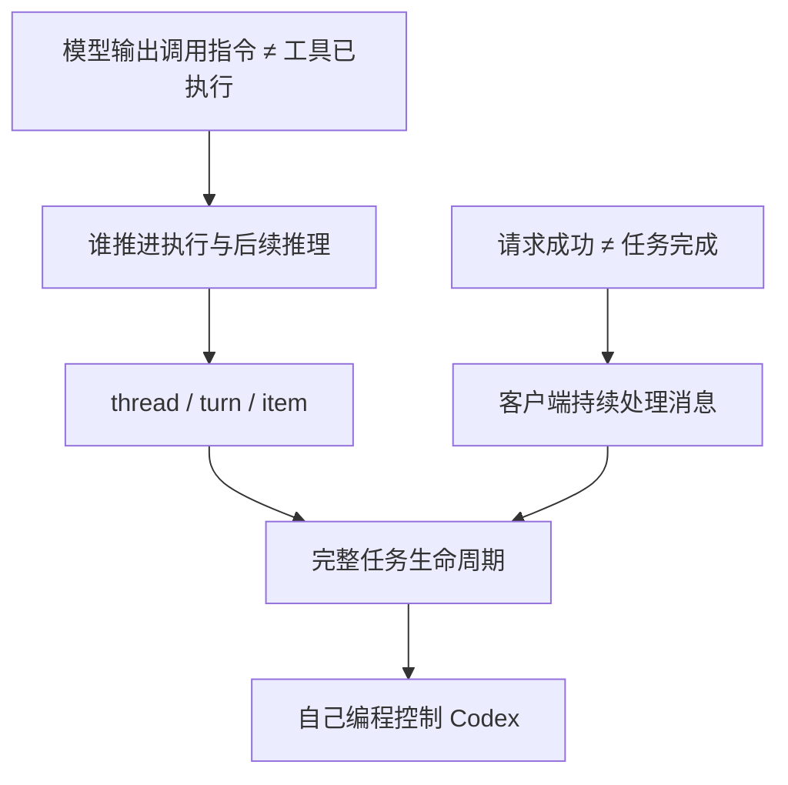
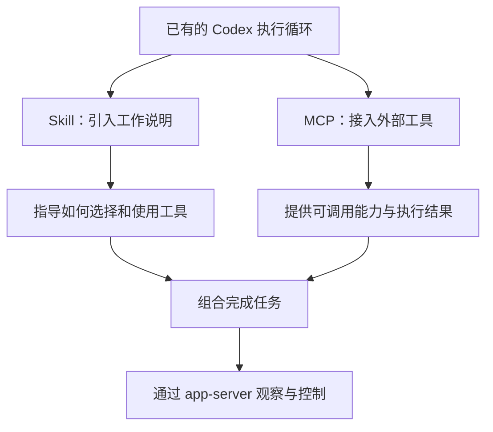

> [!quote] YOU

我想搞明白如何程序化的使用codex app server, 里面有哪些核心概念，而不是仅仅会使用codex客户端


> [!abstract] PI

可以，我们把目标放在**能自己写程序驱动 Codex**，而不是记住客户端的操作步骤。具体协议和概念我会核对官方资料，避免把不同版本或 SDK 的接口混在一起。

先确定一个实际落点，再摸清你对进程通信、异步事件这些基础的熟悉程度。


> [!question] Question
> 你最希望学完后，能用 Codex app-server 做出什么？
>
> 1. 写一个最小控制程序，真正弄懂运行机制（Recommended）
> 2. 把 Codex 接入自己的产品
> 3. 构建自动化任务系统
> 4. 先理解整体架构与核心概念


> [!example] Answer
> 4. 先理解整体架构与核心概念


> [!question] Quiz
> 先定位你已有的理解：一个模型接口返回了“调用 shell 执行 npm test”的工具调用。在这个时刻，实际发生了什么？
>
> 1. 模型已经执行了命令，接入它的程序只需要显示结果。
> 2. 模型把命令交给了操作系统，接入它的程序只需要等待。
> 3. 模型产出了调用指令，接入它的程序还需要执行命令。


> [!success] Quiz — correct ✓
> Your answer: 3. 模型产出了调用指令，接入它的程序还需要执行命令。
> Correct answer: 3
>
> 工具调用是模型生成的结构化指令，不是命令已经执行的证明。接入模型的程序需要安排执行，并把结果送回模型。这是区分“模型”与“agent 运行时”的关键。


> [!question] Quiz
> 再往程序化接入走一步：你的程序向 app-server 发送 turn/start，收到成功响应后，应该怎样判断这次任务完成了？
>
> 1. 继续接收过程消息，以 turn/completed 判断任务结束。
> 2. 成功响应就代表任务完成，读取响应里的最终答案。
> 3. 继续接收文本消息，以最后一段文本判断任务结束。


> [!success] Quiz — correct ✓
> Your answer: 1. 继续接收过程消息，以 turn/completed 判断任务结束。
> Correct answer: 1
>
> turn/start 的成功响应表示这一轮任务已建立，不表示执行完毕。后续工作通过异步消息报告；turn/completed 才表示这一轮结束，结束状态还可能是失败或被中断。


> [!question] Quiz
> 如果执行过程中需要用户批准一条命令，app-server 与你写的客户端之间如何配合？
>
> 1. 服务端发出带 id 的请求；客户端用对应 id 返回审批结果。
> 2. 服务端发出普通进度通知；客户端发送新的 turn/start 表达批准。
> 3. 服务端在原来的 turn/start 响应中询问；客户端重新提交该请求表达批准。


> [!success] Quiz — correct ✓
> Your answer: 1. 服务端发出带 id 的请求；客户端用对应 id 返回审批结果。
> Correct answer: 1
>
> 这是双向 RPC：app-server 也能充当请求发起方，等待客户端回答。审批不是普通进度通知，也不是一次新的用户任务；客户端需要识别服务端请求，并返回对应的响应。


> [!question] Quiz
> 假设 Codex 在一个会话里收到“修复测试”，随后读文件、改代码、跑了两次测试，最后回复用户。这些动作与 thread / turn / item 的关系，哪种描述正确？
>
> 1. 每次工具执行属于一个 thread，整次修复工作合起来形成一个 turn。
> 2. 每次模型调用属于一个 turn，命令执行和消息等分别形成 item。
> 3. 这次请求及后续工作属于一个 turn，命令执行和消息等分别形成 item。


> [!failure] Quiz — incorrect ✗
> Your answer: 2. 每次模型调用属于一个 turn，命令执行和消息等分别形成 item。
> Correct answer: 3
>
> thread 是会话；turn 是一次用户请求及其引发的 agent 工作；item 是其中的具体输入或输出单元。一个 turn 可以包含多次模型调用与工具执行，并不等于模型只回答一次。


> [!question] Quiz
> 沿着刚才的边界再确认一下：你写自己的客户端接入 app-server。模型决定读文件，读完后还需要继续推理。正常情况下，谁负责把工具结果交回模型、继续这轮工作？
>
> 1. 你的客户端负责推进，每次工具完成后再发一个 turn/start。
> 2. app-server 背后的 Codex 运行时负责推进，客户端处理交互。
> 3. 上游模型服务负责推进，直接读取本地工具的执行结果。


> [!question] Quiz — I don't know
> Your answer: I don't know
> Correct answer: 2
>
> app-server 暴露的是 Codex agent 的能力，而不只是模型调用的转发。正常的工具执行与后续模型调用由 Codex 运行时推进；你的客户端不需要为每一步重新发起 turn。


> [!abstract] PI

定位到了：你已经理解**模型产出工具调用、任务异步完成、服务端可以反向请求审批**。现在缺的不是通信基础，而是：

**一次用户任务中，谁负责持续推进工作？这段工作又如何对应 thread / turn / item？**

我们围绕这个缺口讲，不从 JSON-RPC 入门重来。

计划按三个步骤：
1. **划清职责**：你的程序、app-server 背后的 Codex 运行时、模型服务，分别做什么。
2. **推导核心概念**：从“修复一个测试”的完整过程理解 thread、turn、item，特别是为什么一次 turn 不等于一次模型调用。
3. **落到程序控制**：把任务映射成启动、事件、审批、结束与恢复，理解你的程序实际要管理什么。



接口细节已核对[官方文档](https://developers.openai.com/codex/app-server/)，讲解时会区分协议概念和内部实现。

按这个路线开始，可以吗？


> [!quote] YOU

好的 按这个路线来


> [!abstract] PI

先看一个具体任务：**你在自己写的网页里输入“修复


> [!abstract] PI

先解决第一个问题：**你写的程序，要接管多少工作？**

假设用户要求：“修复这个项目里失败的测试。”

你已经知道，模型输出“执行 `npm test`”，**不代表测试已经执行**。因此，要完成任务，模型之外必须有程序负责：

1. 调用模型，得到下一步指令。
2. 执行指令，例如运行测试、读取文件。
3. 把执行结果交回模型。
4. 继续上述过程，直到结束，或需要外部介入。

这就是这里说的 **agent loop（智能体执行循环）**。一次任务可以经过很多次模型调用。

### app-server 的关键边界

如果你直接接模型 API，这个循环需要你自己实现，或交给某个框架。

**接 Codex app-server，则已有 Codex 运行时负责推进这个循环。** app-server 把这套能力暴露给你的程序，而不是只帮你转发一次模型请求。

三方职责因此分开：

| 角色 | 在“修复测试”中负责什么 |
|---|---|
| **你的程序：客户端** | 提交任务、显示进度、收集并回复审批决定 |
| **Codex 运行时，经 app-server 暴露** | 组织模型调用、安排工具执行、处理结果并继续工作 |
| **模型服务** | 根据当前上下文，产出消息或下一步工具调用 |

这里的“客户端”不一定是界面：你写的 Python 脚本也可以是客户端。

**所以，你不是在编程控制每一次模型调用，而是在编程驱动一个已经具备执行循环的 Codex agent。**

这也解释了一个刚才容易混淆的点：模型读完文件后需要继续推理，通常不需要你的程序再发起一轮任务；那仍然是 Codex 在完成原来的任务。


> [!quote] YOU

好的 继续


> [!question] Quiz
> 假设你的客户端已提交“修复测试”，也已经处理了必要审批。Codex 跑测试后发现仍然失败，需要读文件再修改。正常情况下，下一步由谁推进？
>
> 1. 模型服务自行读取本地文件，继续执行修改命令。
> 2. Codex 运行时把失败结果交给模型，继续当前任务。
> 3. 客户端把失败结果交给模型，重新发起下一轮任务。


> [!success] Quiz — correct ✓
> Your answer: 2. Codex 运行时把失败结果交给模型，继续当前任务。
> Correct answer: 2
>
> 客户端提交的是一项交给 Codex 完成的任务，不是一次孤立的模型调用。测试失败可以成为当前执行循环的下一份输入，由 Codex 运行时继续推进；遇到审批等交互时才需要客户端配合。


> [!abstract] PI

接下来理解 **thread / turn / item**。它们不是三个要硬记的名词，而是三个不同尺度的问题。

### 1. Thread：我们在接着哪段对话？

你先说“修复测试”，完成后又说“给这次修改补上注释”。

第二句话需要前面的上下文。因此，需要一个对象把这段持续的会话关联起来，这就是 **thread（会话）**。

它不是操作系统的线程。

### 2. Turn：这一轮委托完成了吗？

“修复测试”可能经历：

运行测试 → 发现失败 → 读文件 → 修改 → 再测试 → 回复。

这些都是为了完成**同一次用户请求**，所以属于一个 **turn（任务轮次）**，而不是每调用一次模型就新开一轮。

之后你说“补上注释”，才发起下一个 turn。

**turn 划分的是用户委托的轮次，不是模型调用的次数。**

### 3. Item：这一轮里具体发生了什么？

只知道“正在修复”不够，你还需要知道它执行了什么命令、改了哪些文件、说了什么。

这些具体的输入或输出单元，就是 **item**。例如用户消息、命令执行、文件变更、agent 消息。

```text
Thread：这段开发会话
│
├─ Turn 1：修复测试
│  ├─ Item：用户消息“修复测试”
│  ├─ Item：命令执行 npm test
│  ├─ Item：读取文件的命令执行
│  ├─ Item：文件变更
│  ├─ Item：命令执行 npm test
│  └─ Item：agent 消息“已修复……”
│
└─ Turn 2：补上注释
   ├─ Item：用户消息“补上注释”
   ├─ Item：文件变更
   └─ Item：agent 消息“已补充……”
```

这是简化示例，不是固定执行顺序。

把它们压缩成三个问题：

- **Thread：接着哪段会话？**
- **Turn：完成哪一轮委托？**
- **Item：这一轮具体输入、输出了什么？**

注意：**item 也不等于一个流式消息包**。一条 agent 回复是一个 item，但它的文本可以分很多次增量消息传给你。


> [!quote] YOU

item是怎么生成的


> [!question] Quiz
> 先确认你想厘清的这个边界：模型分三段输出同一条回复的文本，这是否意味着产生了三个 item？
>
> 1. 是；每收到一段文本都会创建一个新 item。
> 2. 不是；三段文本可以是同一个 item 的增量。


> [!success] Quiz — correct ✓
> Your answer: 2. 不是；三段文本可以是同一个 item 的增量。
> Correct answer: 2
>
> item 是逻辑上的输入或输出单元，传输消息则是在报告这个单元的进展。同一条回复可以对应一个 item，而它的文本通过多条增量通知逐步到达。


> [!abstract] PI

**item 是 Codex 在处理输入、生成回复和执行工具时，通过 app-server 暴露出来的结构化工作记录。不是客户端自己划分的，也不全是模型直接生成的。**

为什么需要它？因为客户端看不到服务端内部执行过程，需要一种统一表示来知道“发生了什么”。

### 谁提供内容，谁形成 item？

| 工作来源 | 暴露的 item 类型 |
|---|---|
| 你通过 `turn/start` 提交用户输入 | `userMessage` |
| 模型生成回复 | `agentMessage` |
| Codex 安排执行 shell 命令 | `commandExecution` |
| Codex 执行文件修改 | `fileChange` |
| Codex 调用 MCP 工具 | `mcpToolCall` |

因此要区分：**模型可能决定“应该运行测试”，而 Codex 运行时把命令执行这件事表示为 item，并更新它的执行状态。**

### 一个 item 如何逐渐形成？

以执行 `npm test` 为例，下面是简化的事件过程：

```text
Codex 准备执行 npm test
  ↓
item/started
  item = { id: "cmd_1", type: "commandExecution", ... }
  ↓
item/commandExecution/outputDelta
  itemId = "cmd_1"，新增输出：“Running tests…”
  ↓
item/commandExecution/outputDelta
  itemId = "cmd_1"，新增输出：“2 tests failed”
  ↓
item/completed
  item = { id: "cmd_1", ..., exitCode: 1, ... }
```

这里**只产生了一个命令执行 item**。后续消息通过相同的 `itemId` 报告它的进展；最终的 `item/completed` 给出完整最终状态。不同类型的 item 不一定都有增量消息。

你的客户端通常只需要：

- 收到 `item/started`：登记这个 item。
- 收到增量消息：按 `itemId` 更新显示。
- 收到 `item/completed`：用最终状态收尾。

**一句话：item 是被观察的工作单元，事件是这个工作单元随时间发生的更新。**

另外，命令 item 完成不代表整个 turn 完成——测试失败后，Codex 还可能继续修改，产生更多 item。

[官方 item 定义](https://developers.openai.com/codex/app-server/#items)


> [!quote] YOU

继续


> [!question] Quiz
> 你收到命令 item「npm test」的 item/completed，退出码为 1。此时客户端应该如何理解？
>
> 1. 这条命令尚未结束；应等退出码变成 0 才记录完成。
> 2. 这条命令已结束；这轮任务可能继续，应继续处理消息。
> 3. 这轮任务已失败；应停止处理消息，等待用户重试。


> [!success] Quiz — correct ✓
> Your answer: 2. 这条命令已结束；这轮任务可能继续，应继续处理消息。
> Correct answer: 2
>
> 完成描述生命周期，退出码描述命令结果。命令执行结束且测试失败，可以成为 Codex 下一步修复的依据。item/completed 只结束该 item；整轮任务是否结束，要看 turn/completed。


> [!abstract] PI

现在把这些概念串起来：**你的程序怎样实际驱动一次任务？**

### 1. 建立通信，而不是模拟操作客户端

最基本的方式是，你的程序启动：

```bash
codex app-server
```

默认通过 **标准输入／标准输出（stdio）** 双向通信，每行一个 JSON 消息：

- 你的程序写入它的 stdin：发送请求或回复。
- 你的程序读取它的 stdout：接收响应、事件或反向请求。

这里的 “server” **不意味着必须部署一个 HTTP 服务**。它可以就是你的程序启动的本地子进程。

### 2. 一次任务的完整流程

下面是协议流程示意，不是可直接发送的 JSON：

```text
你的程序                           app-server
   │                                   │
   ├── initialize ─────────────────────>│ 介绍客户端、声明能力
   │<────────────────────────── 响应 ──┤
   ├── initialized ───────────────────>│ 初始化握手完成
   │                                   │
   ├── thread/start ──────────────────>│ 创建会话
   │<────────────────────── thread.id ─┤
   │                                   │
   ├── turn/start(threadId, 输入) ─────>│ 提交这一轮任务
   │<──────────────────────── turn ────┤ 已建立，不等于已完成
   │                                   │
   │<────────── item/started 等事件 ────┤
   │<────────── 文本或命令输出增量 ─────┤
   │<────────── item/completed ─────────┤
   │              ……                   │
   │<────────── turn/completed ─────────┤ 这一轮结束
```

之后继续对话，通常沿用同一个 `threadId`，再发送 `turn/start`，不必重新初始化或新建会话。

### 3. 你的程序真正需要的是“消息分派器”

因为任务执行期间，服务端不只是返回答案，还可能要求审批。所以不能写成“发送请求 → 把下一行当答案”。

读取到的消息，要分成三类：

| 收到的消息 | 如何识别 | 你的程序怎么处理 |
|---|---|---|
| **请求的响应** | 有 `id`，以及 `result` 或 `error` | 找到对应的待处理请求 |
| **通知／事件** | 有 `method`，没有 `id` | 更新任务状态或显示 |
| **服务端请求** | 有 `method`，也有 `id` | 处理请求，并用对应 `id` 回复 |

这里有两套不要混淆的 ID：

- **RPC `id`**：这一条请求和哪一条响应配对？
- **`threadId` / `turnId` / `itemId`**：消息说的是哪段会话、哪轮任务、哪个工作单元？

**前者关联通信，后者关联工作。**

这样，你的程序就不只是“调用一个函数等答案”，而是在维护一条双向通信连接，观察并参与 Codex 的任务生命周期。


> [!quote] YOU

codex app server通常都通过什么形式来提供，如何自部署一个


> [!abstract] PI

可以。这里先区分两个目标：**在自己的机器上运行 Codex agent**，和**把它开放成供其他机器连接的服务**。两者的通信方式和安全要求不同。

我先核对官方安装、启动命令及远程连接限制，再给你最小部署步骤。

你说的“自部署”，主要是指哪一种？

- **本地运行**：你的程序和 Codex 在同一台机器，通过子进程通信。
- **远程运行**：Codex 在服务器上，你的程序从另一台机器连接。

我正在核对两种方式的官方支持范围与启动命令。


> [!abstract] PI

**app-server 随 Codex CLI 一起分发，是 `codex` 的一个子命令，不需要另装一个服务端产品。**

“自部署”的是 **Codex agent 运行时**，不是模型本身。默认情况下，模型推理仍由云端服务提供；文件读写、命令执行则发生在运行 app-server 的机器上。

## 1. 最小部署：安装、登录、启动

```bash
# 安装
npm install -g @openai/codex

# 登录模型服务
codex login

# 在准备操作的项目目录启动
cd /path/to/project
codex app-server
```

默认使用 **stdio**，不监听网络端口。启动后没有聊天界面是正常的：它在等待程序发送协议消息。

实际集成时，由你的程序创建这个子进程：

```text
你的程序
  └─ 启动 codex app-server
       ├─ stdin：接收你的协议消息
       ├─ stdout：返回协议消息
       └─ 操作当前机器上的项目文件、执行命令
```

**建议先用这种方式学习**：不需要域名、反向代理或端口配置。

## 2. 远程部署：服务器上跑 Codex

当前官方也提供 WebSocket transport：

```bash
codex app-server --listen ws://127.0.0.1:4500
```

但它目前被标为**实验性、不支持生产使用**。具体选项也应以安装版本的帮助为准：

```bash
codex app-server --help
```

学习时可以让服务只监听服务器的回环地址，再通过 SSH 隧道连接：

```bash
# 在你的电脑上运行
ssh -N -L 4500:127.0.0.1:4500 user@server
```

你的程序连接本机 `ws://127.0.0.1:4500`，流量通过 SSH 到服务器。**不要直接把未保护的监听端口开放到公网。**

## 3. 两种“认证”不要混淆

- **`codex login`**：Codex 有权调用模型服务。
- **远程连接认证**：谁有权控制你的 app-server。

前者不自动解决后者。能够控制这个 agent 的程序，可能借助它读取文件、执行命令，因此部署时还要限制运行账户权限、工作目录访问与执行权限。

一句话总结：**先安装普通 Codex，再把它以 `app-server` 模式启动；你的程序取代交互界面，通过协议控制它。**

来源：[安装](https://github.com/openai/codex#quickstart) · [App Server](https://developers.openai.com/codex/app-server/) · [认证](https://developers.openai.com/codex/auth/)


> [!quote] YOU

下面介绍一下codex是如何实现扩展功能的，如skills mcp


> [!question] Quiz
> 先用一个例子定位你的理解：你想让 Codex 按团队规范审查代码，也想让它读取公司内部工单。你认为这两种扩展的核心区别是什么？
>
> 1. 前者主要提供新的模型，后者主要提供额外的对话上下文。
> 2. 前者主要提供工作方法，后者主要提供外部数据访问能力。
> 3. 两者都主要是提示词文件，只是分别用于代码和工单。


> [!success] Quiz — correct ✓
> Your answer: 2. 前者主要提供工作方法，后者主要提供外部数据访问能力。
> Correct answer: 2
>
> 审查规范主要解决“按什么步骤和标准做”；访问内部工单主要解决“通过什么接口取得数据”。Skills 与 MCP 的分工可以从这个区别入手：前者组织工作知识与流程，后者连接外部工具和资源。


> [!question] Quiz
> 更具体一点：一个 skill 的目录里附带了 scripts/check.py，并在 SKILL.md 里说明何时运行它。这个脚本怎样参与任务？
>
> 1. Codex 发现目录时，自动把脚本注册成一个 MCP 工具。
> 2. Codex 启动时加载脚本，让它持续监听每一轮任务。
> 3. Codex 读取说明，需要时通过已有的命令执行能力运行脚本。


> [!success] Quiz — correct ✓
> Your answer: 3. Codex 读取说明，需要时通过已有的命令执行能力运行脚本。
> Correct answer: 3
>
> 附带脚本并不会自动把 skill 变成 MCP server 或常驻插件。Skill 提供说明和辅助文件；Codex 可以按照说明使用已有的工具执行脚本，执行仍受当前权限与沙箱约束。


> [!question] Quiz
> 如果一个 skill 要求“先用公司工单 MCP 工具获取需求，再审查代码”，但 Codex 没有配置这个 MCP server，会发生什么？
>
> 1. Skill 中提到的 MCP 工具，会自动转成 app-server 的客户端请求。
> 2. Skill 的说明仍可读取，但不会凭空提供缺失的 MCP 连接。
> 3. Skill 被读取后，会自动按工具名称发现并连接公司 MCP 服务。


> [!success] Quiz — correct ✓
> Your answer: 2. Skill 的说明仍可读取，但不会凭空提供缺失的 MCP 连接。
> Correct answer: 2
>
> 工作说明与工具连接是两层机制。Skill 可以要求使用某项能力，但只写工具名称不会建立连接、完成认证或授予权限；MCP server 仍需配置并可访问。


> [!question] Quiz
> 如果安装了很多 skills，Codex 通常如何把这些工作说明提供给模型？
>
> 1. 先提供名称和描述等索引，选用后再读取完整说明。
> 2. 先把所有说明转换成工具参数，调用时不再读取文本。
> 3. 先读取所有完整说明，每轮任务都一起交给模型。


> [!success] Quiz — correct ✓
> Your answer: 1. 先提供名称和描述等索引，选用后再读取完整说明。
> Correct answer: 1
>
> Skills 使用渐进式加载：先让 Codex 知道有哪些技能以及适用范围，需要时才读取完整 SKILL.md 和相关材料。这让大量工作方法不必同时占据上下文。


> [!abstract] PI

你已经理解了基本分工，也知道 skill 的按需加载机制。接下来不再停留在“是什么”，而是看**它们如何接入你已经理解的 agent loop**。

我建议按这个顺序讲：

1. **Skill 的实现链路**：发现目录 → 提供技能索引 → 读取 `SKILL.md` → 指令进入上下文 → Codex 按说明使用工具。重点解释：它为什么不需要独立的插件执行器。
2. **MCP 的实现链路**：连接服务 → 发现工具及参数定义 → 模型选择调用 → Codex 转发执行 → 结果回到模型。重点解释：模型、Codex、MCP server 各负责哪一步。
3. **组合与部署**：用“读取工单并修复代码”贯穿两者，说明配置应该放在 app-server 所在机器还是客户端，以及权限边界。



这次会以**配置和消息流**为主，不再反复测概念。按这个顺序展开，可以吗？


> [!quote] YOU

可以


> [!abstract] PI

先看 **Skill 怎样接入 Codex 的执行循环**。

核心是：**Skill 主要通过给模型提供工作说明来改变行为，而不是往 Codex 进程里加载一段插件代码。**

## 1. 从一个普通需求推导出来

假设团队要求每次修复问题都：

1. 先复现。
2. 再定位原因。
3. 做最小修改。
4. 重跑测试。

你可以每次都把这段话发给 Codex。模型收到这些指令后，通过已有的读文件、执行命令等工具完成工作。

但每次重复很麻烦，因此把它存成文件：

```text
fix-bug/
├── SKILL.md
├── scripts/
│   └── check.py
└── references/
    └── testing-guide.md
```

其中 `SKILL.md` 可以是：

```markdown
---
name: fix-bug
description: 修复缺陷或失败测试时使用。
---

1. 修改代码前，先复现问题。
2. 根据失败结果定位原因。
3. 进行最小必要修改。
4. 重跑相关测试。

需要了解项目测试约定时，读取 references/testing-guide.md。
需要辅助检查时，运行 scripts/check.py。
```

**本质变化只是：重复输入的工作说明，变成了可发现、可复用的工作包。**

## 2. Codex 如何知道它存在？

Codex 从约定的技能目录发现 skills，先向模型提供轻量索引，包括名称、描述和路径。

概念上像这样：

```text
可用技能：
- fix-bug：修复缺陷或失败测试时使用。
  位置：.../fix-bug/SKILL.md
- review-code：审查代码变更时使用。
  位置：.../review-code/SKILL.md
```

这时不需要把每个技能的完整说明、所有参考资料都塞进上下文。

所以 `description` 不只是给人看的介绍，**也是 Codex 判断何时使用技能的重要依据**。

## 3. 被选用后发生什么？

用户提出：

> 帮我修复这个失败测试。

接下来可能发生：

```text
模型看到任务和技能索引
  ↓
判断 fix-bug 适用
  ↓
Codex 读取 fix-bug/SKILL.md
  ↓
完整说明进入模型上下文
  ↓
模型按照说明规划下一步
  ↓
Codex 使用已有工具执行
```

用户也可以显式指定，例如：

```text
$fix-bug 修复这个失败测试
```

隐式选用依赖模型判断，**不是一个保证命中的规则路由器**。

## 4. 附带脚本怎样执行？

假如模型按照说明决定运行 `scripts/check.py`，仍然走已有的命令执行路径：

```text
Skill 中的说明
  ↓
模型提出运行脚本
  ↓
Codex 的命令工具
  ↓
权限／沙箱约束下执行 Python
  ↓
执行结果回到模型
```

不是发现 skill 时就自动运行脚本，也不会自动把脚本注册成 MCP 工具。

这还揭示了一个重要限制：

**Skill 提供的是行为指引，不是程序级强制约束。**  
“必须先测试再修改”写在 skill 里，是让模型遵循的指令；要强制保证，则需要执行层或外部验证机制。

## 5. 与你的 app-server 客户端有什么关系？

通常，你的客户端不需要实现“技能解析器”。

你只需要让 **app-server 所在环境能发现相应 skill**，然后提交任务。读取说明、调用命令、处理执行结果，都发生在 Codex 的工作过程中；客户端接收相应事件，并处理必要审批。

因此可以把这条链路记为：

> **Skill → 给模型增加工作说明 → 改变工具使用方式 → 仍由原来的 agent loop 执行。**

下一层 MCP 则不同：它不只是告诉 Codex **怎么做**，而是让执行循环多出**可以调用的外部能力**。

[官方 Skills 文档](https://developers.openai.com/codex/skills/)


> [!quote] YOU

继续


> [!abstract] PI

接着看 **MCP 怎样把外部能力接入同一个执行循环**。

假设你要求：

> 读取公司工单 BUG-123，然后修复代码。

Skill 可以告诉 Codex“先读工单，再复现问题”，但它不能凭文字获得公司工单系统的访问能力。这里缺的是一个真正可调用的接口。

## 1. MCP server 是接口的提供方

例如，你部署一个连接公司工单系统的 MCP server，提供：

```text
get_issue(id)                 获取工单
add_comment(issue_id, text)   添加评论
```

MCP 规定客户端如何发现和调用这些能力。**具体如何访问工单数据库或 API，由这个 MCP server 实现。**

这里有两个不同的“服务端”：

```text
你写的客户端
    │ app-server 协议
    ▼
Codex app-server / 运行时
    │ MCP 协议
    ▼
工单 MCP server
    │ 工单系统 API
    ▼
公司工单系统
```

**Codex 对你的程序是服务端，对 MCP server 则是客户端。**

## 2. 先连接，再发现工具

在运行 Codex 的环境中配置 MCP server。通常配置位于：

```text
~/.codex/config.toml
```

连接方式主要有两种：

| 方式 | MCP server 在哪里运行 |
|---|---|
| **stdio** | Codex 启动一个本地子进程，通过标准输入输出通信 |
| **Streamable HTTP** | Codex 连接一个已经运行的 HTTP 服务 |

建立连接后，Codex 可以获取工具清单及其定义。概念上，一个工具定义包含：

```text
名称：get_issue
描述：根据编号获取工单内容
输入：{ id: string }
```

这些描述和参数结构，让模型知道**有哪些工具、什么时候用、需要传什么参数**。

注意：**模型看到的是工具定义，不是 MCP server 的源代码。**

## 3. 一次调用经过谁？

用户要求读取 `BUG-123` 后：

```text
模型：决定调用 get_issue({ id: "BUG-123" })
  ↓
Codex：通过 MCP 连接发出工具调用
  ↓
MCP server：使用自己的凭据访问工单系统
  ↓
MCP server：返回工单内容
  ↓
Codex：把工具结果交回模型
  ↓
模型：根据需求继续分析、读代码、提出修改
```

三方职责很明确：

- **模型选择调用什么，以及参数是什么。**
- **Codex 负责协议调用与执行循环。**
- **MCP server 实现外部操作。**

在 app-server 客户端这一侧，这类工作会表现为 `mcpToolCall` 等相关事件。**普通 MCP 调用不需要你的客户端代为执行。**

## 4. Skill 和 MCP 在哪里配合？

还是“修复工单”：

| 层次 | 提供什么 |
|---|---|
| **Skill** | 先获取工单、复现、最小修改、验证、汇报 |
| **工单 MCP** | 获取工单、添加评论的实际接口 |
| **Codex 内建工具** | 读取本地文件、修改代码、运行测试 |
| **Codex 执行循环** | 把这些步骤串起来，持续推进任务 |

因此：

**Skill 能指导 Codex 使用 MCP，但不会凭空建立 MCP 连接。MCP 能提供工具，但不会自动提供完整的解决问题流程。**

另外，本地沙箱不等于远程系统的权限边界。若 MCP server 持有“修改工单”的凭据，它就可能产生远程副作用，需要单独控制工具权限与认证。

一句话压缩：

> **Skill 扩展工作方法；MCP 接入工具和数据；Codex 的执行循环把两者结合起来。**

[官方 MCP 文档](https://developers.openai.com/codex/mcp/)


> [!quote] YOU

理论是是不是skills + cli可以基本替换掉mcp


> [!abstract] PI

**是的。如果你说的是“访问外部系统、执行操作”，Skill + CLI 可以替代很多 MCP 工具。** 但这是**能力可以替代，不代表协议和集成方式等价**。

### 为什么能替代？

真正完成工作的，是调用 API、读数据库的代码，不是 MCP 本身。

同一个“读取工单”能力可以有两种入口：

```text
方案 A：
模型 → Codex 命令工具 → issues CLI → 工单 API
                         ↑
                   Skill 说明怎么用

方案 B：
模型 → Codex MCP 客户端 → 工单 MCP server → 工单 API
```

只要 CLI 有相同的权限、能调用相同 API，就可以得到相同结果。**甚至不一定需要 Skill：CLI 的帮助信息足够清楚，也能使用；Skill 主要补充使用方法和工作流程。**

### 那 MCP 多提供了什么？

它的价值主要在**统一接入约定**，而不是提供 CLI 做不到的计算能力。

| 问题 | Skill + CLI | MCP |
|---|---|---|
| 有哪些操作？ | Skill、`--help` 等说明 | 标准化工具发现 |
| 参数怎么传？ | 命令行参数约定 | 工具的结构化参数定义 |
| 结果怎么读？ | 自定输出，最好支持 JSON | 协议规定的结果结构 |
| 怎么接入不同 agent？ | 需要命令执行环境与相应说明 | 接入支持 MCP 的宿主 |
| 安装与认证在哪里处理？ | 管理 CLI、依赖与凭据 | 管理 MCP 服务、连接与认证 |

CLI 同样可以有严格参数校验、JSON 输出、良好的认证和错误处理。**这些不是 MCP 独占的能力，只是 CLI 路线需要你自行制定或采用约定。**

此外，MCP 不仅有工具调用，也有资源等协议能力；只替换工具命令，并不等于实现了完整 MCP。

### 放到你的 app-server 场景

如果你控制运行环境，而且已有好用的 CLI：

> **先用 CLI，必要时加 Skill，是很合理的选择。**

例如让 Codex 通过 `gh` 操作 GitHub，未必需要再接一个覆盖相同功能的 MCP server。

如果你要把同一套能力提供给多个不同的 agent 产品，或者想让它们通过统一方式发现和调用工具，MCP 的价值就更明显。

安全上两者也都不自动可靠：CLI 执行权限、MCP 工具权限，以及它们持有的外部系统凭据，都需要控制。

**所以你的推断成立：MCP 不是扩展能力的必经之路，它是一种标准化的接入方式。**


> [!quote] YOU

下面我们在来深入了解一下 subagent的实现


> [!question] Question
> 你想先深入哪一种 subagent 实现？
>
> 1. Codex 内置 subagent（Recommended）
> 2. 自己通过 app-server 实现多 agent 调度
> 3. 先比较两者的架构边界


> [!example] Answer
> 1. Codex 内置 subagent（Recommended）


> [!question] Quiz
> 先确认一个实现上的关键边界：主 agent 让 subagent 专门检查测试。要称得上把任务委派给另一个 agent，而不只是换一个角色继续回答，最关键的是什么？
>
> 1. 子 agent 有自己的任务上下文和执行循环。
> 2. 子 agent 必须使用另一个厂商的模型。
> 3. 子 agent 必须运行在另一台机器上。


> [!success] Quiz — correct ✓
> Your answer: 1. 子 agent 有自己的任务上下文和执行循环。
> Correct answer: 1
>
> 委派的关键是让另一个 agent 在自己的任务上下文中推进工作，并把结果交回来。模型厂商和机器位置是部署选择，不是构成 subagent 的必要条件；Codex 的具体组织方式需要进一步看其运行时实现。


> [!question] Quiz
> 如果两个 subagent 各自有独立的对话上下文，但操作同一个项目目录，这种“上下文隔离”能否防止它们同时修改同一文件时互相干扰？
>
> 1. 能；独立上下文会让文件修改自动相互隔离。
> 2. 不能；对话状态分开，不代表工作目录分开。
> 3. 能；独立上下文会让所有文件操作自动串行。


> [!success] Quiz — correct ✓
> Your answer: 2. 不能；对话状态分开，不代表工作目录分开。
> Correct answer: 2
>
> 上下文隔离解决的是各自看到哪些消息、如何推理；文件系统隔离解决的是修改落在哪里。它们是两件事。若工作目录共享，仍需通过任务分工、独立 worktree 等方式避免写入冲突。


> [!abstract] PI

这两个边界你已经很清楚：**独立执行循环不等于独立机器，上下文隔离也不等于文件隔离。**

接下来要核实 Codex 的具体实现：模型发出创建子 agent 的工具调用后，运行时创建什么对象、交给它哪些上下文，以及它完成后如何唤回主 agent。我正在对照官方文档和源码，避免把一般的多 agent 设计当成 Codex 的实际机制。

源码核实后，我们沿着这一条调用链拆解：

```text
主 agent 决定委派
→ 运行时创建子 agent
→ 构造子 agent 的初始上下文
→ 子 agent 独立执行
→ 返回结果，主 agent 继续
```

重点看三件事：**创建的到底是什么、共享与隔离哪些状态、父子之间如何通信。**


> [!abstract] PI

源码核实了。先抓住核心：

**Codex 内置 subagent，是运行时创建的一个独立子 thread，拥有自己的上下文和执行循环；不是简单换一段角色提示词，也不是必然启动另一个 Codex 进程。**

下面沿着一次委派展开。具体工具名会随版本变化，先理解机制。

## 1. 模型提出委派，运行时真正创建

主 agent 接到：

> 修复登录功能，同时检查是否有相关安全问题。

它可以生成一个 `spawn_agent` 工具调用，表达：

```text
任务：检查登录模块的安全问题，只分析，不修改文件。
角色：审查者
```

这时还只是**模型输出了一个创建请求**。

Codex 的工具处理器收到请求后，才会：

1. 检查配置及限制。
2. 构造子 agent 的配置与初始上下文。
3. 创建新的 thread，记录父子关系。
4. 提交委派任务，启动子 agent 的执行循环。
5. 向主 agent 返回子 agent 标识。

和 shell 工具一样：**模型决定调用，运行时执行调用。**

## 2. 创建的是 thread，不一定是进程

当前本地实现中，父子 agent 共享本地运行时，通过异步任务驱动，并不是每次都启动一个新的 `codex` 可执行程序。

```text
同一个 Codex 本地运行时
│
├─ 主 thread
│   └─ 模型调用 → 工具执行 → 模型调用……
│
└─ 子 thread
    └─ 模型调用 → 工具执行 → 模型调用……
```

它们可以并行推进，各自拥有对话状态。

所以这里的“另一个 agent”，主要指**另一份执行中的 agent 状态**，而不是另一台机器或另一个程序。

## 3. 子 agent 起初知道什么？

需要区分两种情况：

- **新上下文**：由子 agent 的配置、指令和委派任务构成，不默认复制父 agent 的全部对话。
- **Fork 上下文**：以父 agent 的历史快照为起点；当前源码有不同的历史复制模式。

关键是：**复制历史不等于共享一个实时上下文。**

即使一开始拿到了相同历史，之后也分别增长：

```text
父历史 ──复制──> 子历史
  │               │
新增父消息       新增子消息
```

父 agent 后来知道的事情，不会仅仅因为发生过 fork，就自动成为子 agent 的新消息。

## 4. 哪些隔离，哪些可能共享？

| 状态 | 典型情况 |
|---|---|
| 对话历史、执行进度 | 各自独立 |
| 模型配置 | 可以继承，也可以覆盖 |
| 工作目录 | 通常继承，不自动创建独立副本 |
| 文件修改 | 若使用同一目录，彼此可见且可能冲突 |
| 权限与沙箱 | 由运行时策略约束，不因创建子 agent 自动放宽 |

因此，“让子 agent 只分析、不修改”是一种任务分工；**如果需要强制只读，还要有权限层面的限制**。

## 5. 子 agent 怎么把结果交回来？

创建后，主 agent 可以继续自己的工作，也可以等待子 agent。

子 agent 完成任务时，运行时会将完成信息路由回父 thread，主 agent 再根据结果继续推理、整合答案。它并不是自动把子 agent 的全部原始执行历史塞进父上下文。

概念上：

```text
主 agent：修复登录问题 ──────────────────> 整合结果
               │                            ↑
               └─ 子 agent：安全审查 ──完成──┘
```

当前源码提供创建、等待、追加输入、打断或关闭等协作工具，但存在不同版本的工具接口，不能把这些内部工具名当成稳定的 app-server RPC 方法。

## 6. 从你的 app-server 客户端看

你仍然使用已经学过的对象：

- 父 agent 是一个 **thread**。
- 子 agent 是另一个 **thread**，带有 subagent 来源信息。
- 子 thread 内仍有自己的 **turn / item**。
- 父 thread 中可以出现 `collabAgentToolCall` 等协作记录，关联父子 thread。

**内置委派由 Codex 运行时管理，你的客户端不需要自己实现子 agent 调度循环。**

最值得记住的是：

> **Subagent = 独立上下文与执行循环 + 父子任务关系 + 运行时消息路由。文件隔离是另一回事。**

源码：[创建子 agent](https://github.com/openai/codex/blob/main/codex-rs/core/src/agent/control/spawn.rs) · [完成结果路由](https://github.com/openai/codex/blob/main/codex-rs/core/src/agent/control/completion.rs)


> [!quote] YOU

好的 现在我们汇总一下我们所有的讨论，给出下个阶段应该在深入了解的问题


> [!abstract] PI

## 一、我们已经建立的整体模型

```text
你的客户端
    │ app-server 协议：请求、响应、事件、反向请求
    ▼
Codex 运行时
    ├─ 管理 thread / turn / item
    ├─ 调用模型，推进 agent loop
    ├─ 执行内建工具：命令、文件操作等
    ├─ 加载 Skills：工作方法与说明
    ├─ 连接 MCP servers：外部工具与数据
    └─ 创建 Subagents：委派任务、独立执行、回收结果
```

### 1. App-server：程序控制 Codex 的入口

- 随 Codex CLI 提供，通过 `codex app-server` 启动。
- 默认通过 **stdio + 逐行 JSON** 通信，不要求部署 HTTP 服务。
- 部署的是 agent 运行时，不是模型推理服务。
- Codex 负责模型与工具之间的执行循环；你的程序负责提交任务、处理消息和交互。
- WebSocket 支持及内部协作接口有版本与实验性限制，需要核对实际安装版本。

### 2. Thread / Turn / Item：三个不同尺度

| 概念 | 回答的问题 |
|---|---|
| **Thread** | 接着哪段会话？ |
| **Turn** | 正在完成哪一轮用户委托？ |
| **Item** | 这一轮具体输入、输出或执行了什么？ |

特别重要：

- 一次 turn 可以包含多次模型调用和工具执行。
- 一个 item 可以通过多条增量事件逐步更新。
- `turn/start` 成功，不等于任务完成。
- `item/completed` 不等于整个 turn 完成；命令结束也不等于命令成功。

### 3. 通信：不是简单的一问一答

客户端需要区分：

- **响应**：回答客户端之前的请求。
- **通知**：报告进度和状态。
- **服务端请求**：例如要求客户端提供审批决定。

两套 ID 各司其职：

> RPC `id` 关联请求与响应；`threadId / turnId / itemId` 关联工作对象。

### 4. Skills / CLI / MCP：扩展方式不同

- **Skill**：按需加载的工作说明，可以附带脚本和参考资料。
- **CLI**：通过命令执行能力访问外部系统或完成操作。
- **MCP**：标准化发现和调用外部工具、访问上下文的接入方式。

你的判断成立：**Skill + CLI 可以替代很多 MCP 工具能力。** MCP 的主要价值是统一接入约定，不是提供不可替代的计算能力。

但工作说明不等于强制规则，接入工具也不等于获得权限。

### 5. Subagent：运行时管理的任务委派

- 主模型提出委派，运行时创建独立子 thread。
- 子 agent 有自己的上下文和执行循环。
- 当前本地实现不要求为每个子 agent 启动独立 OS 进程。
- 可以从新上下文开始，也可以复制父历史；复制不等于实时共享。
- 完成信息回到父 thread，由主 agent 整合。
- **上下文隔离不等于文件系统隔离。**

---

## 二、下阶段最值得深入的问题

建议从“知道各部分是什么”，转向 **“系统运行时，状态、权限与故障如何被控制”**。

### 第一优先：实现一个最小客户端，验证完整生命周期

需要回答：

1. 如何建立连接、初始化、创建 thread 和启动 turn？
2. 多个请求与事件交错到达时，如何正确分派？
3. 如何处理审批，而不阻塞整个消息读取循环？
4. 如何判断成功、失败、中断，以及进程意外退出？
5. 客户端需要保存哪些状态，哪些以服务端为准？

**产出：**一个能提交任务、显示过程、回复审批并识别结束状态的小程序。

### 第二优先：上下文与持久化到底如何工作？

需要回答：

1. 一次模型请求究竟包含哪些内容？
2. 项目指令、Skills、工具定义和历史结果怎样进入上下文？
3. 上下文过长后怎样压缩，哪些信息可能丢失？
4. thread 历史、模型当前上下文、磁盘文件分别是什么状态？
5. 断开连接、重启进程和 `thread/resume` 分别意味着什么？

**目标：**不再把“会话历史存在”误认为“模型此刻看到了全部历史”。

### 第三优先：权限与安全边界

需要回答：

1. 审批策略和沙箱分别限制什么？
2. CLI、MCP、子 agent 的权限从哪里来？
3. 哪些规则只是提示词，哪些由运行时强制执行？
4. 多用户使用同一个服务时，如何隔离文件、凭据和会话？

**目标：**明确“模型想做”“用户批准”“运行时允许”是三个不同层次。

### 第四优先：并发、委派与故障恢复

需要回答：

1. 什么时候应该使用 subagent，而不是主 agent 直接做？
2. 委派任务应该提供多少上下文？
3. 多个 agent 修改同一仓库，如何避免冲突？
4. 子任务失败、超时或被取消后，父任务如何处理？
5. 重试是否会重复执行已有副作用？

**目标：**从“能并行运行”走向“并行结果可靠”。

---

## 推荐的下一步

**先写最小 app-server 客户端，并逐条解释真实消息。**

我们已经有了概念地图；下一阶段最有价值的不是继续增加名词，而是拿一次真实的“读文件 → 执行命令 → 返回结果”，观察这些概念如何实际运转。


> [!quote] YOU

好的 帮我规划一个写最小 app-server客户端的项目


> [!abstract] PI

🥷 建议把它做成一个**学习用的终端客户端**：直接连接本地 `codex app-server`，显示协议消息和任务进度，不先做网页、多 agent 或 MCP 集成。这样每增加一个功能，都能对应我们讨论过的一个核心概念。

先确定实现语言，再把范围、里程碑和验收标准定下来；这一步只规划，不写代码。


> [!abstract] PI

环境提示：规划技能包有可选更新（3.32.0 → 3.38.0），不影响本次规划，我不会自动更新。


> [!question] Question
> 这个学习项目，你希望用哪种语言实现？
>
> 1. TypeScript + Node.js（Recommended）
> 2. Python
> 3. 其他语言


> [!example] Answer
> 1. TypeScript + Node.js（Recommended）


> [!abstract] PI

本机前置条件已具备：Node.js 22、Codex CLI 0.147.0，且已使用 ChatGPT 登录。当前目录没有现有应用代码或项目规则需要兼容。

我会按这个已安装版本核对协议，并把项目划成“只读任务跑通 → 审批与修改 → 恢复与中断”三个可独立验收的阶段。不会先加入高层 SDK，以免隐藏你要学习的通信细节。


> [!question] Question
> 这个项目你希望如何推进实现？
>
> 1. 逐阶段一起写、每阶段观察真实协议（Recommended）
> 2. 先一次实现完整最小客户端，再逐模块讲解
> 3. 我自己写，你提供计划和验收任务


> [!example] Answer
> 1. 逐阶段一起写、每阶段观察真实协议（Recommended）


> [!abstract] PI

确定：**逐阶段一起写，每阶段都能运行并观察真实消息**。

第一阶段会刻意限制为：本地 stdio、单会话、单轮任务、只读项目目录、实时输出文本。先把“客户端请求已返回”和“Codex 任务已结束”这两个状态真正分开；协议类型正在用本机 Codex 版本核验。

我会把计划整理成三个阶段，每阶段都有明确的演示任务、测试和完成标准。待本机协议核验返回，就给你完整方案；暂不创建文件或启动模型任务。


> [!abstract] PI

## 项目：`codex-client-lab`

**目标：用 TypeScript 写一个能看见协议细节的终端客户端，而不是再造 Codex CLI。**

项目放在 `/Users/hongling/learn/codex-client-lab`。按三个阶段一起实现，每完成一阶段，就用真实消息验证我们学过的概念。

### 一、技术选择与范围

- **Node.js 22 + TypeScript**
- 直接启动 `codex app-server`，通过 **stdio / JSONL** 通信。
- 使用本机 **Codex 0.147.0** 生成的协议类型，不手抄网上示例。
- 用 Node 内置测试工具测试，`tsx` 运行 TypeScript。
- 不使用高层 SDK：这是学习项目，需要亲自实现消息分派。

**暂不做：**网页界面、远程服务、并发任务、MCP 配置、subagent 调度、自动重试任务。

本机已安装 Codex 且已登录；**尚未验证实际模型调用是否可用**。若账号或网络不可用，离线协议测试仍能进行，真实任务验收则暂停。

---

## 二、最小架构

只拆三个手写模块，避免一开始做成框架：

| 文件 | 职责 |
|---|---|
| `src/transport.ts` | 管理子进程、按行收发 JSON、处理退出与 stderr |
| `src/client.ts` | 请求配对、消息分派、握手、thread/turn 生命周期 |
| `src/cli.ts` | 参数、文本显示、审批交互、退出操作 |

辅助文件包括测试、`README.md`、配置及本地忽略规则。

协议生成物放入 `src/generated/`。当前版本会生成数百个文件，**它们属于机器生成的外部协议，不作为逐个学习或手工修改的代码**。记录对应 Codex 版本，升级时重新生成并检查差异。

---

## 三、阶段 1：跑通一轮只读任务

### 要实现

1. 启动 app-server，完成 `initialize → initialized`。
2. 在明确指定的目录创建只读 thread。
3. 提交一条用户输入。
4. 实时显示 agent 文本，以及 item 的开始、结束。
5. 收到 `turn/completed` 后，根据状态正常收尾。
6. 可选保存双向 JSONL 消息，方便逐条复盘。

客户端始终持续读取消息：

- 响应按 RPC `id` 找到对应请求。
- 通知更新状态。
- 已知命令／文件审批默认拒绝。
- 未支持的服务端请求返回协议错误，不静默丢弃。

### 演示任务

在专门的练习目录里放一个小文本文件，让 Codex：

> 读取这个文件并总结内容，不修改任何文件。

目录使用显式 `read-only` 配置；不拿你的真实工作仓库练手。只读文件沙箱也不能被当成外部 MCP 服务的权限限制，因此不让任务依赖已有外部工具。

### 验收标准

- 能指出握手、任务接受、文本增量和任务结束各对应哪条消息。
- 不把 `turn/start` 响应当作最终答案。
- JSON 被拆成多个数据块，或多条消息一次到达，仍能正确解析。
- RPC 报错、进程退出时，不留下永远等待的 Promise。
- 未知通知被记录，但不会导致客户端崩溃。

**这一阶段完成后，已经是可用的最小客户端。**

---

## 四、阶段 2：加入人工审批与受控修改

### 要实现

- 增加显式的可写模式，仅用于练习目录。
- 展示服务端提供的命令、路径、原因等审批信息。
- 支持单次允许、拒绝；默认拒绝，不提供会话级自动放行。
- 等待用户输入时，消息读取循环继续运行。
- 审批按服务端请求 `id` 配对；多个请求排队展示。

**重要边界：**`workspace-write` 不代表每一次修改都会询问。客户端只能处理运行时实际发出的审批请求，不能承诺“所有写入必先人工批准”。

### 演示任务

让 Codex 修改练习文件中的一个拼写错误，然后检查实际 diff。

### 验收标准

- 用模拟服务端稳定验证“允许”和“拒绝”两条路径。
- 真人审批期间仍能接收其他事件。
- 不因为拒绝一次工具调用，就误判整轮任务已经结束。
- 真实运行记录哪些操作触发了审批，哪些没有，不靠提示词推测。

---

## 五、阶段 3：加入中断与恢复

### 要实现

- 保存 thread ID、工作目录及对应 Codex 版本。
- 退出后，通过 `thread/resume` 继续同一会话。
- 活跃任务中首次按 Ctrl+C，发送 `turn/interrupt`。
- 等待终态后退出；再次按 Ctrl+C 强制清理本地子进程。
- 断线或进程异常时，显示“结果未确认”，不自动重发任务。

### 验收标准

- 第二次运行能够接着上一段会话提问。
- 中断请求的响应，不被误认为 turn 已经终止。
- 能区分 `completed`、`failed`、`interrupted`。
- 不存在的 thread、恢复失败、子进程异常都有明确提示。
- 不会因重试而重复执行有副作用的任务。

---

## 六、测试与运行约定

项目提供这些命令：

| 命令 | 用途 |
|---|---|
| `npm run dev -- --cwd ./playground` | 启动学习客户端 |
| `npm test` | 离线协议与生命周期测试 |
| `npm run typecheck` | TypeScript 类型检查 |
| `npm run protocol:generate` | 用本机 Codex 重新生成协议类型 |

自动测试不调用真实模型，使用模拟子进程输入输出；真实 Codex 调用单独手工验收，避免消耗与不确定性。

消息日志默认不保存，开启后只落本地忽略目录：它可能包含源代码、文件路径和工具结果，不提交 Git。项目沿用已有 Codex 登录，不另外收集 API key，也不修改全局 Codex 配置。

## 推荐实施节奏

每阶段都按：

**实现一小段 → 运行真实任务 → 读协议记录 → 补测试 → 总结职责边界。**

先只实施阶段 1，完成后再进入下一阶段。预计整个项目需要三轮这样的结对学习，而不是一次性生成全部代码。

**如果认可这个方案，下一步说“开始阶段 1”即可。**


> [!quote] YOU

开始阶段一


> [!abstract] PI

开始阶段 1。我会先实现只读客户端和离线协议测试，再用独立练习目录跑一次真实任务；不会修改全局 Codex 配置，也不会加入可写模式。


> [!abstract] PI

基础实现已完成，类型检查和 17 项离线测试全部通过，包括消息分块、乱序响应、审批请求与客户端请求 ID 重名、异常退出，以及“任务已接受但尚未完成”的情况。

接下来先只做真实握手和创建只读会话，不调用模型；确认通过后，再让 Codex 读取练习文件。


> [!abstract] PI

真实握手已通过，并确认服务端返回了只读、禁止网络的沙箱配置。

同时发现一个需要先处理的隔离问题：传入空 MCP 配置后，本机仍启动了已有的 MCP 服务。我先核实原因，确保这个练习不会意外使用外部工具，再发起模型任务。


> [!abstract] PI

隔离检查现在通过了：客户端会用进程级配置禁用已有 MCP 和插件，并检查当前会话没有暴露外部能力，不改全局配置。测试也补到了 24 项。

接下来跑一次真实只读任务，并核对练习文件运行前后的哈希值。


> [!abstract] PI

真实运行验证了失败处理链路：任务被接受后，服务端明确报错，客户端等到 `turn/completed` 才以失败退出；练习文件哈希未变。

阻塞原因是本机配置的 `gpt-6-astra` 要求更新的 Codex 版本。刚查询的模型列表则把 `gpt-5.6-sol` 标为默认模型。我不会自动升级 Codex 或修改你的全局模型配置。


> [!question] Question
> 是否为这次练习显式选择模型列表中的 gpt-5.6-sol，继续验证成功路径？
>
> 1. 使用 gpt-5.6-sol 继续（Recommended）
> 2. 先停在这里，讲解现有代码与失败日志
