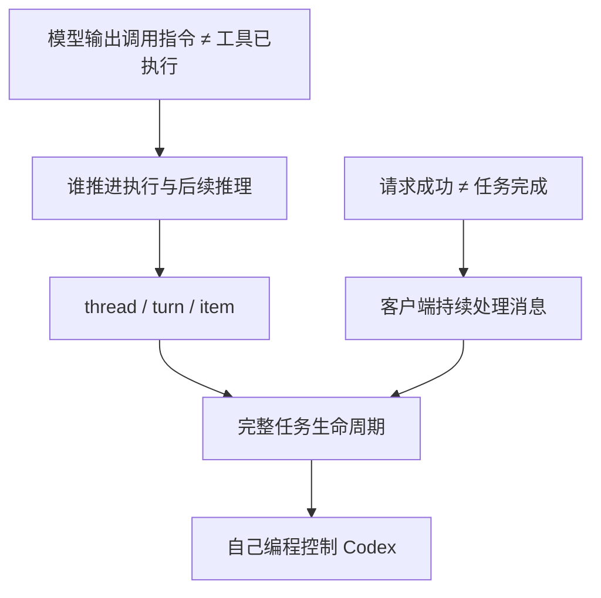

> [!quote] YOU

我想搞明白如何程序化的使用codex app server, 里面有哪些核心概念，而不是仅仅会使用codex客户端

> [!abstract] PI

可以，我们把目标放在**能自己写程序驱动 Codex**，而不是记住客户端的操作步骤。具体协议和概念我会核对官方资料，避免把不同版本或 SDK 的接口混在一起。

先确定一个实际落点，再摸清你对进程通信、异步事件这些基础的熟悉程度。

> [!question] Question
> 你最希望学完后，能用 Codex app-server 做出什么？
>
> 1. 写一个最小控制程序，真正弄懂运行机制（Recommended）
> 2. 把 Codex 接入自己的产品
> 3. 构建自动化任务系统
> 4. 先理解整体架构与核心概念

> [!example] Answer
> 4. 先理解整体架构与核心概念

> [!question] Quiz
> 先定位你已有的理解：一个模型接口返回了“调用 shell 执行 npm test”的工具调用。在这个时刻，实际发生了什么？
>
> 1. 模型已经执行了命令，接入它的程序只需要显示结果。
> 2. 模型把命令交给了操作系统，接入它的程序只需要等待。
> 3. 模型产出了调用指令，接入它的程序还需要执行命令。

> [!success] Quiz — correct ✓
> Your answer: 3. 模型产出了调用指令，接入它的程序还需要执行命令。
> Correct answer: 3
>
> 工具调用是模型生成的结构化指令，不是命令已经执行的证明。接入模型的程序需要安排执行，并把结果送回模型。这是区分“模型”与“agent 运行时”的关键。

> [!question] Quiz
> 再往程序化接入走一步：你的程序向 app-server 发送 turn/start，收到成功响应后，应该怎样判断这次任务完成了？
>
> 1. 继续接收过程消息，以 turn/completed 判断任务结束。
> 2. 成功响应就代表任务完成，读取响应里的最终答案。
> 3. 继续接收文本消息，以最后一段文本判断任务结束。

> [!success] Quiz — correct ✓
> Your answer: 1. 继续接收过程消息，以 turn/completed 判断任务结束。
> Correct answer: 1
>
> turn/start 的成功响应表示这一轮任务已建立，不表示执行完毕。后续工作通过异步消息报告；turn/completed 才表示这一轮结束，结束状态还可能是失败或被中断。

> [!question] Quiz
> 如果执行过程中需要用户批准一条命令，app-server 与你写的客户端之间如何配合？
>
> 1. 服务端发出带 id 的请求；客户端用对应 id 返回审批结果。
> 2. 服务端发出普通进度通知；客户端发送新的 turn/start 表达批准。
> 3. 服务端在原来的 turn/start 响应中询问；客户端重新提交该请求表达批准。

> [!success] Quiz — correct ✓
> Your answer: 1. 服务端发出带 id 的请求；客户端用对应 id 返回审批结果。
> Correct answer: 1
>
> 这是双向 RPC：app-server 也能充当请求发起方，等待客户端回答。审批不是普通进度通知，也不是一次新的用户任务；客户端需要识别服务端请求，并返回对应的响应。

> [!question] Quiz
> 假设 Codex 在一个会话里收到“修复测试”，随后读文件、改代码、跑了两次测试，最后回复用户。这些动作与 thread / turn / item 的关系，哪种描述正确？
>
> 1. 每次工具执行属于一个 thread，整次修复工作合起来形成一个 turn。
> 2. 每次模型调用属于一个 turn，命令执行和消息等分别形成 item。
> 3. 这次请求及后续工作属于一个 turn，命令执行和消息等分别形成 item。

> [!failure] Quiz — incorrect ✗
> Your answer: 2. 每次模型调用属于一个 turn，命令执行和消息等分别形成 item。
> Correct answer: 3
>
> thread 是会话；turn 是一次用户请求及其引发的 agent 工作；item 是其中的具体输入或输出单元。一个 turn 可以包含多次模型调用与工具执行，并不等于模型只回答一次。

> [!question] Quiz
> 沿着刚才的边界再确认一下：你写自己的客户端接入 app-server。模型决定读文件，读完后还需要继续推理。正常情况下，谁负责把工具结果交回模型、继续这轮工作？
>
> 1. 你的客户端负责推进，每次工具完成后再发一个 turn/start。
> 2. app-server 背后的 Codex 运行时负责推进，客户端处理交互。
> 3. 上游模型服务负责推进，直接读取本地工具的执行结果。

> [!question] Quiz — I don't know
> Your answer: I don't know
> Correct answer: 2
>
> app-server 暴露的是 Codex agent 的能力，而不只是模型调用的转发。正常的工具执行与后续模型调用由 Codex 运行时推进；你的客户端不需要为每一步重新发起 turn。

> [!abstract] PI

定位到了：你已经理解**模型产出工具调用、任务异步完成、服务端可以反向请求审批**。现在缺的不是通信基础，而是：

**一次用户任务中，谁负责持续推进工作？这段工作又如何对应 thread / turn / item？**

我们围绕这个缺口讲，不从 JSON-RPC 入门重来。

计划按三个步骤：
1. **划清职责**：你的程序、app-server 背后的 Codex 运行时、模型服务，分别做什么。
2. **推导核心概念**：从“修复一个测试”的完整过程理解 thread、turn、item，特别是为什么一次 turn 不等于一次模型调用。
3. **落到程序控制**：把任务映射成启动、事件、审批、结束与恢复，理解你的程序实际要管理什么。

接口细节已核对[官方文档](https://developers.openai.com/codex/app-server/)，讲解时会区分协议概念和内部实现。

按这个路线开始，可以吗？
