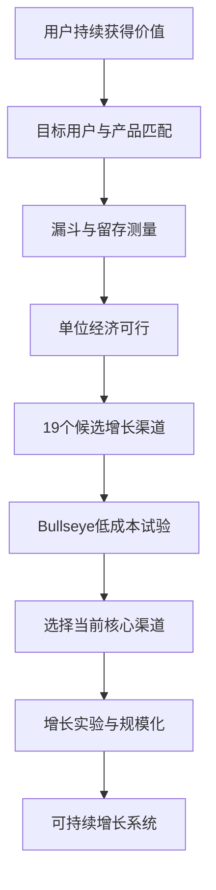

> [!quote] YOU

基于 
拉新：快速实现用户增长 (【美】加布里埃尔·温伯格, 【美】贾斯汀·迈尔斯, 谢天
这本书的观点，我们来系统学习用户增长

> [!question] Quiz
> 如果一个产品“新增注册用户很多”，但用户很快流失，按照用户增长的核心视角，最应该先判断什么？
>
> 先凭直觉选，不需要知道书中的原话。
>
> 1. 产品是否为用户持续创造价值
> 2. 获客渠道是否足够便宜
> 3. 销售团队是否足够庞大
> 4. 广告素材是否足够吸引人

> [!success] Quiz — correct ✓
> Your answer: 1. 产品是否为用户持续创造价值
> Correct answer: 1
>
> 用户增长不是单纯把更多人带进来，而是让目标用户持续获得价值并留下来。获客、激活、留存、推荐和变现都应围绕“可持续价值”展开；如果价值没有成立，放大获客只会放大流失。

> [!question] Quiz
> 一个产品有 10 万注册用户，但次日留存只有 5%。团队想通过投放广告把注册量提升 10 倍。最合理的判断是？
>
> 这题测试你是否能把“增长”与“增长引擎”区分开。
>
> 1. 应该先定位用户流失原因并验证留存改进
> 2. 应该立刻投放，因为规模会自然改善留存
> 3. 应该先把广告点击率做到行业最高
> 4. 应该优先增加销售人员来承接流量

> [!success] Quiz — correct ✓
> Your answer: 1. 应该先定位用户流失原因并验证留存改进
> Correct answer: 1
>
> 次日留存极低说明用户尚未稳定获得核心价值。此时扩大获客通常只是更快地把更多用户送入漏斗顶部，不能解决底层价值问题。应先找到激活/留存瓶颈，再用实验验证改进。

> [!question] Quiz
> 团队每周可以做 20 个增长实验，但资源有限。哪种排序方式最符合“系统增长”的思路？
>
> 关注实验与用户价值、瓶颈和可验证性的关系。
>
> 1. 优先做最能提升曝光的实验
> 2. 优先做最容易上线的实验
> 3. 优先做竞争对手最近做过的实验
> 4. 优先做针对当前关键瓶颈且影响可测的实验

> [!success] Quiz — correct ✓
> Your answer: 4. 优先做针对当前关键瓶颈且影响可测的实验
> Correct answer: 4
>
> 增长实验的价值不在数量，而在是否击中当前瓶颈、是否与用户价值相关、是否能清晰测量结果。只追求曝光、易上线或模仿竞品，容易制造“忙碌但没有增长”的假象。

> [!question] Question
> 你希望这套“用户增长”学习最终主要服务于什么？
>
> 1. 建立完整理论框架（推荐）
> 2. 能为一个真实产品制定增长方案
> 3. 提升增长实验与数据分析能力
> 4. 准备创业、产品或增长岗位面试

> [!example] Answer
> 1. 建立完整理论框架（推荐）

> [!abstract] PI

🥷 我们先建立完整框架，再逐步深入：

1. 用户增长的底层目标：持续创造用户价值  
2. 增长系统：获客、激活、留存、变现、推荐  
3. 《拉新》的核心：19 个增长渠道与 Bullseye 靶心框架  
4. 如何选择渠道：从可能性清单到核心渠道  
5. 增长实验：假设、指标、优先级、验证  
6. 从单点技巧升级为可复制的增长系统  

我正在先核实书中的具体框架与术语，避免把通用增长知识误说成书中观点。核实完成后，我会给出依赖关系图和第一课。

> [!abstract] PI

🥷 你的当前基础已经覆盖两点：

- 增长不等于单纯拉新，而是持续创造用户价值。
- 增长实验应优先解决当前瓶颈，并且可测量。

接下来从更系统的层次展开，重点不是背诵 19 个渠道，而是理解：**为什么要先建立价值与测量基础，再选择渠道，最后集中资源验证。**

## 学习路线

1. **增长的底层对象**：用户价值、目标用户、产品—市场匹配  
2. **增长系统的测量语言**：漏斗、留存、分群、CAC、LTV、回收期  
3. **《拉新》的核心框架**：19 个渠道与 Bullseye 三环  
4. **渠道选择**：如何从“所有可能”收敛到“当前靶心”  
5. **增长实验**：假设、指标、样本、阈值与复盘  
6. **增长系统化**：从单一渠道到增长循环和多渠道组合  

### 一个重要边界

《拉新》的独特贡献主要是：

- **19 个渠道的候选清单**
- **Bullseye 渠道选择框架**
- **用实验而不是直觉选择分发渠道**

而漏斗、CAC、LTV、留存、A/B 测试等，是整个增长领域的通用工具，不应全部归功于这本书。

第一课我们将从最根本的问题开始：

> **什么才算“增长”？为什么注册人数增加，可能反而意味着增长变差？**

如果这条路线符合你的目标，我就开始第一课。

> [!quote] YOU

符合

> [!abstract] PI

🥷## 第一课：什么才算“增长”？

### 1. 先解决一个问题

如果一家产品本月新增用户从 1 万变成 10 万，但大多数用户只打开一次就离开，我们能说它增长得很好吗？

直觉上不能。因为“进来的人变多”不等于“留下来的价值变大”。

### 2. 先锁定一个基础事实

> **真正的增长，是更多目标用户持续获得价值，而不只是更多人完成注册。**

这里有三个关键词：

- **目标用户**：不是所有人，而是产品真正服务的人。
- **持续获得价值**：用户不只是来过，而是反复解决问题。
- **更多**：增长最终仍然需要规模，但规模建立在价值之上。

所以，注册量只是增长系统的一个表面信号。更重要的问题是：

> 用户是否完成了第一次价值体验？  
> 用户是否愿意回来？  
> 用户是否愿意付费或推荐？

### 3. 这个事实如何推出增长系统？

一旦接受“增长 = 持续价值的扩大”，我们就能自然推出：

- **获客**：把目标用户带进来；
- **激活**：让用户尽快感受到核心价值；
- **留存**：让价值持续发生；
- **变现**：让价值交换能够持续；
- **推荐**：让满意用户带来更多目标用户。

这就是为什么只优化广告点击率，可能无法带来真正增长：它只改善了入口，不一定改善价值链条。

请回答下面的问题，确认这个基础节点已经建立。

> [!quote] YOU

继续

> [!question] Quiz
> 下面哪一种情况最能说明产品出现了真正的增长？
>
> 1. 目标用户持续获得价值并愿意回来
> 2. 注册用户数量持续增加
> 3. 社交媒体曝光次数持续增加
> 4. 广告点击率持续提高

> [!success] Quiz — correct ✓
> Your answer: 1. 目标用户持续获得价值并愿意回来
> Correct answer: 1
>
> 真正的增长建立在用户持续获得价值之上。注册、点击和曝光都是可能有用的中间指标，但如果用户没有激活、留存或形成持续行为，它们不能单独证明增长成立。

> [!abstract] PI

### 2. 从“价值”到“可测量的增长”

既然增长不是一个数字，而是一条价值链，我们接下来会遇到一个实际问题：

> 用户到底在哪一步失去了价值？

例如：

- 根本没看到产品：获客问题
- 注册后不会用：激活问题
- 用过一次就离开：留存问题
- 留下但不付费：变现问题
- 满意却不传播：推荐问题

因此，我们把用户从首次接触到持续使用的过程拆成几个阶段：

$$
\text{获客} \rightarrow \text{激活} \rightarrow \text{留存} \rightarrow \text{变现} \rightarrow \text{推荐}
$$

这不是一套必须机械套用的标签，而是一种**定位瓶颈的观察方法**。

### 一个例子

假设 1,000 人看到广告：

- 100 人注册；
- 30 人完成首次核心操作；
- 8 人在一周后回来；
- 2 人付费；
- 1 人推荐朋友。

那么问题可能不在广告，而在：

- 注册到核心操作只有 30%；
- 核心操作到一周留存只有约 27%。

如果团队只看“注册数”，就会继续买广告；如果看完整链条，就会优先研究激活和留存。

**连接上一节点：**

- 上一节点告诉我们：增长的本质是持续价值；
- 这一节点告诉我们：持续价值必须沿用户过程被观察和测量；
- 下一步我们才能判断：究竟该优化哪一环。

请判断下面这个场景中的主要瓶颈。

> [!quote] YOU

继续

> [!question] Quiz
> 某产品每月有大量新用户注册，但只有少数人完成第一次核心操作，最可能的首要问题是？
>
> 1. 获客环节没有带来足够曝光
> 2. 变现环节没有设计足够多价格方案
> 3. 激活环节没有让用户感受到核心价值
> 4. 推荐环节没有提供足够传播奖励

> [!success] Quiz — correct ✓
> Your answer: 3. 激活环节没有让用户感受到核心价值
> Correct answer: 3
>
> 用户已经完成注册，说明至少通过了获客环节；但没有完成第一次核心操作，说明他们还没有进入产品价值体验，首要应检查激活流程、首次使用体验和价值传达。

> [!abstract] PI

### 3. 指标不是目标：先定义“有效价值行为”

漏斗能告诉我们“哪里掉人”，但还不够。我们还需要回答：

> 什么行为，才真正代表用户获得了价值？

例如：

- 视频网站：不是“打开 App”，而是完成有效观看；
- 协作工具：不是“注册”，而是与他人完成一次协作；
- 外卖平台：不是“浏览首页”，而是完成一次有效订单。

这个行为可以称为**核心价值行为**。增长团队应优先追踪它，而不是被注册量、曝光量等表面数字牵着走。

一个好的增长指标通常满足：

1. 与用户价值有直接关系；
2. 能被产品行为观察到；
3. 能通过实验改变；
4. 能进一步连接到留存或收入。

因此，指标体系应从：

$$
\text{曝光} \rightarrow \text{注册} \rightarrow \text{核心价值行为} \rightarrow \text{留存/收入}
$$

逐渐从“看起来热闹”转向“真正产生价值”。

**连接前面：**

- 我们先用漏斗定位用户在哪一步流失；
- 再定义核心价值行为，判断用户是否真正通过了那一步；
- 之后才有资格讨论哪个增长渠道更值得投入。

请完成判断题。

> [!quote] YOU

继续

> [!question] Quiz
> 对于一个协作工具，下面哪个指标最可能代表用户完成了核心价值行为？
>
> 1. 团队成员完成一次共同协作
> 2. 首页访问次数
> 3. 广告页面展示次数
> 4. 新增注册账号数量

> [!success] Quiz — correct ✓
> Your answer: 1. 团队成员完成一次共同协作
> Correct answer: 1
>
> 协作工具的核心价值在于帮助多人完成协作，因此共同协作比注册、访问或曝光更接近真实价值。具体指标仍需结合产品定义和后续留存验证，但方向上应优先选择价值行为。

> [!abstract] PI

### 4. 增长还必须“经济上成立”

到这里，我们知道要追踪用户价值。但还有一个问题：

> 如果每获得一个用户都亏很多钱，用户越多，亏损是否会越大？

会。因此，增长不仅要看用户数量，还要看单位经济。

最基本的关系是：

$$
\text{单位贡献} = \text{单个用户带来的毛利} - \text{获客成本（CAC）}
$$

通常希望：

$$
\text{LTV} > \text{CAC}
$$

其中：

- **CAC**：获得一个用户平均花多少钱；
- **LTV**：一个用户在整个关系期间带来的预期价值。

但这里要小心：注册用户的 LTV 不是付费用户的 LTV。只有真正激活、留存并产生收入的用户，才有经济价值。

这解释了一个常见陷阱：

> 某个渠道带来大量便宜注册，但这些用户不激活、不留存、不付费。  
> 它的“表面 CAC”很低，真实的有效用户成本却可能很高。

**连接前面：**

$$
\text{用户价值}
\rightarrow
\text{核心价值行为}
\rightarrow
\text{留存与收入}
\rightarrow
\text{可持续单位经济}
$$

到了这里，我们才有足够基础进入《拉新》的核心问题：

> 在众多渠道中，如何找到最值得投入的渠道？

先检查这一节点。

> [!quote] YOU

继续

> [!question] Quiz
> 某广告渠道带来大量注册用户，但这些用户几乎不激活、不留存，也不付费。对此渠道最合理的判断是？
>
> 1. 渠道一定无效，因为注册用户没有价值
> 2. 渠道一定有效，因为注册成本很低
> 3. 渠道一定值得扩大，因为规模会自动改善留存
> 4. 不能只看注册成本，还要看有效用户的真实成本与后续价值

> [!success] Quiz — correct ✓
> Your answer: 4. 不能只看注册成本，还要看有效用户的真实成本与后续价值
> Correct answer: 4
>
> 真正应该计算的是获得有效用户的成本，并结合激活、留存和收入判断渠道质量。低注册成本可能只是把问题隐藏在后续环节，并不代表单位经济成立。

> [!abstract] PI

### 5. 为什么需要“19 个渠道清单”？

现在我们已经知道：

- 要先确认用户价值；
- 要找到漏斗瓶颈；
- 要判断单位经济；
- 不能只看表面指标。

接下来才进入《拉新》的核心贡献。

创业团队常犯的错误是：

> 只尝试自己最熟悉的渠道。

例如：

- 工程师优先做 SEO；
- 销售团队优先做线下销售；
- 内容团队优先做公众号；
- 创始人优先参加活动。

问题不一定是这些渠道不好，而是团队可能**过早把熟悉误认为适合**。

所以，书中提供了 19 类候选渠道，作为一张“探索地图”：

- 内容与搜索：SEO、SEM、内容营销、定向博客；
- 广告与传播：社交/展示广告、线下广告、媒体报道、非常规公关；
- 产品与技术：病毒式营销、工程即营销；
- 合作与交易：商务拓展、销售、联盟计划、既有平台；
- 线下触达：展会、线下活动、演讲；
- 关系网络：邮件营销、社群建设。

关键不是把 19 个渠道全部做一遍，而是：

> **先扩大候选空间，再通过低成本实验收敛。**

这张清单的价值类似于地图：它不告诉你目的地一定在哪里，但能防止你只在家门口找路。

**连接前面：**

- 单位经济告诉我们：渠道必须带来可持续价值；
- 19 个渠道清单告诉我们：不要过早锁定熟悉渠道；
- 下一步 Bullseye 框架会告诉我们：如何从候选空间逐步选出当前靶心。

请检查这个关键区别：渠道清单是“探索地图”，不是“执行清单”。

> [!quote] YOU

继续

> [!question] Quiz
> 《拉新》的 19 个渠道清单，最主要的作用是什么？
>
> 1. 证明线上渠道一定优于线下渠道
> 2. 替团队直接选出唯一最佳渠道
> 3. 扩大候选空间，避免过早依赖熟悉渠道
> 4. 要求每个创业团队同时运营全部渠道

> [!success] Quiz — correct ✓
> Your answer: 3. 扩大候选空间，避免过早依赖熟悉渠道
> Correct answer: 3
>
> 19 个渠道是探索地图，不是必须全部执行的任务，也不会脱离具体产品替你自动选出答案。它的作用是提醒团队系统地考虑不同分发路径，再通过实验收敛。

> [!abstract] PI

### 6. Bullseye：从“可能”到“靶心”

有了 19 个候选渠道后，问题变成：

> 我们怎么知道现在该押注哪个渠道？

《拉新》给出的答案是 Bullseye（三环靶心）：

#### 外环：可能性

对每个渠道提出具体假设：

- 用户在哪里出现？
- 我们如何触达他们？
- 预计能带来什么结果？
- 需要什么成本和资源？

此时不急着执行，目标是避免遗漏机会。

#### 中环：试验

用小预算、短周期的实验，粗略判断：

- 能否触达目标用户；
- 用户是否完成核心价值行为；
- 有效用户成本大概多少；
- 渠道是否可能扩大。

实验不是为了证明渠道“绝对有效”，而是为了比较不同渠道的潜力。

#### 靶心：集中投入

选择当前最有希望的渠道，集中资源优化：

- 素材和信息；
- 触达方式；
- 转化流程；
- 激活与留存；
- 成本和规模。

可以把它表达为：

$$
\text{广泛构想}
\rightarrow
\text{低成本比较}
\rightarrow
\text{集中投入}
$$

### 一个关键理解

“核心渠道”不是永远唯一的渠道。

它只是：

> **在当前阶段、当前目标和当前资源下，最值得集中投入的渠道。**

当渠道饱和、用户变化或业务阶段变化时，还要重新扫描外环。

这就避免了两个极端：

- 一开始就只押一个熟悉渠道；
- 永远同时做很多渠道，却没有任何一个做深。

请完成判断题。

> [!quote] YOU

继续

> [!question] Quiz
> 在 Bullseye 框架中，低成本试验的主要目的是什么？
>
> 1. 立刻把全部预算投入实验渠道
> 2. 在候选渠道之间比较潜力与可行性
> 3. 用一次实验证明渠道长期一定成功
> 4. 只测量曝光量而不考虑用户质量

> [!success] Quiz — correct ✓
> Your answer: 2. 在候选渠道之间比较潜力与可行性
> Correct answer: 2
>
> 低成本试验是筛选工具，用来比较触达能力、有效用户成本、价值行为和可扩展性等信号。它不能一次性证明长期成功，后续仍需在靶心阶段持续验证与优化。

> [!abstract] PI

### 7. 什么才是一个合格的增长实验？

“我们试试做内容营销”不是实验，只是一个方向。

合格的实验至少要包含：

1. **假设**：我们认为谁会被什么方式触达；
2. **动作**：具体投放什么内容、给谁、在哪里；
3. **核心指标**：是否完成核心价值行为；
4. **成本指标**：获得一个有效用户要多少钱；
5. **成功阈值**：达到什么结果才值得继续；
6. **时间边界**：观察多久后做判断。

例如：

> 我们假设，面向独立设计师发布“免费作品集模板”，能通过设计社区带来目标用户；如果每位有效用户成本低于 50 元，且 30% 完成首次作品上传，就进入下一轮优化。

这里的关键不是“内容发布了没有”，而是：

$$
\text{渠道动作}
\rightarrow
\text{目标用户}
\rightarrow
\text{核心价值行为}
\rightarrow
\text{留存/收入}
$$

实验必须连接到用户价值，否则很容易优化出大量“漂亮但无意义”的数据。

请检查这个节点。

> [!quote] YOU

继续

> [!question] Quiz
> 下面哪一个最接近合格的增长实验？
>
> 1. 模仿竞品最近使用的增长方式
> 2. 尝试做社群运营，观察大家的反馈
> 3. 面向目标用户测试具体方案，并设定价值指标、成本阈值和观察周期
> 4. 持续发布内容，看看曝光是否增加

> [!success] Quiz — correct ✓
> Your answer: 3. 面向目标用户测试具体方案，并设定价值指标、成本阈值和观察周期
> Correct answer: 3
>
> 合格实验必须明确目标用户、具体动作、价值指标、成本或成功阈值，以及观察周期。只有这样，结果才能帮助团队决定继续、修改或放弃，而不是停留在“做过了”的层面。

> [!abstract] PI

### 8. 先定义“增长目标”，再选渠道

不同阶段的增长目标不同：

- 早期：验证目标用户是否愿意使用；
- 产品初步成立：提升激活和留存；
- 找到核心用户后：扩大有效获客；
- 商业化阶段：提升收入和回收速度。

因此，“哪个渠道最好”没有脱离上下文的答案。更准确的问题是：

> **哪个渠道，最可能在当前阶段帮助我们完成当前目标？**

例如：

- 目标是验证需求：访谈、社群、定向触达可能更适合；
- 目标是扩大已有需求：搜索、内容、广告可能更适合；
- 目标是高客单价成交：销售、商务拓展可能更适合；
- 目标是形成传播循环：推荐机制、社群、产品内分享可能更适合。

所以 Bullseye 的真正逻辑不是：

$$
\text{找一个永远最好的渠道}
$$

而是：

$$
\text{当前目标}
\rightarrow
\text{候选渠道}
\rightarrow
\text{低成本验证}
\rightarrow
\text{阶段性核心渠道}
$$

这也解释了为什么增长团队需要定期重新扫描渠道，而不是把一次成功经验当成永久战略。

到这里，我们已经完成了第一轮基础框架。下一阶段将逐一学习 19 个渠道，并用同一套问题分析它们：

1. 它适合什么用户和场景？
2. 它如何触达用户？
3. 它的优势和限制是什么？
4. 如何设计最小实验？
5. 用什么指标判断是否值得继续？

> [!quote] YOU

继续

> [!abstract] PI

## 第二阶段：逐个理解 19 个渠道

### 渠道一：定向博客（Targeting Blogs）

#### 为什么需要这个渠道？

很多产品不是面向“大众”，而是面向一个明确的小群体：

- 独立开发者；
- 摄影师；
- 财务负责人；
- 某类企业采购者；
- 某个垂直兴趣社群。

这些用户往往已经聚集在特定博客、 newsletter 或专业内容平台周围。与其一开始做广泛广告，不如先找到已经拥有目标用户注意力的节点。

#### 这个渠道的基本机制

$$
\text{目标博客/内容平台}
\rightarrow
\text{目标用户注意}
\rightarrow
\text{可信内容或合作}
\rightarrow
\text{核心价值行为}
$$

它不只是“去博客投广告”，还可能包括：

- 为目标博客提供有价值的客座内容；
- 与作者合作制作专题；
- 赞助高度垂直的 newsletter；
- 通过内容进入一个已有的专业受众群体。

#### 它适合什么时候？

当你满足以下条件时，定向博客值得测试：

1. 目标用户集中在明确的内容社区；
2. 这些内容节点有稳定且匹配的受众；
3. 你的产品能解决该受众的具体问题；
4. 你能提供比普通广告更有价值的内容或合作。

#### 最小实验

不要一开始签长期合作。可以先：

- 选择 3 个受众高度匹配的平台；
- 为每个平台设计一个不同的合作方案；
- 使用独立链接或邀请码追踪来源；
- 观察注册、核心价值行为和留存；
- 比较有效用户成本，而非只看点击量。

#### 常见误区

博客读者多，不代表它适合你的产品。真正重要的是：

$$
\text{受众匹配度}
\times
\text{信任度}
\times
\text{价值行为转化}
$$

流量大但受众不匹配，通常不如流量小但高度垂直的平台。

请检查这个渠道的核心逻辑。

> [!quote] YOU

继续

> [!question] Quiz
> 测试“定向博客”渠道时，哪个信号最有价值？
>
> 1. 文章带来的用户完成核心价值行为并持续留下
> 2. 博客文章获得很多总浏览量
> 3. 合作内容获得很多点赞
> 4. 博客作者拥有很多社交媒体粉丝

> [!success] Quiz — correct ✓
> Your answer: 1. 文章带来的用户完成核心价值行为并持续留下
> Correct answer: 1
>
> 博客流量、粉丝和点赞只能说明注意力，不一定说明用户匹配。更有价值的信号是目标用户完成核心价值行为并持续留下，因为这直接连接到产品价值和可持续增长。

> [!abstract] PI

### 渠道二：媒体报道（Publicity）

媒体报道的本质不是“获得曝光”，而是借助媒体的可信度和分发能力，把产品带到目标用户面前。

基本链路是：

$$
\text{新闻价值}
\rightarrow
\text{媒体报道}
\rightarrow
\text{目标用户注意}
\rightarrow
\text{核心价值行为}
$$

#### 什么更可能获得报道？

不是“我们上线了一个产品”，而是具备某种新闻价值，例如：

- 解决了一个明确且普遍的问题；
- 有独特数据或研究发现；
- 服务了一个正在发生的趋势；
- 创始人或用户故事具有公共意义；
- 产品取得了可验证的显著结果。

#### 为什么很多报道没有带来增长？

因为报道解决的只是“被看见”，不一定解决：

- 受众是否匹配；
- 用户是否理解产品；
- 用户是否能快速体验价值；
- 用户是否会留下或付费。

所以媒体渠道必须和产品承接能力配合：

$$
\text{报道}
\rightarrow
\text{落地页}
\rightarrow
\text{激活}
\rightarrow
\text{留存}
$$

#### 最小实验

可以测试不同角度的故事，而不是立刻追求大媒体：

1. 为同一个产品写出 2—3 个不同新闻角度；
2. 联系受众匹配的垂直媒体；
3. 使用独立链接追踪访问和后续行为；
4. 比较有效用户，而不只是报道数量。

媒体报道适合制造突破和信任，但通常不等于稳定、可预测的获客引擎。

> [!quote] YOU

继续

> [!question] Quiz
> 一个产品获得了大量媒体报道，但报道带来的用户几乎不激活。最应该优先检查什么？
>
> 1. 报道受众与产品价值承接是否匹配
> 2. 是否同时开通更多社交账号
> 3. 是否继续争取更多媒体报道
> 4. 是否把报道标题写得更夸张

> [!success] Quiz — correct ✓
> Your answer: 1. 报道受众与产品价值承接是否匹配
> Correct answer: 1
>
> 媒体报道主要解决注意力和可信度问题。用户不激活时，应检查受众是否匹配、报道是否准确传达价值，以及落地页和首次体验是否能承接流量，而不是盲目增加曝光。

> [!abstract] PI

### 渠道三：非常规公关（Unconventional PR）

普通公关争取“被报道”；非常规公关则是：

> **主动创造一个足够特别、可传播、能吸引目标用户的事件或体验。**

例如：

- 一个与产品价值相关的公开挑战；
- 一个有趣的工具或互动体验；
- 一次反常规的线下行动；
- 一个能引发讨论的数据项目；
- 一个用户愿意主动分享的特殊事件。

它的基本链路是：

$$
\text{独特事件/体验}
\rightarrow
\text{讨论与传播}
\rightarrow
\text{目标用户注意}
\rightarrow
\text{产品价值体验}
$$

### 普通公关与非常规公关的区别

| 类型 | 核心问题 |
|---|---|
| 媒体报道 | 为什么媒体愿意报道我们？ |
| 非常规公关 | 我们能创造什么值得讨论的事情？ |

但要注意：

> “有趣”不等于“有效”。

如果事件和产品没有关系，可能带来大量围观，却带不来目标用户。优秀的非常规公关，应该让传播本身成为产品价值、用户身份或核心问题的一部分。

例如，一个环保产品发起环保挑战，传播内容与产品使命相连；而一个软件产品单纯制造噱头，可能只获得短暂流量。

下一步，我们会比较这类渠道与付费广告的根本区别。

> [!quote] YOU

继续

> [!question] Quiz
> 非常规公关活动最需要避免的问题是什么？
>
> 1. 活动获得的讨论量不够大
> 2. 活动无法同时覆盖所有用户
> 3. 活动需要团队投入时间
> 4. 活动很有趣，但与产品价值和目标用户没有关系

> [!success] Quiz — correct ✓
> Your answer: 4. 活动很有趣，但与产品价值和目标用户没有关系
> Correct answer: 4
>
> 非常规公关可以带来注意力，但如果事件与产品价值、目标用户没有关联，传播就很难转化为有效用户。讨论量本身不是增长结果。

> [!abstract] PI

### 渠道四：搜索引擎营销（SEM）

SEM 的核心是：

> 当用户已经表达出明确需求时，争取出现在他的搜索结果中。

链路通常是：

$$
\text{用户主动搜索}
\rightarrow
\text{广告/结果页}
\rightarrow
\text{落地页}
\rightarrow
\text{核心价值行为}
$$

它与媒体报道不同：

- 媒体报道：先制造注意力，再等待用户产生兴趣；
- SEM：用户已经有需求，产品争取承接需求。

因此，SEM 特别适合解决“用户已经知道自己要什么”的问题。

### SEM 实验要看什么？

不能只看点击率，而要追踪：

1. 搜索词是否真的代表目标需求；
2. 点击用户是否完成核心价值行为；
3. 每个有效用户的成本；
4. 用户后续是否留存或付费。

例如，“项目管理软件”可能是高意图词；“如何管理项目”可能处于学习阶段；两者点击量相近，但转化质量可能完全不同。

### 常见误区

- 只追求搜索量大的词；
- 忽略搜索意图；
- 广告文案和落地页承诺不一致；
- 用注册替代激活作为成功标准；
- 没有设置获客成本上限。

SEM 的优点是意图相对明确、效果容易追踪；限制是竞争激烈的关键词可能很贵，而且搜索需求本身有规模上限。

> [!quote] YOU

继续

> [!question] Quiz
> 评估 SEM 渠道时，哪项信息最能判断搜索流量的质量？
>
> 1. 广告展示次数
> 2. 搜索意图与用户后续价值行为是否匹配
> 3. 广告标题的字数
> 4. 关键词的月搜索量

> [!success] Quiz — correct ✓
> Your answer: 2. 搜索意图与用户后续价值行为是否匹配
> Correct answer: 2
>
> 搜索量和展示量只能说明流量规模，不能说明用户质量。SEM 的关键是用户的搜索意图是否与产品匹配，以及点击后是否完成核心价值行为并持续留下。

> [!abstract] PI

### 渠道五：社交与展示广告

这类渠道与 SEM 的关键区别是：

- **SEM**：用户已经表达需求；
- **社交/展示广告**：根据用户画像、兴趣、行为或场景，主动触达潜在用户。

基本链路：

$$
\text{受众定位}
\rightarrow
\text{广告素材}
\rightarrow
\text{点击/访问}
\rightarrow
\text{激活与留存}
$$

它的难点在于：平台可以精准找到“可能感兴趣的人”，但“感兴趣”不等于“愿意持续使用”。

因此实验不能只测试点击率，还要同时测试：

- 受众分群；
- 广告承诺；
- 落地页；
- 首次体验；
- 有效用户成本；
- 后续留存。

一个常见现象是：

> 素材越刺激，点击率越高；但如果承诺与产品真实价值不一致，激活率和留存率可能更差。

所以社交广告优化的不是单一点击率，而是整条链路的质量。

$$
\text{广告承诺}
\approx
\text{落地页承诺}
\approx
\text{真实产品价值}
$$

三者越一致，流量质量通常越好。

> [!quote] YOU

继续

> [!question] Quiz
> 社交与展示广告点击率很高，但激活率和留存率很低，最可能的问题是什么？
>
> 1. 应该把所有预算投入同一素材
> 2. 广告展示次数还不够多
> 3. 广告平台的用户数量太大
> 4. 广告承诺、落地页和真实产品价值不一致

> [!success] Quiz — correct ✓
> Your answer: 4. 广告承诺、落地页和真实产品价值不一致
> Correct answer: 4
>
> 高点击只能说明素材制造了兴趣；激活和留存低，常见原因是广告承诺吸引了错误用户，或落地页与真实产品体验不一致。应优化整条承诺—体验链路，而不是只追求更多点击。

> [!abstract] PI

### 渠道六：搜索引擎优化（SEO）

SEO 与 SEM 都依赖搜索，但机制不同：

- **SEM**：付费获得搜索曝光，见效较快；
- **SEO**：通过内容、结构和权威性获得自然搜索流量，积累较慢。

SEO 的增长链路是：

$$
\text{用户问题}
\rightarrow
\text{搜索}
\rightarrow
\text{高质量内容}
\rightarrow
\text{产品价值体验}
\rightarrow
\text{留存/转化}
$$

SEO 的关键不是“写很多文章”，而是：

1. 目标用户确实会搜索这个问题；
2. 内容真正解决问题；
3. 内容自然引导到产品价值；
4. 来访用户与目标用户匹配；
5. 流量最终能产生有效行为。

### 一个重要区别

有些关键词流量很大，但购买意图很低；有些关键词搜索量小，却非常接近用户决策。

所以 SEO 不应只优化：

$$
\text{访问量}
$$

而应观察：

$$
\text{搜索意图}
\rightarrow
\text{有效访问}
\rightarrow
\text{核心价值行为}
\rightarrow
\text{留存/收入}
$$

SEO 的优势是长期积累和边际成本较低；限制是见效慢、需要持续产出，而且搜索规则和竞争环境会变化。

> [!quote] YOU

继续

> [!question] Quiz
> SEO 内容获得大量自然流量，但几乎没有用户完成核心价值行为，最应该优先检查什么？
>
> 1. 继续扩大文章发布数量
> 2. 把所有标题改成更夸张的形式
> 3. 流量对应的搜索意图与产品价值是否匹配
> 4. 只关注页面停留时间

> [!success] Quiz — correct ✓
> Your answer: 3. 流量对应的搜索意图与产品价值是否匹配
> Correct answer: 3
>
> SEO 流量本身不是结果。若搜索意图与产品解决的问题不匹配，或者内容与产品价值衔接很弱，访问量就难以转化为有效行为。应先检查匹配关系，而不是盲目扩大内容数量。

> [!abstract] PI

### 渠道七：内容营销（Content Marketing）

内容营销与 SEO 有交集，但不完全相同：

- **SEO** 更关注：用户搜索什么，如何获得自然流量；
- **内容营销** 更关注：如何持续教育、吸引并转化目标用户。

内容可以是：

- 教程；
- 案例；
- 行业研究；
- 工具模板；
- 对比分析；
- 用户故事；
- 邮件通讯；
- 视频或播客。

有效内容营销的链路是：

$$
\text{用户问题}
\rightarrow
\text{有用内容}
\rightarrow
\text{信任}
\rightarrow
\text{产品尝试}
\rightarrow
\text{持续价值}
$$

### 内容营销的核心判断

不要问：

> 这篇内容有多少阅读量？

而要问：

> 这篇内容是否吸引了正确的人，并帮助他们更快理解产品价值？

内容营销常见的失败方式：

- 内容受欢迎，但吸引的是非目标用户；
- 内容与产品完全无关；
- 只追求发布频率，没有明确用户问题；
- 内容带来访问，却没有设计下一步行动；
- 用点赞和阅读量替代激活、留存和收入。

因此，内容营销不是“不断生产内容”，而是建立一条从用户问题到产品价值的信任路径。

> [!quote] YOU

继续

> [!question] Quiz
> 下面哪种情况最能说明内容营销发挥了增长作用？
>
> 1. 文章阅读量持续增加
> 2. 内容带来目标用户，并促成核心价值行为
> 3. 账号粉丝数量持续增加
> 4. 发布频率高于竞争对手

> [!success] Quiz — correct ✓
> Your answer: 2. 内容带来目标用户，并促成核心价值行为
> Correct answer: 2
>
> 内容营销的目标不是单纯制造关注，而是吸引正确用户、建立信任并推动他们体验产品价值。阅读量、粉丝和频率都是辅助指标，不能单独证明增长。

> [!abstract] PI

### 渠道八：邮件营销（Email Marketing）

邮件营销最适合做的，不是第一次制造注意力，而是：

> **把已经接触过产品的用户，带回下一次价值体验。**

基本链路：

$$
\text{用户许可}
\rightarrow
\text{相关信息}
\rightarrow
\text{再次使用}
\rightarrow
\text{留存/转化}
$$

常见用途包括：

- 新用户引导；
- 提醒用户完成关键步骤；
- 根据行为发送个性化内容；
- 召回流失用户；
- 推送产品更新；
- 促进付费或续费。

### 邮件营销的关键

邮件不是发得越多越好，而是要做到：

1. 对用户当前阶段有用；
2. 与用户过去行为相关；
3. 有清晰且合理的下一步；
4. 能观察它是否带来实际价值行为。

例如，刚注册但没有完成首次核心操作的用户，收到“完成第一步”的引导邮件，通常比收到泛泛的产品新闻更有价值。

邮件营销的典型误区是把“打开率”当成最终结果。打开邮件只是注意力，真正重要的是用户是否完成了下一步，并因此更接近持续获得产品价值。

> [!quote] YOU

继续

> [!question] Quiz
> 对于刚注册但尚未完成首次核心操作的用户，哪种邮件最可能有助于增长？
>
> 1. 发送与当前行为相关的下一步引导
> 2. 只发送公司新闻和融资消息
> 3. 每天发送相同的品牌宣传邮件
> 4. 发送所有产品功能的完整介绍

> [!success] Quiz — correct ✓
> Your answer: 1. 发送与当前行为相关的下一步引导
> Correct answer: 1
>
> 新用户此时的主要瓶颈是激活。与当前行为相关、能帮助用户完成下一步价值体验的引导，比泛泛介绍或公司宣传更可能改善激活和留存。

> [!abstract] PI

### 渠道九：病毒式营销（Viral Marketing）

病毒式营销不是“做一个容易刷屏的内容”，而是：

> **让产品的使用过程自然产生传播，并带来新的目标用户。**

基本循环是：

$$
\text{用户获得价值}
\rightarrow
\text{产生分享动机}
\rightarrow
\text{新用户进入}
\rightarrow
\text{新用户获得价值}
$$

它通常依赖三个条件：

1. 产品本身适合被分享、邀请或协作；
2. 分享对原用户有明确收益；
3. 被邀请者也能快速获得价值。

例如，协作工具邀请同事加入，不只是营销动作，而是完成协作本身的一部分。

### 一个重要区分

病毒式增长不是简单的“用户愿意转发”。真正要看的是传播是否形成可测量的增长循环：

$$
\text{每个用户带来的新用户数}
\times
\text{新用户留存质量}
$$

如果用户大量分享，但新用户不激活、不留存，那么只是传播，不是可持续的病毒式增长。

常见误区：

- 强迫用户分享；
- 用奖励制造低质量传播；
- 只看分享次数；
- 忽略新用户的产品体验；
- 把偶然爆款当成稳定增长机制。

> [!quote] YOU

继续

> [!question] Quiz
> 判断病毒式营销是否真正有效，最重要的不是分享次数，而是？
>
> 1. 活动页面的访问峰值
> 2. 奖励金额是否足够高
> 3. 用户带来的新用户是否激活并持续留存
> 4. 每条内容获得的点赞数量

> [!success] Quiz — correct ✓
> Your answer: 3. 用户带来的新用户是否激活并持续留存
> Correct answer: 3
>
> 病毒式增长的核心是传播循环能否带来高质量新用户。分享、点赞和流量峰值只是表面信号；如果新用户不激活、不留存，传播就无法形成可持续增长。

> [!abstract] PI

### 渠道十：工程即营销（Engineering as Marketing）

这个渠道的核心思路是：

> **用工程能力创造一个有用的免费工具、组件或资源，让目标用户主动接触产品。**

例如：

- 免费计算器；
- 分析工具；
- 模板生成器；
- 诊断工具；
- 开发者组件；
- 可嵌入其他网站的小工具。

基本链路：

$$
\text{免费工具}
\rightarrow
\text{解决具体问题}
\rightarrow
\text{吸引目标用户}
\rightarrow
\text{转向核心产品}
$$

### 它为什么可能有效？

传统广告是在说：

> “请相信我们的产品有用。”

工程工具则是先让用户实际得到价值：

> “你已经通过这个工具获得了帮助，如果需要更完整的能力，可以继续使用我们的产品。”

### 关键限制

工具必须同时满足：

1. 真正解决一个具体问题；
2. 使用者与核心产品目标用户相匹配；
3. 工具与核心产品存在自然连接；
4. 使用成本足够低；
5. 能追踪后续激活与留存。

如果只是做了一个“看起来很酷”的工具，却和核心产品没有关系，它可能带来流量，但不一定带来增长。

工程即营销的本质不是“用技术替代营销”，而是把产品能力转化为一种可传播、可体验的获客入口。

> [!quote] YOU

继续

> [!question] Quiz
> 一个免费工程工具最可能成为有效增长渠道的前提是什么？
>
> 1. 工具开发使用了最新技术
> 2. 工具解决目标用户问题，并自然连接核心产品
> 3. 工具页面获得大量搜索流量
> 4. 工具功能越复杂越有吸引力

> [!success] Quiz — correct ✓
> Your answer: 2. 工具解决目标用户问题，并自然连接核心产品
> Correct answer: 2
>
> 工程工具的增长价值来自目标用户匹配和产品连接。复杂、热门或技术先进本身都不能保证用户会进入核心产品并持续获得价值。

> [!abstract] PI

### 渠道十一：商务拓展（Business Development）

商务拓展的核心不是“找合作伙伴”，而是：

> **借助另一方已有的用户、渠道、能力或信任，创造双方都能获得的价值。**

常见合作方式：

- 联合产品；
- 互相导流；
- 平台接入；
- 联合营销；
- 渠道分销；
- 数据或资源合作。

基本链路：

$$
\text{合作伙伴资源}
\rightarrow
\text{目标用户触达}
\rightarrow
\text{产品体验}
\rightarrow
\text{双方收益}
$$

### 判断合作是否值得

一个合作机会至少要回答：

1. 对方是否拥有我们想触达的目标用户？
2. 对方为什么愿意合作？
3. 用户从合作中得到什么额外价值？
4. 合作带来的用户是否会激活和留存？
5. 合作成本是否低于替代方案？

最常见的误区是把“知名伙伴”误认为“好伙伴”。品牌大、用户多，不代表用户匹配，也不代表合作能落地。

真正有效的商务拓展，不是借名气，而是设计出一个可持续的价值交换。

> [!quote] YOU

继续

> [!question] Quiz
> 判断一个商务拓展合作是否有价值，最关键的组合是什么？
>
> 1. 合作伙伴资源与目标用户匹配，并能形成双方价值交换
> 2. 合作方员工数量与办公地点
> 3. 合作协议页数与会议次数
> 4. 合作伙伴知名度与媒体曝光量

> [!success] Quiz — correct ✓
> Your answer: 1. 合作伙伴资源与目标用户匹配，并能形成双方价值交换
> Correct answer: 1
>
> 商务拓展的本质是借助伙伴资源触达目标用户，同时让合作双方和用户都获得价值。知名度和公司规模只是表面信号，不能替代用户匹配与实际价值交换。

> [!abstract] PI

### 渠道十二：销售（Sales）

销售适合这样的产品：

- 客单价较高；
- 用户需求复杂；
- 需要定制方案；
- 决策涉及多人；
- 单个客户价值足以覆盖销售成本。

销售的链路是：

$$
\text{识别目标客户}
\rightarrow
\text{理解需求}
\rightarrow
\text{展示解决方案}
\rightarrow
\text{成交}
\rightarrow
\text{持续服务}
$$

销售不是单纯“说服客户”，而是验证：

1. 客户是否有真实问题；
2. 问题是否足够重要；
3. 产品是否能解决；
4. 客户是否愿意付费；
5. 成交后的交付是否能带来长期价值。

### 销售与产品反馈

销售渠道还有一个重要作用：它能直接暴露用户为什么不买。

如果多个潜在客户反复提出同样的异议，这可能说明：

- 产品价值没有被理解；
- 目标客户选错了；
- 产品缺少关键能力；
- 定价或购买流程有问题。

所以销售不仅是获客渠道，也是产品和市场学习渠道。

常见误区是只看签约数量，而忽略：

- 销售周期；
- 销售成本；
- 客户留存；
- 客户扩展收入；
- 交付和服务成本。

真正的销售增长必须满足：

$$
\text{客户长期贡献}
>
\text{获客与服务总成本}
$$

> [!quote] YOU

继续

> [!question] Quiz
> 高客单价产品评估销售渠道时，除了签约数量，还必须关注什么？
>
> 1. 销售团队的会议室数量
> 2. 销售演示文稿的页数
> 3. 销售人员每天发送的消息数量
> 4. 客户长期价值、销售成本和服务成本

> [!success] Quiz — correct ✓
> Your answer: 4. 客户长期价值、销售成本和服务成本
> Correct answer: 4
>
> 销售增长必须在经济上成立。签约数量之外，还要考虑销售周期、获客成本、交付服务成本、客户留存和扩展收入，才能判断客户是否真正带来长期价值。

> [!abstract] PI

### 渠道十三：联盟计划（Affiliate Programs）

联盟计划是让外部个人、媒体或机构帮助推广产品，并按结果获得报酬。

基本链路：

$$
\text{合作推广者}
\rightarrow
\text{触达其受众}
\rightarrow
\text{用户转化}
\rightarrow
\text{按结果分成}
$$

它适合：

- 产品容易在线购买；
- 转化过程容易追踪；
- 推广者拥有匹配的受众；
- 单个用户有足够利润空间支付佣金。

### 为什么联盟计划有吸引力？

它把一部分获客成本从“先投入”变成“结果发生后支付”。但这不代表它天然便宜，仍要计算：

- 佣金；
- 平台费用；
- 退款；
- 欺诈和重复归因；
- 用户后续留存与收入。

### 关键判断

联盟伙伴不是越多越好。最重要的是：

> 推广者是否拥有信任你的目标用户，而不是单纯拥有大量流量。

如果推广者为了佣金吸引错误用户，可能带来大量低质量注册，甚至损害品牌和用户信任。

> [!quote] YOU

继续

> [!question] Quiz
> 联盟计划中，最重要的不是推广者的总流量，而是？
>
> 1. 推广者的粉丝总数
> 2. 推广者与目标用户的匹配度及带来的用户质量
> 3. 推广链接的视觉设计
> 4. 联盟伙伴的数量

> [!success] Quiz — correct ✓
> Your answer: 2. 推广者与目标用户的匹配度及带来的用户质量
> Correct answer: 2
>
> 联盟计划的价值取决于推广者是否被目标用户信任，以及带来的用户是否激活、留存并产生收入。总流量、链接设计和伙伴数量都只是表面规模。

> [!abstract] PI

### 渠道十四：借力既有平台（Existing Platforms）

这个渠道的核心是：

> **利用已经拥有大量用户、注意力或分发能力的平台，接触目标用户。**

平台可能包括：

- 应用商店；
- 社交平台；
- 电商平台；
- 开发者平台；
- 浏览器或操作系统生态；
- 专业市场和垂直社区。

基本链路：

$$
\text{既有平台}
\rightarrow
\text{平台内分发}
\rightarrow
\text{用户发现}
\rightarrow
\text{产品价值}
$$

### 平台渠道的优势

- 用户已经聚集；
- 分发基础设施已经存在；
- 可以借助平台信任；
- 新产品更容易获得初始触达。

### 平台渠道的风险

- 平台规则可能变化；
- 平台掌握分发权；
- 竞争者也能使用同一平台；
- 过度依赖平台会削弱自主获客能力；
- 平台上的曝光不一定转化为长期留存。

因此，平台渠道的正确目标不只是“在平台上获得流量”，还要把流量转化为自己的用户关系、产品价值和可持续留存。

> [!quote] YOU

继续

> [!question] Quiz
> 过度依赖既有平台的主要风险是什么？
>
> 1. 平台无法提供任何曝光
> 2. 平台用户永远不会变化
> 3. 平台一定没有任何用户
> 4. 平台规则和分发权掌握在他方手中

> [!success] Quiz — correct ✓
> Your answer: 4. 平台规则和分发权掌握在他方手中
> Correct answer: 4
>
> 既有平台能快速带来触达，但规则、分发机制和用户关系通常由平台掌握。平台政策或算法变化，可能显著影响产品的获客，因此不能把平台流量误认为完全自主的增长能力。

> [!abstract] PI

### 渠道十五：行业展会（Trade Shows）

行业展会适合需要建立信任、展示复杂产品或进行面对面商务交流的场景。

它的链路是：

$$
\text{目标行业聚集}
\rightarrow
\text{现场接触}
\rightarrow
\text{需求判断}
\rightarrow
\text{后续销售}
$$

展会的价值不只是现场成交，还包括：

- 发现潜在客户；
- 观察竞争对手；
- 了解行业语言；
- 获取用户反馈；
- 建立合作关系；
- 验证产品定位。

### 展会最容易被误判的地方

展位人流量、名片数量和现场热闹程度，都不是最终结果。

应追踪：

- 有多少是目标客户；
- 有多少存在真实需求；
- 有多少进入后续沟通；
- 有多少完成成交；
- 客户长期价值是否覆盖参展成本。

展会本质上是一个高密度的线下触达和销售场景。若产品客单价低、决策简单，展会成本可能很难回收。

> [!quote] YOU

继续

> [!question] Quiz
> 评估行业展会是否有效，最应关注什么？
>
> 1. 收集到的名片数量
> 2. 展会现场的热闹程度
> 3. 目标客户后续形成的有效机会与长期价值
> 4. 展位的人流量

> [!success] Quiz — correct ✓
> Your answer: 3. 目标客户后续形成的有效机会与长期价值
> Correct answer: 3
>
> 展会现场的流量和名片只是中间信号。真正需要判断的是目标客户质量、后续销售机会、成交与长期价值是否覆盖参展和跟进成本。

> [!abstract] PI

### 渠道十六：线下活动（Offline Events）

线下活动与行业展会相似，但范围更广，可能包括：

- 用户见面会；
- 工作坊；
- 产品体验会；
- 黑客松；
- 本地聚会；
- 行业沙龙。

它的优势是互动深、反馈快、信任建立强。

基本链路：

$$
\text{聚集目标用户}
\rightarrow
\text{现场体验/交流}
\rightarrow
\text{关系与信任}
\rightarrow
\text{使用或转化}
$$

线下活动尤其适合：

- 产品需要现场演示；
- 用户之间的关系本身有价值；
- 目标用户集中在某个地域或行业；
- 需要深入理解用户问题。

但活动不能只以“来了多少人”为成功标准。还要判断：

- 来的人是否是目标用户；
- 是否完成产品体验；
- 是否进入后续关系；
- 是否带来留存、付费或推荐。

一个小而匹配的活动，可能比一个大型但泛化的活动更有价值。

> [!quote] YOU

继续

> [!question] Quiz
> 一个线下活动只有 30 人参加，但其中大多数是高度匹配的目标用户并持续使用产品。合理判断是？
>
> 1. 只能根据现场气氛判断
> 2. 活动可能有效，应看后续价值行为和经济结果
> 3. 活动一定成功，因为所有活动都有效
> 4. 活动失败，因为参与人数太少

> [!success] Quiz — correct ✓
> Your answer: 2. 活动可能有效，应看后续价值行为和经济结果
> Correct answer: 2
>
> 线下活动的价值取决于目标用户质量、产品体验、后续留存和经济结果，而不是单纯人数。小规模但高度匹配的活动可能是非常有价值的渠道实验。

> [!abstract] PI

### 渠道十七：演讲与分享（Speaking Engagements）

演讲渠道通过一个可信的表达者，把专业知识、观点或故事传递给目标受众。

链路是：

$$
\text{可信表达}
\rightarrow
\text{目标受众理解问题}
\rightarrow
\text{建立信任}
\rightarrow
\text{尝试产品}
$$

它特别适合：

- 专业服务；
- B2B 产品；
- 教育类产品；
- 创始人品牌；
- 需要较长决策周期的产品。

### 演讲的真正价值

演讲不是把产品功能讲完，而是：

1. 帮用户理解一个重要问题；
2. 展示你对问题的深度理解；
3. 让产品成为解决问题的自然下一步。

常见误区是把演讲变成广告推销。这样即使现场反应不错，也可能损害信任。

评估演讲渠道时，要看：

- 听众是否匹配；
- 演讲后是否产生有效对话；
- 是否完成核心价值行为；
- 后续成交和留存如何；
- 准备与出席成本是否值得。

> [!quote] YOU

继续

> [!question] Quiz
> 一场有效的增长型演讲，最重要的作用是什么？
>
> 1. 获得最多现场掌声
> 2. 让演讲时间尽可能延长
> 3. 帮助目标受众理解问题并建立对解决方案的信任
> 4. 尽可能介绍所有产品功能

> [!success] Quiz — correct ✓
> Your answer: 3. 帮助目标受众理解问题并建立对解决方案的信任
> Correct answer: 3
>
> 演讲的核心不是功能展示或现场热闹，而是让目标受众更清楚地理解问题，并相信你的解决方案值得进一步尝试。

> [!abstract] PI

### 渠道十八：社群建设（Community Building）

社群建设不是简单建一个群，而是建立一个让目标用户持续交流、互相帮助并形成归属感的环境。

基本链路：

$$
\text{共同问题/身份}
\rightarrow
\text{持续互动}
\rightarrow
\text{信任与归属}
\rightarrow
\text{留存、推荐与反馈}
$$

社群可能围绕：

- 某类职业；
- 某种兴趣；
- 某个共同问题；
- 某种产品使用方式；
- 某个行业或地域。

### 社群为什么能成为增长渠道？

好的社群会同时产生几种价值：

- 用户相互帮助，降低产品使用成本；
- 用户更愿意留下；
- 新用户能获得经验和信任；
- 产品团队获得真实反馈；
- 用户之间可能自然传播产品。

但社群不能只靠“拉人”增长。若没有共同价值，群人数越多，噪音越大，活跃度和信任反而会下降。

社群的核心指标也不只是人数，而包括：

- 有价值的互动；
- 用户解决问题的效率；
- 成员留存；
- 新用户激活；
- 推荐与贡献行为。

社群是一个长期渠道，通常需要持续运营，不能期待一次活动立刻产生结果。

> [!quote] YOU

继续

> [!question] Quiz
> 判断一个社群是否具有增长价值，最重要的不是成员数量，而是？
>
> 1. 一次性拉入多少成员
> 2. 群聊消息是否越多越好
> 3. 成员之间是否持续产生有价值的互动
> 4. 群名称是否足够吸引人

> [!success] Quiz — correct ✓
> Your answer: 3. 成员之间是否持续产生有价值的互动
> Correct answer: 3
>
> 社群的价值来自共同问题、持续互动、互助和信任。成员数量和消息数量如果没有产生有效帮助，甚至可能制造噪音，不能代表社群真的有增长价值。

> [!abstract] PI

### 渠道十九：线下广告（Offline Ads）

线下广告包括：

- 电视；
- 广播；
- 户外广告；
- 地铁和公交广告；
- 纸媒；
- 直邮；
- 其他实体媒介。

它的核心价值是通过线下场景获得规模化注意力，但通常比数字渠道更难精确归因。

基本链路：

$$
\text{线下曝光}
\rightarrow
\text{品牌/需求认知}
\rightarrow
\text{访问或搜索}
\rightarrow
\text{产品体验}
$$

### 什么时候值得测试？

线下广告更适合：

- 目标用户集中在明确地域；
- 产品具有较高客户价值；
- 需要建立品牌信任；
- 目标市场足够大；
- 能设计可追踪的响应方式。

例如：

- 独立落地页；
- 专属优惠码；
- 特定电话号码；
- 特定搜索词；
- 地域分组对照。

最大误区是把“很多人看到了”当作效果。线下广告必须尽量建立测量机制，并与后续搜索、访问、激活和收入连接起来。

> [!quote] YOU

继续

> [!question] Quiz
> 测试线下广告时，最重要的做法是什么？
>
> 1. 设计可追踪的响应方式并观察后续价值行为
> 2. 只统计有多少人可能看见广告
> 3. 只选择人流量最大的地点
> 4. 只根据广告尺寸判断效果

> [!success] Quiz — correct ✓
> Your answer: 1. 设计可追踪的响应方式并观察后续价值行为
> Correct answer: 1
>
> 线下广告的归因较难，因此需要通过专属链接、优惠码、搜索词、电话或地域对照等方式追踪响应，并进一步观察激活、留存和收入。曝光规模本身不能证明效果。

> [!abstract] PI

## 19 个渠道学完：把清单变成决策系统

现在可以把 19 个渠道分成四类：

### 1. 借助注意力

- 定向博客
- 媒体报道
- 非常规公关
- 社交/展示广告
- 线下广告
- 演讲

### 2. 承接明确需求

- SEM
- SEO
- 内容营销
- 邮件营销

### 3. 借助关系与网络

- 病毒式营销
- 商务拓展
- 联盟计划
- 既有平台
- 社群建设

### 4. 借助直接触达与体验

- 销售
- 工程即营销
- 行业展会
- 线下活动

但要注意：这些分类只是帮助理解，**不是优先级排序**。

真正的决策顺序是：

$$
\text{当前目标}
\rightarrow
\text{目标用户在哪里}
\rightarrow
\text{候选渠道}
\rightarrow
\text{最小实验}
\rightarrow
\text{有效用户结果}
\rightarrow
\text{核心渠道}
$$

### Bullseye 的完整工作表

| 环节 | 核心问题 | 产出 |
|---|---|---|
| 外环 | 哪些渠道理论上可能有效？ | 渠道假设清单 |
| 中环 | 哪些渠道值得小规模测试？ | 实验结果与比较 |
| 靶心 | 当前最值得集中投入哪个渠道？ | 核心渠道 |
| 重新扫描 | 渠道是否饱和或环境是否变化？ | 新一轮候选清单 |

到这里，书中的核心思想可以压缩成一句话：

> **不要迷信某个增长技巧；系统探索多个分发渠道，用低成本实验找到当前最有效的渠道，再集中资源把它做深。**

下一阶段我们会进入**实战建模**：拿一个具体产品，建立目标用户、核心价值行为、渠道假设、实验指标和 Bullseye 选择表。

> [!quote] YOU

用中国区做海外AI订阅代付这个场景

> [!abstract] PI

## 实战：在中国区做“海外 AI 订阅代付”

先划定业务边界：

> 我们讨论的是**合规的支付协助/订阅购买服务**，不包括绕过地区限制、伪造身份、盗用支付工具、共享违反服务条款的账号。

### 1. 先定义真正的用户问题

表面问题是：

> “我想订阅海外 AI 产品，但付款不方便。”

但用户实际可能遇到的是：

- 没有可用的国际支付方式；
- 不清楚账单、扣款和取消规则；
- 担心支付失败或退款困难；
- 不知道如何安全地完成订阅；
- 需要发票、订单记录或售后支持。

因此，产品价值不应只是“帮你付款”，而应是：

> **让用户以透明、可追踪、可取消、风险可控的方式完成合法订阅。**

### 2. 目标用户不能一开始写成“所有中国用户”

可以先聚焦一个细分群体，例如：

- 独立开发者；
- AI 工具重度用户；
- 小型创业团队；
- 跨境从业者；
- 需要订阅多个 SaaS 的专业用户。

每一类人的需求、客单价、信任门槛和售后成本不同。

### 3. 初步价值链

$$
\text{发现服务}
\rightarrow
\text{确认产品与价格}
\rightarrow
\text{完成合规支付}
\rightarrow
\text{成功开通}
\rightarrow
\text{持续续费}
$$

其中真正的核心价值行为不是“提交订单”，而是：

> **用户成功开通目标订阅，并能清楚管理后续续费与取消。**

### 4. 这个场景的增长难点

它不是普通电商，最大瓶颈可能不是获客，而是信任：

- 用户担心资金安全；
- 用户担心账号和隐私；
- 海外产品价格、税费和汇率复杂；
- 订阅可能自动续费；
- 退款责任边界不清；
- 上游服务条款可能限制转售或代购；
- 支付失败会产生大量人工售后。

所以不能一开始只追求订单量。第一阶段应先验证：

$$
\text{支付成功率}
+
\text{开通成功率}
+
\text{退款/纠纷率}
+
\text{复购率}
$$

这就是本场景的第一个增长判断：

> **如果一次代付很便宜，但售后、退款和纠纷成本很高，表面增长可能越快，真实损失越大。**

下一步我们会据此建立这个业务的完整漏斗和第一个 Bullseye 渠道实验。

> [!quote] YOU

继续

> [!abstract] PI

## 这个场景的增长漏斗

### 1. 获客

用户知道你提供海外 AI 订阅支付协助。

指标：

- 有效咨询人数；
- 目标产品搜索量；
- 咨询到报价转化率。

### 2. 信任与激活

用户确认：

- 价格和汇率；
- 服务费；
- 是否自动续费；
- 退款条件；
- 需要提供哪些信息；
- 账号和隐私如何处理。

核心激活行为：

> 用户完成一次透明报价，并成功提交合法订单。

### 3. 履约

关键指标：

- 支付成功率；
- 开通成功率；
- 平均处理时间；
- 失败订单率；
- 退款和纠纷率。

### 4. 留存与复购

订阅业务的留存不只是用户回来再次购买，还包括：

- 用户持续使用该 AI 产品；
- 到期时愿意续费；
- 愿意购买其他合规订阅；
- 愿意推荐同事或朋友。

完整漏斗可以写成：

$$
\text{曝光}
\rightarrow
\text{咨询}
\rightarrow
\text{报价确认}
\rightarrow
\text{支付}
\rightarrow
\text{成功开通}
\rightarrow
\text{续费/推荐}
$$

## 单位经济模型

每笔订单的贡献不能只看“服务费”，而应计算：

$$
\text{订单贡献}
=
\text{服务费}
-
\text{支付成本}
-
\text{汇率损失}
-
\text{人工履约成本}
-
\text{退款与纠纷预期成本}
\]

例如，假设一笔订单：

- 服务费：¥30；
- 支付和汇兑成本：¥8；
- 人工处理成本：¥10；
- 退款/纠纷预期成本：¥5。

那么：

$$
30 - 8 - 10 - 5 = 7
$$

这笔订单虽然成交了，但只贡献 ¥7。若还要花 ¥20 获得一个新客户，首单实际上是亏损的。

所以必须区分：

- **首单贡献**；
- **续费贡献**；
- **客户生命周期贡献**；
- **获客成本 CAC**。

增长成立的条件应接近：

$$
\text{客户生命周期贡献} > \text{获客成本}
$$

### 本场景的核心指标

我建议先设一个“北极星结果”：

> **每月成功完成、低纠纷、可持续续费的有效订阅数。**

而不是：

- 咨询量；
- 下单量；
- 收款金额；
- 社群人数；
- 访问量。

请检查这个关键判断：对代付业务而言，**成功履约和低纠纷比单纯成交更接近真实增长**。

> [!quote] YOU

继续

> [!question] Quiz
> 这个代付业务最适合作为早期核心结果指标的是哪一个？
>
> 1. 累计收款金额
> 2. 客服收到的咨询数量
> 3. 成功开通且低纠纷、可持续续费的订阅数
> 4. 微信群总人数

> [!success] Quiz — correct ✓
> Your answer: 3. 成功开通且低纠纷、可持续续费的订阅数
> Correct answer: 3
>
> 代付业务的真实价值不仅是收款或咨询，而是订单成功履约、用户满意、纠纷可控并能持续续费。这个指标更接近可持续增长，而非表面流量或交易规模。

> [!abstract] PI

## 为这个业务做 Bullseye 渠道选择

先不要问“去哪里发广告”，而要问：

> 中国区的目标用户，在哪里主动表达“想用某个海外 AI 工具，但支付不方便”？

### 外环：候选渠道

| 渠道 | 初步假设 |
|---|---|
| 内容/SEO | 用户会搜索“某 AI 工具如何订阅、支付失败、续费方式”等问题 |
| 社群建设 | 开发者、创业者和跨境从业者会在垂直社群中讨论工具 |
| 定向博客/Newsletter | AI、独立开发、跨境行业媒体拥有高匹配受众 |
| 商务拓展 | 培训机构、创业服务机构、SaaS 顾问拥有目标客户 |
| 推荐机制 | 已成功订阅的用户愿意推荐有相同需求的人 |
| 既有平台 | 某些合规的服务市场或工具目录能提供目标流量 |
| 社交/展示广告 | 可以按兴趣触达 AI 工具用户，但信任和合规风险较高 |

### 不建议一开始做的事

- 大规模投放广告；
- 在大量群里重复刷屏；
- 承诺“任何产品都能代付”；
- 隐瞒汇率、服务费和自动续费；
- 用夸张承诺吸引高风险订单；
- 依赖违反平台规则的账号或支付方式。

这些做法可能提高咨询量，却会同时放大售后和合规风险。

## 中环：三个最小实验

### 实验 A：问题型内容

发布 5 篇真正有帮助的内容，例如：

- 海外 AI 订阅的费用结构；
- 如何识别自动续费；
- 支付失败后的正规处理方式；
- 不同订阅方案如何比较；
- 订单、退款和隐私注意事项。

衡量：

$$
\text{内容访问}
\rightarrow
\text{有效咨询}
\rightarrow
\text{成功开通}
$$

### 实验 B：垂直社群合作

选择 3 个高匹配社群或内容作者，提供透明的 FAQ 和服务说明，而不是直接刷广告。

衡量：

- 咨询到支付转化率；
- 成功开通率；
- 售后工时；
- 30 天内投诉/退款率。

### 实验 C：老用户推荐

给成功完成订阅的用户提供明确、合规的推荐激励，但奖励必须建立在真实成交和低纠纷上。

衡量：

- 每个老用户带来的有效新用户；
- 新用户开通成功率；
- 新用户首单和续费贡献；
- 推荐带来的售后成本。

### 当前最值得优先测试的渠道

在没有数据前，我会优先顺序设为：

$$
\text{问题型内容}
\rightarrow
\text{垂直社群/合作}
\rightarrow
\text{老用户推荐}
\rightarrow
\text{付费广告}
$$

原因是这个业务的第一瓶颈更可能是**信任与履约验证**，而不是流量不足。先用低成本、高解释力的渠道验证服务是否值得信任，再考虑放大。

> [!quote] YOU

继续

> [!question] Quiz
> 在这个代付业务的早期，为什么优先测试问题型内容和垂直社群，而不是直接大规模投广告？
>
> 1. 社群运营不需要任何成本
> 2. 广告渠道完全不能使用
> 3. 它们一定能带来最多用户
> 4. 它们更适合先验证信任、需求匹配和履约质量

> [!success] Quiz — correct ✓
> Your answer: 4. 它们更适合先验证信任、需求匹配和履约质量
> Correct answer: 4
>
> 早期最大不确定性通常是用户是否信任、需求是否匹配、订单能否稳定履约。内容和垂直社群能以较低成本获得更有解释力的反馈；广告应在基本模型验证后再放大。

> [!abstract] PI

## 这个场景的关键：把“信任”做成产品能力

代付业务的用户不是只购买支付动作，而是在购买：

- 透明；
- 确定性；
- 安全感；
- 出问题后的责任承担。

因此，信任不能只靠一句“诚信经营”，而要体现在流程里。

### 最小可信服务流程

$$
\text{产品选择}
\rightarrow
\text{明确报价}
\rightarrow
\text{用户确认}
\rightarrow
\text{安全支付}
\rightarrow
\text{订单进度}
\rightarrow
\text{成功开通}
\rightarrow
\text{续费/取消说明}
$$

每一步都应该减少不确定性。

### 首屏必须回答的 6 个问题

1. 你能帮助订阅哪些产品？
2. 总价如何计算？
3. 是否包含服务费、汇率和税费？
4. 用户需要提供什么信息？
5. 支付失败、退款和自动续费如何处理？
6. 哪些情况明确不支持？

### 一个重要的转化原则

不要用“保证任何海外 AI 都能开通”来提高转化率。更好的承诺是：

> **只服务明确支持、流程透明、责任边界清楚的产品和订单。**

这可能降低短期咨询量，却会提高：

- 支付成功率；
- 用户信任；
- 复购率；
- 推荐率；
- 客服效率；
- 合规和纠纷可控性。

在这个场景中，**限制服务范围本身就是增长策略**：它能筛掉高风险订单，把资源集中到真正可交付的用户需求上。

> [!quote] YOU

继续

> [!question] Quiz
> 为什么在代付业务中，主动限制支持的产品范围可能反而有利于增长？
>
> 1. 限制范围能提高履约确定性并降低纠纷成本
> 2. 限制范围能避免所有竞争者
> 3. 产品范围越窄，广告一定越便宜
> 4. 产品越少，用户一定越少

> [!success] Quiz — correct ✓
> Your answer: 1. 限制范围能提高履约确定性并降低纠纷成本
> Correct answer: 1
>
> 明确支持范围能让团队更稳定地完成支付、开通和售后，降低失败订单与纠纷，并建立可信口碑。长期增长依赖可重复交付，而不是承诺无法稳定完成的订单。

> [!abstract] PI

## 第一个 Bullseye 实验：内容 + 垂直社群

### 假设

> 如果我们发布透明、实用的海外 AI 订阅指南，并在高匹配社群中传播，就能获得真正有订阅需求的用户；其中一部分会完成合规订单，而且售后成本可控。

### 实验设计

| 项目 | 设定 |
|---|---|
| 周期 | 14 天 |
| 内容 | 5 篇问题型指南 |
| 社群 | 3 个高匹配社群或合作作者 |
| 服务范围 | 只支持已确认可合规履约的产品 |
| 追踪方式 | 独立链接、邀请码、订单来源字段 |
| 主要结果 | 成功开通且低纠纷的订单数 |

### 需要记录的指标

$$
\text{有效咨询率}
=
\frac{\text{符合目标用户条件的咨询}}{\text{总咨询}}
$$

$$
\text{成功开通率}
=
\frac{\text{成功开通订单}}{\text{已支付订单}}
$$

$$
\text{有效订单贡献}
=
\text{服务费}
-
\text{支付成本}
-
\text{人工成本}
-
\text{退款/纠纷成本}
$$

还要记录：

- 平均响应时间；
- 每单人工处理时长；
- 退款率；
- 投诉率；
- 30 天内复购或续费意愿；
- 推荐来源订单比例。

### 预先设定继续标准

不要实验结束后才临时解释结果。可以提前设定：

- 成功开通率达到目标；
- 纠纷率低于上限；
- 单笔有效订单贡献为正；
- 至少有一部分用户愿意续费或推荐；
- 客服处理时间没有随订单量失控。

如果只有咨询量增加，但上述指标没有改善，就不能判定渠道有效。

### 实验后的三种决策

1. **继续**：渠道带来高质量订单，扩大内容和合作；
2. **调整**：需求存在，但报价、流程或服务范围有问题；
3. **停止**：用户质量低、纠纷高或经济上不可行。

这就是 Bullseye 的“中环”：不是追求一次爆发，而是用小实验判断是否值得进入靶心。
