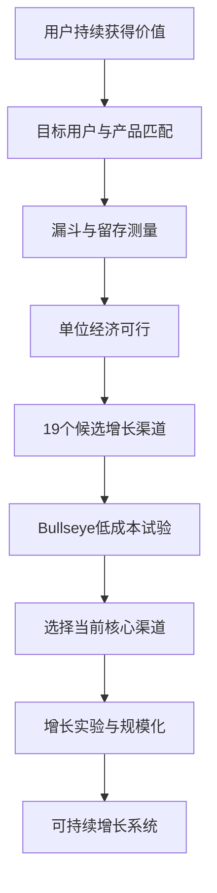

> [!quote] YOU

基于 
拉新：快速实现用户增长 (【美】加布里埃尔·温伯格, 【美】贾斯汀·迈尔斯, 谢天
这本书的观点，我们来系统学习用户增长

> [!question] Quiz
> 如果一个产品“新增注册用户很多”，但用户很快流失，按照用户增长的核心视角，最应该先判断什么？
>
> 先凭直觉选，不需要知道书中的原话。
>
> 1. 产品是否为用户持续创造价值
> 2. 获客渠道是否足够便宜
> 3. 销售团队是否足够庞大
> 4. 广告素材是否足够吸引人

> [!success] Quiz — correct ✓
> Your answer: 1. 产品是否为用户持续创造价值
> Correct answer: 1
>
> 用户增长不是单纯把更多人带进来，而是让目标用户持续获得价值并留下来。获客、激活、留存、推荐和变现都应围绕“可持续价值”展开；如果价值没有成立，放大获客只会放大流失。

> [!question] Quiz
> 一个产品有 10 万注册用户，但次日留存只有 5%。团队想通过投放广告把注册量提升 10 倍。最合理的判断是？
>
> 这题测试你是否能把“增长”与“增长引擎”区分开。
>
> 1. 应该先定位用户流失原因并验证留存改进
> 2. 应该立刻投放，因为规模会自然改善留存
> 3. 应该先把广告点击率做到行业最高
> 4. 应该优先增加销售人员来承接流量

> [!success] Quiz — correct ✓
> Your answer: 1. 应该先定位用户流失原因并验证留存改进
> Correct answer: 1
>
> 次日留存极低说明用户尚未稳定获得核心价值。此时扩大获客通常只是更快地把更多用户送入漏斗顶部，不能解决底层价值问题。应先找到激活/留存瓶颈，再用实验验证改进。

> [!question] Quiz
> 团队每周可以做 20 个增长实验，但资源有限。哪种排序方式最符合“系统增长”的思路？
>
> 关注实验与用户价值、瓶颈和可验证性的关系。
>
> 1. 优先做最能提升曝光的实验
> 2. 优先做最容易上线的实验
> 3. 优先做竞争对手最近做过的实验
> 4. 优先做针对当前关键瓶颈且影响可测的实验

> [!success] Quiz — correct ✓
> Your answer: 4. 优先做针对当前关键瓶颈且影响可测的实验
> Correct answer: 4
>
> 增长实验的价值不在数量，而在是否击中当前瓶颈、是否与用户价值相关、是否能清晰测量结果。只追求曝光、易上线或模仿竞品，容易制造“忙碌但没有增长”的假象。

> [!question] Question
> 你希望这套“用户增长”学习最终主要服务于什么？
>
> 1. 建立完整理论框架（推荐）
> 2. 能为一个真实产品制定增长方案
> 3. 提升增长实验与数据分析能力
> 4. 准备创业、产品或增长岗位面试

> [!example] Answer
> 1. 建立完整理论框架（推荐）

> [!abstract] PI

🥷 我们先建立完整框架，再逐步深入：

1. 用户增长的底层目标：持续创造用户价值  
2. 增长系统：获客、激活、留存、变现、推荐  
3. 《拉新》的核心：19 个增长渠道与 Bullseye 靶心框架  
4. 如何选择渠道：从可能性清单到核心渠道  
5. 增长实验：假设、指标、优先级、验证  
6. 从单点技巧升级为可复制的增长系统  

我正在先核实书中的具体框架与术语，避免把通用增长知识误说成书中观点。核实完成后，我会给出依赖关系图和第一课。

> [!abstract] PI

🥷 你的当前基础已经覆盖两点：

- 增长不等于单纯拉新，而是持续创造用户价值。
- 增长实验应优先解决当前瓶颈，并且可测量。

接下来从更系统的层次展开，重点不是背诵 19 个渠道，而是理解：**为什么要先建立价值与测量基础，再选择渠道，最后集中资源验证。**

## 学习路线

1. **增长的底层对象**：用户价值、目标用户、产品—市场匹配  
2. **增长系统的测量语言**：漏斗、留存、分群、CAC、LTV、回收期  
3. **《拉新》的核心框架**：19 个渠道与 Bullseye 三环  
4. **渠道选择**：如何从“所有可能”收敛到“当前靶心”  
5. **增长实验**：假设、指标、样本、阈值与复盘  
6. **增长系统化**：从单一渠道到增长循环和多渠道组合  

### 一个重要边界

《拉新》的独特贡献主要是：

- **19 个渠道的候选清单**
- **Bullseye 渠道选择框架**
- **用实验而不是直觉选择分发渠道**

而漏斗、CAC、LTV、留存、A/B 测试等，是整个增长领域的通用工具，不应全部归功于这本书。

第一课我们将从最根本的问题开始：

> **什么才算“增长”？为什么注册人数增加，可能反而意味着增长变差？**

如果这条路线符合你的目标，我就开始第一课。

> [!quote] YOU

符合

> [!abstract] PI

🥷## 第一课：什么才算“增长”？

### 1. 先解决一个问题

如果一家产品本月新增用户从 1 万变成 10 万，但大多数用户只打开一次就离开，我们能说它增长得很好吗？

直觉上不能。因为“进来的人变多”不等于“留下来的价值变大”。

### 2. 先锁定一个基础事实

> **真正的增长，是更多目标用户持续获得价值，而不只是更多人完成注册。**

这里有三个关键词：

- **目标用户**：不是所有人，而是产品真正服务的人。
- **持续获得价值**：用户不只是来过，而是反复解决问题。
- **更多**：增长最终仍然需要规模，但规模建立在价值之上。

所以，注册量只是增长系统的一个表面信号。更重要的问题是：

> 用户是否完成了第一次价值体验？  
> 用户是否愿意回来？  
> 用户是否愿意付费或推荐？

### 3. 这个事实如何推出增长系统？

一旦接受“增长 = 持续价值的扩大”，我们就能自然推出：

- **获客**：把目标用户带进来；
- **激活**：让用户尽快感受到核心价值；
- **留存**：让价值持续发生；
- **变现**：让价值交换能够持续；
- **推荐**：让满意用户带来更多目标用户。

这就是为什么只优化广告点击率，可能无法带来真正增长：它只改善了入口，不一定改善价值链条。

请回答下面的问题，确认这个基础节点已经建立。

> [!quote] YOU

继续

> [!question] Quiz
> 下面哪一种情况最能说明产品出现了真正的增长？
>
> 1. 目标用户持续获得价值并愿意回来
> 2. 注册用户数量持续增加
> 3. 社交媒体曝光次数持续增加
> 4. 广告点击率持续提高

> [!success] Quiz — correct ✓
> Your answer: 1. 目标用户持续获得价值并愿意回来
> Correct answer: 1
>
> 真正的增长建立在用户持续获得价值之上。注册、点击和曝光都是可能有用的中间指标，但如果用户没有激活、留存或形成持续行为，它们不能单独证明增长成立。

> [!abstract] PI

### 2. 从“价值”到“可测量的增长”

既然增长不是一个数字，而是一条价值链，我们接下来会遇到一个实际问题：

> 用户到底在哪一步失去了价值？

例如：

- 根本没看到产品：获客问题
- 注册后不会用：激活问题
- 用过一次就离开：留存问题
- 留下但不付费：变现问题
- 满意却不传播：推荐问题

因此，我们把用户从首次接触到持续使用的过程拆成几个阶段：

$$
\text{获客} \rightarrow \text{激活} \rightarrow \text{留存} \rightarrow \text{变现} \rightarrow \text{推荐}
$$

这不是一套必须机械套用的标签，而是一种**定位瓶颈的观察方法**。

### 一个例子

假设 1,000 人看到广告：

- 100 人注册；
- 30 人完成首次核心操作；
- 8 人在一周后回来；
- 2 人付费；
- 1 人推荐朋友。

那么问题可能不在广告，而在：

- 注册到核心操作只有 30%；
- 核心操作到一周留存只有约 27%。

如果团队只看“注册数”，就会继续买广告；如果看完整链条，就会优先研究激活和留存。

**连接上一节点：**

- 上一节点告诉我们：增长的本质是持续价值；
- 这一节点告诉我们：持续价值必须沿用户过程被观察和测量；
- 下一步我们才能判断：究竟该优化哪一环。

请判断下面这个场景中的主要瓶颈。

> [!quote] YOU

继续

> [!question] Quiz
> 某产品每月有大量新用户注册，但只有少数人完成第一次核心操作，最可能的首要问题是？
>
> 1. 获客环节没有带来足够曝光
> 2. 变现环节没有设计足够多价格方案
> 3. 激活环节没有让用户感受到核心价值
> 4. 推荐环节没有提供足够传播奖励

> [!success] Quiz — correct ✓
> Your answer: 3. 激活环节没有让用户感受到核心价值
> Correct answer: 3
>
> 用户已经完成注册，说明至少通过了获客环节；但没有完成第一次核心操作，说明他们还没有进入产品价值体验，首要应检查激活流程、首次使用体验和价值传达。

> [!abstract] PI

### 3. 指标不是目标：先定义“有效价值行为”

漏斗能告诉我们“哪里掉人”，但还不够。我们还需要回答：

> 什么行为，才真正代表用户获得了价值？

例如：

- 视频网站：不是“打开 App”，而是完成有效观看；
- 协作工具：不是“注册”，而是与他人完成一次协作；
- 外卖平台：不是“浏览首页”，而是完成一次有效订单。

这个行为可以称为**核心价值行为**。增长团队应优先追踪它，而不是被注册量、曝光量等表面数字牵着走。

一个好的增长指标通常满足：

1. 与用户价值有直接关系；
2. 能被产品行为观察到；
3. 能通过实验改变；
4. 能进一步连接到留存或收入。

因此，指标体系应从：

$$
\text{曝光} \rightarrow \text{注册} \rightarrow \text{核心价值行为} \rightarrow \text{留存/收入}
$$

逐渐从“看起来热闹”转向“真正产生价值”。

**连接前面：**

- 我们先用漏斗定位用户在哪一步流失；
- 再定义核心价值行为，判断用户是否真正通过了那一步；
- 之后才有资格讨论哪个增长渠道更值得投入。

请完成判断题。

> [!quote] YOU

继续

> [!question] Quiz
> 对于一个协作工具，下面哪个指标最可能代表用户完成了核心价值行为？
>
> 1. 团队成员完成一次共同协作
> 2. 首页访问次数
> 3. 广告页面展示次数
> 4. 新增注册账号数量

> [!success] Quiz — correct ✓
> Your answer: 1. 团队成员完成一次共同协作
> Correct answer: 1
>
> 协作工具的核心价值在于帮助多人完成协作，因此共同协作比注册、访问或曝光更接近真实价值。具体指标仍需结合产品定义和后续留存验证，但方向上应优先选择价值行为。

> [!abstract] PI

### 4. 增长还必须“经济上成立”

到这里，我们知道要追踪用户价值。但还有一个问题：

> 如果每获得一个用户都亏很多钱，用户越多，亏损是否会越大？

会。因此，增长不仅要看用户数量，还要看单位经济。

最基本的关系是：

$$
\text{单位贡献} = \text{单个用户带来的毛利} - \text{获客成本（CAC）}
$$

通常希望：

$$
\text{LTV} > \text{CAC}
$$

其中：

- **CAC**：获得一个用户平均花多少钱；
- **LTV**：一个用户在整个关系期间带来的预期价值。

但这里要小心：注册用户的 LTV 不是付费用户的 LTV。只有真正激活、留存并产生收入的用户，才有经济价值。

这解释了一个常见陷阱：

> 某个渠道带来大量便宜注册，但这些用户不激活、不留存、不付费。  
> 它的“表面 CAC”很低，真实的有效用户成本却可能很高。

**连接前面：**

$$
\text{用户价值}
\rightarrow
\text{核心价值行为}
\rightarrow
\text{留存与收入}
\rightarrow
\text{可持续单位经济}
$$

到了这里，我们才有足够基础进入《拉新》的核心问题：

> 在众多渠道中，如何找到最值得投入的渠道？

先检查这一节点。

> [!quote] YOU

继续

> [!question] Quiz
> 某广告渠道带来大量注册用户，但这些用户几乎不激活、不留存，也不付费。对此渠道最合理的判断是？
>
> 1. 渠道一定无效，因为注册用户没有价值
> 2. 渠道一定有效，因为注册成本很低
> 3. 渠道一定值得扩大，因为规模会自动改善留存
> 4. 不能只看注册成本，还要看有效用户的真实成本与后续价值

> [!success] Quiz — correct ✓
> Your answer: 4. 不能只看注册成本，还要看有效用户的真实成本与后续价值
> Correct answer: 4
>
> 真正应该计算的是获得有效用户的成本，并结合激活、留存和收入判断渠道质量。低注册成本可能只是把问题隐藏在后续环节，并不代表单位经济成立。

> [!abstract] PI

### 5. 为什么需要“19 个渠道清单”？

现在我们已经知道：

- 要先确认用户价值；
- 要找到漏斗瓶颈；
- 要判断单位经济；
- 不能只看表面指标。

接下来才进入《拉新》的核心贡献。

创业团队常犯的错误是：

> 只尝试自己最熟悉的渠道。

例如：

- 工程师优先做 SEO；
- 销售团队优先做线下销售；
- 内容团队优先做公众号；
- 创始人优先参加活动。

问题不一定是这些渠道不好，而是团队可能**过早把熟悉误认为适合**。

所以，书中提供了 19 类候选渠道，作为一张“探索地图”：

- 内容与搜索：SEO、SEM、内容营销、定向博客；
- 广告与传播：社交/展示广告、线下广告、媒体报道、非常规公关；
- 产品与技术：病毒式营销、工程即营销；
- 合作与交易：商务拓展、销售、联盟计划、既有平台；
- 线下触达：展会、线下活动、演讲；
- 关系网络：邮件营销、社群建设。

关键不是把 19 个渠道全部做一遍，而是：

> **先扩大候选空间，再通过低成本实验收敛。**

这张清单的价值类似于地图：它不告诉你目的地一定在哪里，但能防止你只在家门口找路。

**连接前面：**

- 单位经济告诉我们：渠道必须带来可持续价值；
- 19 个渠道清单告诉我们：不要过早锁定熟悉渠道；
- 下一步 Bullseye 框架会告诉我们：如何从候选空间逐步选出当前靶心。

请检查这个关键区别：渠道清单是“探索地图”，不是“执行清单”。

> [!quote] YOU

继续

> [!question] Quiz
> 《拉新》的 19 个渠道清单，最主要的作用是什么？
>
> 1. 证明线上渠道一定优于线下渠道
> 2. 替团队直接选出唯一最佳渠道
> 3. 扩大候选空间，避免过早依赖熟悉渠道
> 4. 要求每个创业团队同时运营全部渠道

> [!success] Quiz — correct ✓
> Your answer: 3. 扩大候选空间，避免过早依赖熟悉渠道
> Correct answer: 3
>
> 19 个渠道是探索地图，不是必须全部执行的任务，也不会脱离具体产品替你自动选出答案。它的作用是提醒团队系统地考虑不同分发路径，再通过实验收敛。

> [!abstract] PI

### 6. Bullseye：从“可能”到“靶心”

有了 19 个候选渠道后，问题变成：

> 我们怎么知道现在该押注哪个渠道？

《拉新》给出的答案是 Bullseye（三环靶心）：

#### 外环：可能性

对每个渠道提出具体假设：

- 用户在哪里出现？
- 我们如何触达他们？
- 预计能带来什么结果？
- 需要什么成本和资源？

此时不急着执行，目标是避免遗漏机会。

#### 中环：试验

用小预算、短周期的实验，粗略判断：

- 能否触达目标用户；
- 用户是否完成核心价值行为；
- 有效用户成本大概多少；
- 渠道是否可能扩大。

实验不是为了证明渠道“绝对有效”，而是为了比较不同渠道的潜力。

#### 靶心：集中投入

选择当前最有希望的渠道，集中资源优化：

- 素材和信息；
- 触达方式；
- 转化流程；
- 激活与留存；
- 成本和规模。

可以把它表达为：

$$
\text{广泛构想}
\rightarrow
\text{低成本比较}
\rightarrow
\text{集中投入}
$$

### 一个关键理解

“核心渠道”不是永远唯一的渠道。

它只是：

> **在当前阶段、当前目标和当前资源下，最值得集中投入的渠道。**

当渠道饱和、用户变化或业务阶段变化时，还要重新扫描外环。

这就避免了两个极端：

- 一开始就只押一个熟悉渠道；
- 永远同时做很多渠道，却没有任何一个做深。

请完成判断题。

> [!quote] YOU

继续

> [!question] Quiz
> 在 Bullseye 框架中，低成本试验的主要目的是什么？
>
> 1. 立刻把全部预算投入实验渠道
> 2. 在候选渠道之间比较潜力与可行性
> 3. 用一次实验证明渠道长期一定成功
> 4. 只测量曝光量而不考虑用户质量

> [!success] Quiz — correct ✓
> Your answer: 2. 在候选渠道之间比较潜力与可行性
> Correct answer: 2
>
> 低成本试验是筛选工具，用来比较触达能力、有效用户成本、价值行为和可扩展性等信号。它不能一次性证明长期成功，后续仍需在靶心阶段持续验证与优化。

> [!abstract] PI

### 7. 什么才是一个合格的增长实验？

“我们试试做内容营销”不是实验，只是一个方向。

合格的实验至少要包含：

1. **假设**：我们认为谁会被什么方式触达；
2. **动作**：具体投放什么内容、给谁、在哪里；
3. **核心指标**：是否完成核心价值行为；
4. **成本指标**：获得一个有效用户要多少钱；
5. **成功阈值**：达到什么结果才值得继续；
6. **时间边界**：观察多久后做判断。

例如：

> 我们假设，面向独立设计师发布“免费作品集模板”，能通过设计社区带来目标用户；如果每位有效用户成本低于 50 元，且 30% 完成首次作品上传，就进入下一轮优化。

这里的关键不是“内容发布了没有”，而是：

$$
\text{渠道动作}
\rightarrow
\text{目标用户}
\rightarrow
\text{核心价值行为}
\rightarrow
\text{留存/收入}
$$

实验必须连接到用户价值，否则很容易优化出大量“漂亮但无意义”的数据。

请检查这个节点。

> [!quote] YOU

继续

> [!question] Quiz
> 下面哪一个最接近合格的增长实验？
>
> 1. 模仿竞品最近使用的增长方式
> 2. 尝试做社群运营，观察大家的反馈
> 3. 面向目标用户测试具体方案，并设定价值指标、成本阈值和观察周期
> 4. 持续发布内容，看看曝光是否增加

> [!success] Quiz — correct ✓
> Your answer: 3. 面向目标用户测试具体方案，并设定价值指标、成本阈值和观察周期
> Correct answer: 3
>
> 合格实验必须明确目标用户、具体动作、价值指标、成本或成功阈值，以及观察周期。只有这样，结果才能帮助团队决定继续、修改或放弃，而不是停留在“做过了”的层面。

> [!abstract] PI

### 8. 先定义“增长目标”，再选渠道

不同阶段的增长目标不同：

- 早期：验证目标用户是否愿意使用；
- 产品初步成立：提升激活和留存；
- 找到核心用户后：扩大有效获客；
- 商业化阶段：提升收入和回收速度。

因此，“哪个渠道最好”没有脱离上下文的答案。更准确的问题是：

> **哪个渠道，最可能在当前阶段帮助我们完成当前目标？**

例如：

- 目标是验证需求：访谈、社群、定向触达可能更适合；
- 目标是扩大已有需求：搜索、内容、广告可能更适合；
- 目标是高客单价成交：销售、商务拓展可能更适合；
- 目标是形成传播循环：推荐机制、社群、产品内分享可能更适合。

所以 Bullseye 的真正逻辑不是：

$$
\text{找一个永远最好的渠道}
$$

而是：

$$
\text{当前目标}
\rightarrow
\text{候选渠道}
\rightarrow
\text{低成本验证}
\rightarrow
\text{阶段性核心渠道}
$$

这也解释了为什么增长团队需要定期重新扫描渠道，而不是把一次成功经验当成永久战略。

到这里，我们已经完成了第一轮基础框架。下一阶段将逐一学习 19 个渠道，并用同一套问题分析它们：

1. 它适合什么用户和场景？
2. 它如何触达用户？
3. 它的优势和限制是什么？
4. 如何设计最小实验？
5. 用什么指标判断是否值得继续？

> [!quote] YOU

继续

> [!abstract] PI

## 第二阶段：逐个理解 19 个渠道

### 渠道一：定向博客（Targeting Blogs）

#### 为什么需要这个渠道？

很多产品不是面向“大众”，而是面向一个明确的小群体：

- 独立开发者；
- 摄影师；
- 财务负责人；
- 某类企业采购者；
- 某个垂直兴趣社群。

这些用户往往已经聚集在特定博客、 newsletter 或专业内容平台周围。与其一开始做广泛广告，不如先找到已经拥有目标用户注意力的节点。

#### 这个渠道的基本机制

$$
\text{目标博客/内容平台}
\rightarrow
\text{目标用户注意}
\rightarrow
\text{可信内容或合作}
\rightarrow
\text{核心价值行为}
$$

它不只是“去博客投广告”，还可能包括：

- 为目标博客提供有价值的客座内容；
- 与作者合作制作专题；
- 赞助高度垂直的 newsletter；
- 通过内容进入一个已有的专业受众群体。

#### 它适合什么时候？

当你满足以下条件时，定向博客值得测试：

1. 目标用户集中在明确的内容社区；
2. 这些内容节点有稳定且匹配的受众；
3. 你的产品能解决该受众的具体问题；
4. 你能提供比普通广告更有价值的内容或合作。

#### 最小实验

不要一开始签长期合作。可以先：

- 选择 3 个受众高度匹配的平台；
- 为每个平台设计一个不同的合作方案；
- 使用独立链接或邀请码追踪来源；
- 观察注册、核心价值行为和留存；
- 比较有效用户成本，而非只看点击量。

#### 常见误区

博客读者多，不代表它适合你的产品。真正重要的是：

$$
\text{受众匹配度}
\times
\text{信任度}
\times
\text{价值行为转化}
$$

流量大但受众不匹配，通常不如流量小但高度垂直的平台。

请检查这个渠道的核心逻辑。

> [!quote] YOU

继续

> [!question] Quiz
> 测试“定向博客”渠道时，哪个信号最有价值？
>
> 1. 文章带来的用户完成核心价值行为并持续留下
> 2. 博客文章获得很多总浏览量
> 3. 合作内容获得很多点赞
> 4. 博客作者拥有很多社交媒体粉丝

> [!success] Quiz — correct ✓
> Your answer: 1. 文章带来的用户完成核心价值行为并持续留下
> Correct answer: 1
>
> 博客流量、粉丝和点赞只能说明注意力，不一定说明用户匹配。更有价值的信号是目标用户完成核心价值行为并持续留下，因为这直接连接到产品价值和可持续增长。

> [!abstract] PI

### 渠道二：媒体报道（Publicity）

媒体报道的本质不是“获得曝光”，而是借助媒体的可信度和分发能力，把产品带到目标用户面前。

基本链路是：

$$
\text{新闻价值}
\rightarrow
\text{媒体报道}
\rightarrow
\text{目标用户注意}
\rightarrow
\text{核心价值行为}
$$

#### 什么更可能获得报道？

不是“我们上线了一个产品”，而是具备某种新闻价值，例如：

- 解决了一个明确且普遍的问题；
- 有独特数据或研究发现；
- 服务了一个正在发生的趋势；
- 创始人或用户故事具有公共意义；
- 产品取得了可验证的显著结果。

#### 为什么很多报道没有带来增长？

因为报道解决的只是“被看见”，不一定解决：

- 受众是否匹配；
- 用户是否理解产品；
- 用户是否能快速体验价值；
- 用户是否会留下或付费。

所以媒体渠道必须和产品承接能力配合：

$$
\text{报道}
\rightarrow
\text{落地页}
\rightarrow
\text{激活}
\rightarrow
\text{留存}
$$

#### 最小实验

可以测试不同角度的故事，而不是立刻追求大媒体：

1. 为同一个产品写出 2—3 个不同新闻角度；
2. 联系受众匹配的垂直媒体；
3. 使用独立链接追踪访问和后续行为；
4. 比较有效用户，而不只是报道数量。

媒体报道适合制造突破和信任，但通常不等于稳定、可预测的获客引擎。

> [!quote] YOU

继续

> [!question] Quiz
> 一个产品获得了大量媒体报道，但报道带来的用户几乎不激活。最应该优先检查什么？
>
> 1. 报道受众与产品价值承接是否匹配
> 2. 是否同时开通更多社交账号
> 3. 是否继续争取更多媒体报道
> 4. 是否把报道标题写得更夸张

> [!success] Quiz — correct ✓
> Your answer: 1. 报道受众与产品价值承接是否匹配
> Correct answer: 1
>
> 媒体报道主要解决注意力和可信度问题。用户不激活时，应检查受众是否匹配、报道是否准确传达价值，以及落地页和首次体验是否能承接流量，而不是盲目增加曝光。

> [!abstract] PI

### 渠道三：非常规公关（Unconventional PR）

普通公关争取“被报道”；非常规公关则是：

> **主动创造一个足够特别、可传播、能吸引目标用户的事件或体验。**

例如：

- 一个与产品价值相关的公开挑战；
- 一个有趣的工具或互动体验；
- 一次反常规的线下行动；
- 一个能引发讨论的数据项目；
- 一个用户愿意主动分享的特殊事件。

它的基本链路是：

$$
\text{独特事件/体验}
\rightarrow
\text{讨论与传播}
\rightarrow
\text{目标用户注意}
\rightarrow
\text{产品价值体验}
$$

### 普通公关与非常规公关的区别

| 类型 | 核心问题 |
|---|---|
| 媒体报道 | 为什么媒体愿意报道我们？ |
| 非常规公关 | 我们能创造什么值得讨论的事情？ |

但要注意：

> “有趣”不等于“有效”。

如果事件和产品没有关系，可能带来大量围观，却带不来目标用户。优秀的非常规公关，应该让传播本身成为产品价值、用户身份或核心问题的一部分。

例如，一个环保产品发起环保挑战，传播内容与产品使命相连；而一个软件产品单纯制造噱头，可能只获得短暂流量。

下一步，我们会比较这类渠道与付费广告的根本区别。

> [!quote] YOU

继续

> [!question] Quiz
> 非常规公关活动最需要避免的问题是什么？
>
> 1. 活动获得的讨论量不够大
> 2. 活动无法同时覆盖所有用户
> 3. 活动需要团队投入时间
> 4. 活动很有趣，但与产品价值和目标用户没有关系

> [!success] Quiz — correct ✓
> Your answer: 4. 活动很有趣，但与产品价值和目标用户没有关系
> Correct answer: 4
>
> 非常规公关可以带来注意力，但如果事件与产品价值、目标用户没有关联，传播就很难转化为有效用户。讨论量本身不是增长结果。

> [!abstract] PI

### 渠道四：搜索引擎营销（SEM）

SEM 的核心是：

> 当用户已经表达出明确需求时，争取出现在他的搜索结果中。

链路通常是：

$$
\text{用户主动搜索}
\rightarrow
\text{广告/结果页}
\rightarrow
\text{落地页}
\rightarrow
\text{核心价值行为}
$$

它与媒体报道不同：

- 媒体报道：先制造注意力，再等待用户产生兴趣；
- SEM：用户已经有需求，产品争取承接需求。

因此，SEM 特别适合解决“用户已经知道自己要什么”的问题。

### SEM 实验要看什么？

不能只看点击率，而要追踪：

1. 搜索词是否真的代表目标需求；
2. 点击用户是否完成核心价值行为；
3. 每个有效用户的成本；
4. 用户后续是否留存或付费。

例如，“项目管理软件”可能是高意图词；“如何管理项目”可能处于学习阶段；两者点击量相近，但转化质量可能完全不同。

### 常见误区

- 只追求搜索量大的词；
- 忽略搜索意图；
- 广告文案和落地页承诺不一致；
- 用注册替代激活作为成功标准；
- 没有设置获客成本上限。

SEM 的优点是意图相对明确、效果容易追踪；限制是竞争激烈的关键词可能很贵，而且搜索需求本身有规模上限。

> [!quote] YOU

继续

> [!question] Quiz
> 评估 SEM 渠道时，哪项信息最能判断搜索流量的质量？
>
> 1. 广告展示次数
> 2. 搜索意图与用户后续价值行为是否匹配
> 3. 广告标题的字数
> 4. 关键词的月搜索量

> [!success] Quiz — correct ✓
> Your answer: 2. 搜索意图与用户后续价值行为是否匹配
> Correct answer: 2
>
> 搜索量和展示量只能说明流量规模，不能说明用户质量。SEM 的关键是用户的搜索意图是否与产品匹配，以及点击后是否完成核心价值行为并持续留下。

> [!abstract] PI

### 渠道五：社交与展示广告

这类渠道与 SEM 的关键区别是：

- **SEM**：用户已经表达需求；
- **社交/展示广告**：根据用户画像、兴趣、行为或场景，主动触达潜在用户。

基本链路：

$$
\text{受众定位}
\rightarrow
\text{广告素材}
\rightarrow
\text{点击/访问}
\rightarrow
\text{激活与留存}
$$

它的难点在于：平台可以精准找到“可能感兴趣的人”，但“感兴趣”不等于“愿意持续使用”。

因此实验不能只测试点击率，还要同时测试：

- 受众分群；
- 广告承诺；
- 落地页；
- 首次体验；
- 有效用户成本；
- 后续留存。

一个常见现象是：

> 素材越刺激，点击率越高；但如果承诺与产品真实价值不一致，激活率和留存率可能更差。

所以社交广告优化的不是单一点击率，而是整条链路的质量。

$$
\text{广告承诺}
\approx
\text{落地页承诺}
\approx
\text{真实产品价值}
$$

三者越一致，流量质量通常越好。

> [!quote] YOU

继续

> [!question] Quiz
> 社交与展示广告点击率很高，但激活率和留存率很低，最可能的问题是什么？
>
> 1. 应该把所有预算投入同一素材
> 2. 广告展示次数还不够多
> 3. 广告平台的用户数量太大
> 4. 广告承诺、落地页和真实产品价值不一致

> [!success] Quiz — correct ✓
> Your answer: 4. 广告承诺、落地页和真实产品价值不一致
> Correct answer: 4
>
> 高点击只能说明素材制造了兴趣；激活和留存低，常见原因是广告承诺吸引了错误用户，或落地页与真实产品体验不一致。应优化整条承诺—体验链路，而不是只追求更多点击。

> [!abstract] PI

### 渠道六：搜索引擎优化（SEO）

SEO 与 SEM 都依赖搜索，但机制不同：

- **SEM**：付费获得搜索曝光，见效较快；
- **SEO**：通过内容、结构和权威性获得自然搜索流量，积累较慢。

SEO 的增长链路是：

$$
\text{用户问题}
\rightarrow
\text{搜索}
\rightarrow
\text{高质量内容}
\rightarrow
\text{产品价值体验}
\rightarrow
\text{留存/转化}
$$

SEO 的关键不是“写很多文章”，而是：

1. 目标用户确实会搜索这个问题；
2. 内容真正解决问题；
3. 内容自然引导到产品价值；
4. 来访用户与目标用户匹配；
5. 流量最终能产生有效行为。

### 一个重要区别

有些关键词流量很大，但购买意图很低；有些关键词搜索量小，却非常接近用户决策。

所以 SEO 不应只优化：

$$
\text{访问量}
$$

而应观察：

$$
\text{搜索意图}
\rightarrow
\text{有效访问}
\rightarrow
\text{核心价值行为}
\rightarrow
\text{留存/收入}
$$

SEO 的优势是长期积累和边际成本较低；限制是见效慢、需要持续产出，而且搜索规则和竞争环境会变化。

> [!quote] YOU

继续

> [!question] Quiz
> SEO 内容获得大量自然流量，但几乎没有用户完成核心价值行为，最应该优先检查什么？
>
> 1. 继续扩大文章发布数量
> 2. 把所有标题改成更夸张的形式
> 3. 流量对应的搜索意图与产品价值是否匹配
> 4. 只关注页面停留时间
