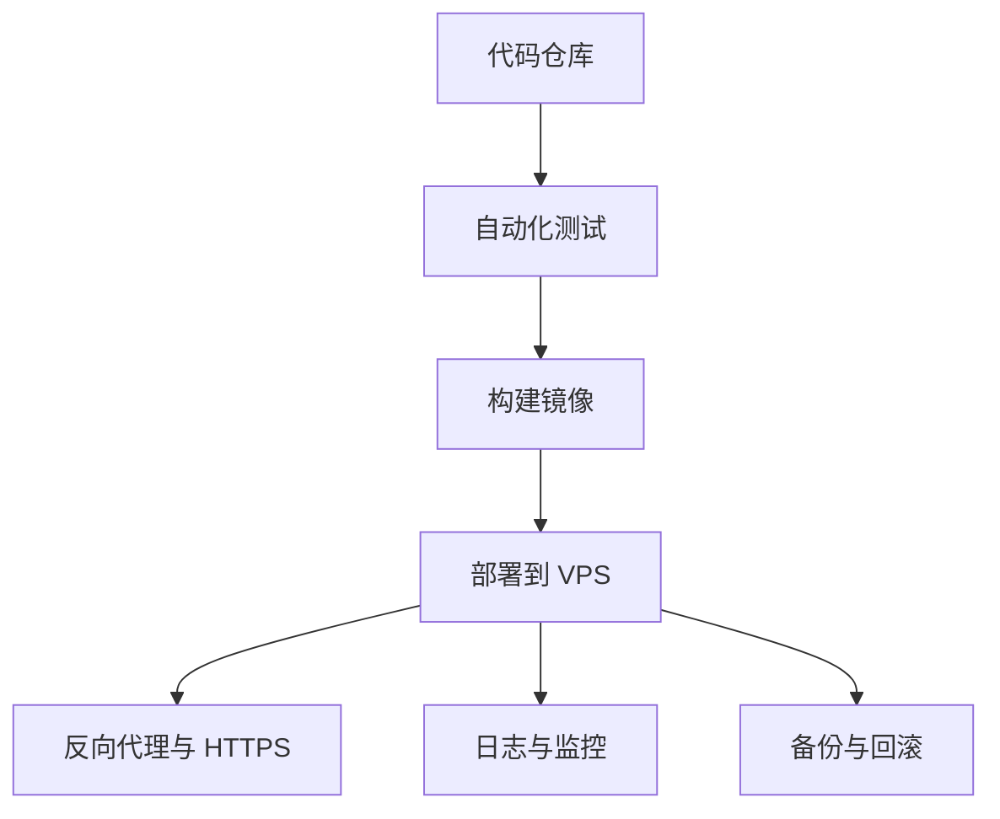
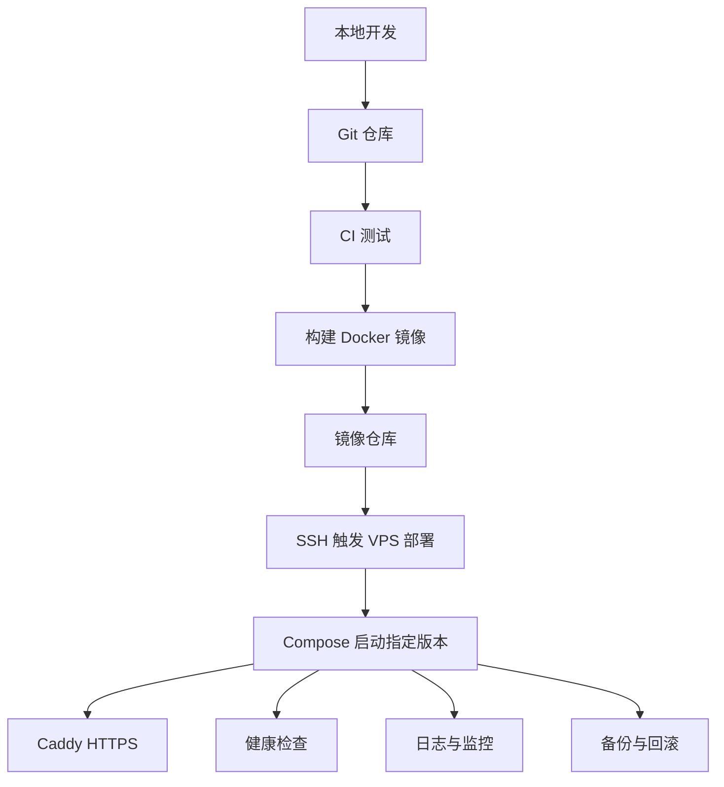
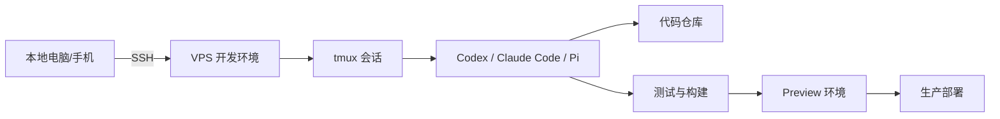
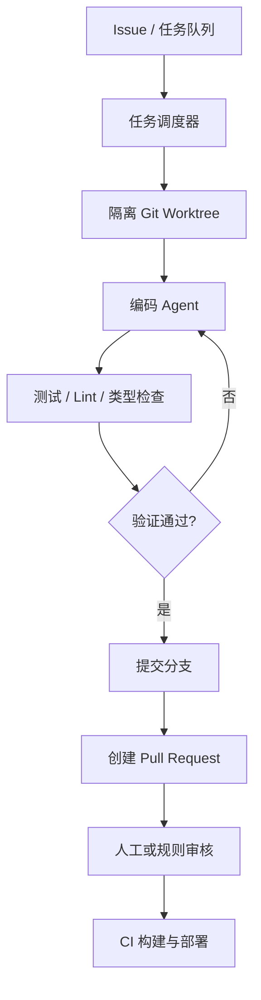
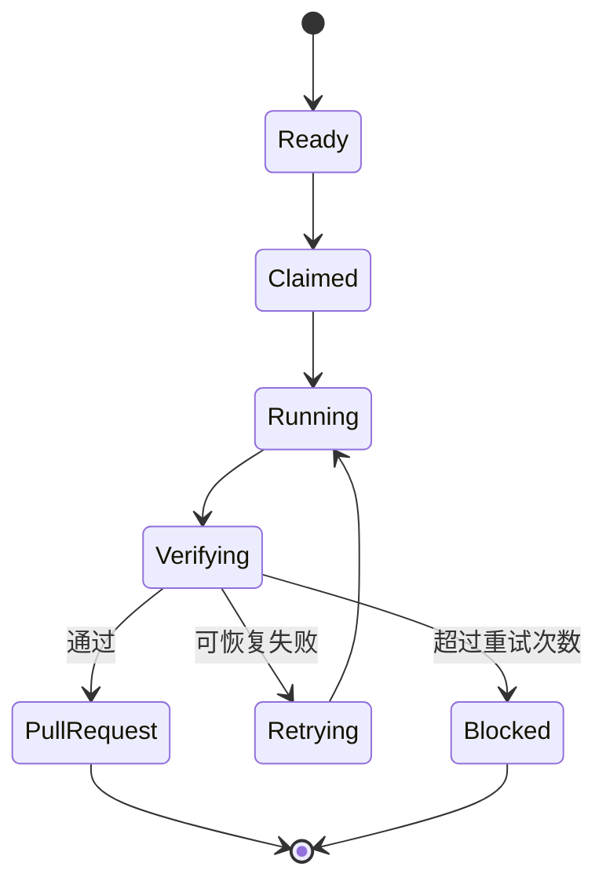

> [!quote] YOU

如何搭建一个基于vps的完整开发工作流


> [!question] Quiz
> 你目前对“VPS 开发工作流”的理解更接近哪一种？
>
> 选最符合你当前情况的一项，用来决定从哪里开始讲。
>
> 1. 我部署过项目，但没有做过自动化发布和监控
> 2. 我会 SSH 登录，也用过 Git，但没部署过项目
> 3. 我只知道 VPS 是一台远程服务器
> 4. 我已经有 CI/CD、容器或多台服务器经验


> [!failure] Quiz — incorrect ✗
> Your answer: 4. 我已经有 CI/CD、容器或多台服务器经验
> Correct answer: 3
>
> 这道题没有真正的对错；我先用你的选择定位起点。若你只知道 VPS 是远程服务器，就从基础模型开始；如果已有部署或 CI/CD 经验，我会直接讲更高层的工作流设计。


> [!question] Question
> 你搭建这套 VPS 工作流，最想优先解决哪类目标？
>
> 1. 个人项目：低成本、能稳定开发和部署
> 2. 团队项目：多人协作、权限和代码审查
> 3. 生产服务：高可用、监控、备份和回滚
> 4. 学习 DevOps：从零搭出完整标准流程


> [!example] Answer
> 1. 个人项目：低成本、能稳定开发和部署


> [!abstract] PI

我会按“个人项目、低成本但稳定”的目标来设计：

1. VPS 与安全基线  
2. 本地开发与 Git 协作  
3. Docker 化运行环境  
4. CI/CD 自动部署  
5. 域名、HTTPS 与反向代理  
6. 日志、监控、备份和回滚  
7. 最终整理成一套可复制的目录结构与命令

依赖关系大致是：



我先核对一套适合个人项目的最小完整方案，再开始逐步搭建。


> [!abstract] PI

你的目标是“个人项目、低成本、稳定开发部署”，且你已有 CI/CD、容器和多服务器经验，所以不需要从 SSH 基础讲起。

我建议采用这套方案：

- **代码**：GitHub/GitLab
- **CI/CD**：GitHub Actions 或 GitLab CI
- **制品**：带 Git SHA 的 Docker 镜像
- **服务器**：单台 Linux VPS
- **运行**：Docker Compose
- **入口**：Caddy 自动 HTTPS
- **数据库**：PostgreSQL，仅内网访问
- **密钥**：CI Secrets + VPS 权限受限的环境文件
- **备份**：数据库逻辑备份 + Restic 异地加密备份
- **回滚**：按镜像版本回滚，而不是在 VPS 上重新构建

核心原则是：

> 本地写代码，CI 构建和测试，VPS 只运行已经验证过的不可变镜像。



接下来可以按以下顺序实操：

1. 设计项目目录和环境分层  
2. 编写 `compose.dev.yaml` 与 `compose.prod.yaml`  
3. 加固 VPS 和配置 SSH 部署用户  
4. 配置镜像构建与 CI  
5. 编写安全的部署脚本  
6. 配置 Caddy 与 HTTPS  
7. 加入数据库迁移、健康检查和回滚  
8. 配置备份、日志轮转与基础监控  

如果这个技术选型和推进顺序可以，我下一步直接从**项目目录结构 + Compose 文件**开始。


> [!quote] YOU

我期望的是vps可以使用类似 codex claude code pi的编码agent自动化开发


> [!abstract] PI

明白了：你要的不是“把应用部署到 VPS”，而是把 VPS 变成一个**远程 AI 编码工作站**，运行 Codex、Claude Code、Pi 等 Agent，自动完成开发、测试、提交和部署。

推荐架构：



核心设计：

- VPS 上运行持久化 `tmux`/`screen` 会话
- 每个项目独立目录、用户和环境变量
- Agent 只拥有项目目录权限，避免直接使用 root
- 通过 SSH/Git 获取代码
- Agent 修改代码后必须运行测试、Lint、类型检查
- 通过分支和 Pull Request 控制合并
- 生产部署使用独立脚本或 CI，不让 Agent 直接随意操作生产机
- 用 `systemd`/Docker 管理项目服务
- 用日志、磁盘监控和备份保证长期运行
- 可选：通过 Telegram、Web Terminal 或 SSH 远程触发 Agent

需要先确定一个关键边界：你希望 Agent 是**你在线时辅助编码**，还是能够根据任务在你离线时**自主领取任务、修改代码、测试并提交 PR**？


> [!quote] YOU

后者


> [!abstract] PI

那目标应定义为：

> **VPS 上的无人值守 Agent 开发工厂：从任务队列领取任务，创建隔离工作区，修改代码，运行验证，提交分支并创建 PR；不直接改生产。**

## 推荐架构



## VPS 上的主要组件

```text
VPS
├── agent-runner        # 持续运行的任务调度器
├── agent-worker        # Codex / Claude Code / Pi 执行环境
├── task-queue          # GitHub Issues、Linear 或本地队列
├── workspace/
│   ├── task-001/       # 每个任务独立 worktree
│   └── task-002/
├── repositories/       # 裸仓库或项目缓存
├── logs/
└── secrets/            # API key，不进入项目目录
```

## 关键安全边界

1. **Agent 不使用 root**
2. 每个任务使用独立 Git worktree 或临时容器
3. Agent 默认不能访问生产密钥
4. Agent 不能直接执行生产部署
5. 网络访问设置白名单或至少记录审计日志
6. 每个任务限制 CPU、内存、运行时间和磁盘空间
7. 修改完成后必须通过测试、Lint、类型检查
8. 只允许创建分支和 PR，不允许直接推送主分支
9. 失败任务自动停止，不能无限循环
10. API Key 使用独立、可撤销、低权限的凭据

## 我建议的第一版技术选型

- **任务入口**：GitHub Issues
- **调度器**：一个 Python/TypeScript 守护进程
- **执行隔离**：Docker 容器
- **项目隔离**：Git worktree
- **会话管理**：systemd
- **Agent**：先接入一个，例如 Claude Code 或 Codex
- **验证**：项目自己的测试命令 + 通用超时
- **结果输出**：分支、提交、测试摘要、PR
- **失败处理**：自动重试 1～2 次，之后标记为 blocked
- **生产发布**：仍由 CI/CD 负责

这一版先不要做“多个 Agent 自由协作”。先做一个可靠闭环：

```text
Issue → Agent → 修改代码 → 测试 → 分支 → PR
```

等这个闭环稳定后，再增加：

```text
规划 Agent → 编码 Agent → 测试 Agent → Review Agent
```

接下来应先实现四个最小模块：

1. `agent-runner`：轮询并领取 Issue  
2. `workspace manager`：创建和销毁隔离 worktree/容器  
3. `agent adapter`：统一调用 Codex、Claude Code、Pi  
4. `result reporter`：提交分支并创建 PR  

这是后续实施的基础方案。


> [!quote] YOU

有对应的开源解决方案嘛现在


> [!abstract] PI

有，但需要区分两类：

## 1. 最接近“开箱即用”的方案：OpenHands

GitHub：<https://github.com/OpenHands/OpenHands>

特点：

- 开源、自托管
- 支持 Docker 沙箱
- 能读任务、修改代码、运行命令和测试
- 有 Web UI、CLI 和 SDK
- 可接入多种模型
- 适合部署在 VPS 上长期运行

它更像一个完整的“AI 开发工作台”，是目前最接近你目标的选择。

但要注意：它主要调用模型/API，不是直接复用你的 Claude Code、Codex CLI 或 Pi 登录状态。

---

## 2. 更适合“Issue → 自动修复 → PR”：SWE-agent

GitHub：<https://github.com/SWE-agent/SWE-agent>

特点：

- 输入 GitHub Issue
- 自动分析代码
- 修改代码
- 运行测试
- 尝试提交修复
- MIT 开源

它更偏“软件工程任务执行器”，而不是持续运行的 VPS 工作台。

适合这样的流程：

```text
GitHub Issue
    ↓
SWE-agent
    ↓
代码修改
    ↓
测试
    ↓
Pull Request
```

---

## 3. 适合自己编排：Goose

GitHub：<https://github.com/block/goose>

特点：

- Apache-2.0 开源
- 可执行命令、编辑文件、运行测试
- 支持扩展和 MCP
- 支持多种模型
- 适合自己搭建 Agent 流程

但它本身不是完整的“Issue 队列 → 自动创建 PR”平台，调度、隔离、重试和 GitHub 集成通常需要你补充。

---

## 4. 适合单任务编码：Aider

GitHub：<https://github.com/Aider-AI/aider>

特点：

- 终端内运行
- Git 集成很好
- 修改和提交代码方便
- 部署简单

但它更像“终端编码助手”，不是无人值守任务平台。你需要自己用 systemd、队列和脚本包装它。

---

## 关键结论

目前没有一个成熟开源项目同时满足：

```text
VPS 常驻运行
+ GitHub Issue 自动领取
+ 使用 Claude Code / Codex / Pi CLI
+ 隔离执行
+ 自动测试
+ 自动创建 PR
+ 失败重试和任务恢复
```

最现实的选择是：

### 方案 A：使用 OpenHands

```text
GitHub Issue
    ↓
OpenHands
    ↓
Docker 沙箱
    ↓
测试
    ↓
PR
```

适合希望少写基础设施的人。

### 方案 B：自己做一个 Agent Runner

```text
GitHub Issue
    ↓
任务调度器
    ↓
Docker 容器 / Git worktree
    ↓
Claude Code / Codex / Pi
    ↓
测试与检查
    ↓
创建 PR
```

适合你明确想使用 Claude Code、Codex、Pi 的情况。

我更推荐 **方案 B**：用现成 Agent CLI 做执行器，只自己实现一个很薄的调度层。这样不会被某个平台绑定，也能切换 Codex、Claude Code 和 Pi。、】【


> [!quote] YOU

好的 我们深入方案B


> [!abstract] PI

🥷 我建议把方案 B 做成一个**轻量级 Agent Runner**，而不是直接改造 Codex、Claude Code 或 Pi。Runner 负责“什么时候运行、在哪里运行、运行多久、结果如何回传”；具体编码能力交给现成 CLI。

## 目标

```text
GitHub Issue
  ↓
Runner 领取任务
  ↓
创建隔离 worktree / Docker 容器
  ↓
调用 Codex / Claude Code / Pi
  ↓
运行测试与质量检查
  ↓
提交分支
  ↓
创建 Pull Request
  ↓
等待人工审核
```

## 推荐架构

```text
                    ┌──────────────┐
                    │ GitHub Issues │
                    └──────┬───────┘
                           │
                    ┌──────▼───────┐
                    │ Agent Runner  │
                    │ 任务调度/重试 │
                    └──────┬───────┘
                           │
        ┌──────────────────┼──────────────────┐
        │                  │                  │
┌───────▼───────┐  ┌───────▼───────┐  ┌───────▼───────┐
│ Task Worker 1 │  │ Task Worker 2 │  │ Task Worker N │
│ Docker + Git  │  │ Docker + Git  │  │ Docker + Git  │
└───────┬───────┘  └───────┬───────┘  └───────┬───────┘
        │                  │                  │
        ▼                  ▼                  ▼
  Claude/Codex/Pi      Claude/Codex/Pi      Claude/Codex/Pi
```

## 关键设计决定

### 1. Runner 与 Agent 解耦

不要在业务逻辑中写死：

```bash
claude ...
```

而是定义统一接口：

```text
AgentAdapter
├── ClaudeCodeAdapter
├── CodexAdapter
├── PiAdapter
└── OpenHandsAdapter（备用）
```

Runner 只关心：

```text
run(task, workspace, timeout) -> result
```

这样未来可以切换模型或 CLI，而不用重写任务系统。

### 2. 每个任务独立工作区

第一版使用：

```text
Git worktree + Docker worker
```

每个任务拥有：

- 独立分支
- 独立目录
- 独立容器
- 独立日志
- 独立超时
- 独立任务状态

不要让多个 Agent 共用一个工作目录，否则很容易互相覆盖代码。

### 3. Agent 不直接接触生产环境

Agent 只能：

- 读取代码仓库
- 修改自己的分支
- 运行测试
- 推送任务分支
- 创建 PR

Agent 不能：

- 直接合并主分支
- 直接部署生产
- 读取生产数据库
- 读取生产环境变量
- 使用 VPS root 权限

### 4. 用 GitHub Issue 作为第一版任务队列

任务状态可以用 Label 表示：

```text
agent:ready
agent:running
agent:failed
agent:review
agent:blocked
agent:done
```

Runner 只领取带有 `agent:ready` 的 Issue，并通过 GitHub API 加锁，避免重复领取。

## 代码目录建议

```text
agent-runner/
├── runner/
│   ├── scheduler.py
│   ├── github.py
│   ├── workspace.py
│   ├── policy.py
│   ├── executor.py
│   └── reporter.py
├── adapters/
│   ├── base.py
│   ├── claude_code.py
│   ├── codex.py
│   └── pi.py
├── worker/
│   ├── Dockerfile
│   ├── entrypoint.sh
│   └── verify.sh
├── config/
│   └── projects.yaml
├── systemd/
│   └── agent-runner.service
└── README.md
```

## 单个任务的状态机



状态不能只存在内存里，应持久化到 SQLite：

```text
tasks
├── id
├── repository
├── issue_number
├── status
├── branch
├── agent
├── attempt
├── started_at
├── finished_at
├── error
└── result_summary
```

这样 VPS 重启后可以恢复未完成任务。

## 第一版边界

### 构建

- GitHub Issue 轮询
- Issue 加锁
- Git worktree 创建和销毁
- Docker worker
- 一个 Agent Adapter
- 测试命令执行
- 分支提交
- 创建 Draft PR
- SQLite 状态持久化
- 超时与最多两次重试
- systemd 常驻运行

### 暂不构建

- 多 Agent 自由协作
- 自动合并 PR
- 自动生产部署
- Web 控制台
- 多 VPS 调度
- Agent 长期记忆
- 自建模型推理
- 自动修改数据库迁移
- 让 Agent 访问生产数据

## 我推荐的实现顺序

### Phase 1：单项目、手动触发

```text
命令行任务 → 创建 worktree → 调用 Agent → 测试 → 提交分支
```

这一阶段不依赖 GitHub Issue，先证明 Agent 执行闭环可靠。

### Phase 2：接入 GitHub Issue

```text
agent:ready Issue → Runner 领取 → 自动执行 → Draft PR
```

### Phase 3：无人值守运行

加入：

- systemd
- SQLite 恢复
- 超时
- 重试
- 日志轮转
- 磁盘清理
- 并发限制

### Phase 4：安全与质量门禁

加入：

- Docker 网络限制
- Secret 隔离
- 测试必须通过
- 禁止修改保护文件
- PR diff 大小限制
- 变更文件白名单
- 人工审核后才能合并

## 必需凭据

| 凭据 | 用途 |
|---|---|
| GitHub Fine-grained Token 或 GitHub App | 读取 Issue、推送分支、创建 PR |
| Claude API Key | 调用 Claude Code 或相关 API |
| OpenAI API Key | 调用 Codex 或 OpenAI 模型 |
| Pi 所需凭据 | 调用 Pi 使用的模型 |
| 镜像仓库凭据 | 可选，用于发布构建镜像 |

建议全部放在：

```text
/etc/agent-runner/runner.env
```

权限设置为：

```text
root:agent-runner 640
```

不要把这些凭据放进项目目录、Docker 镜像或 Git 仓库。

## 最脆弱的假设

这个方案假设 **Codex、Claude Code 和 Pi 都能在 VPS 上以稳定的非交互模式运行，并且允许长期自动化调用**。

如果某个 CLI 依赖浏览器登录、交互确认或个人订阅授权，方案仍然能运行，但应改用对应厂商的 API Key，或者把该 Agent 作为手动模式使用。无人值守场景优先使用官方 API 或明确支持自动化的认证方式，不建议共享个人登录凭据。

## 结论

第一版最值得做的是：

```text
Python Runner
+ GitHub Issues
+ SQLite
+ Docker worker
+ Git worktree
+ 一个 Agent Adapter
+ Draft PR
```

不要一开始同时接入 Codex、Claude Code 和 Pi。先选一个最稳定的 CLI，把完整闭环跑通，再增加其他 Adapter。

这会涉及一个新服务和约 8～12 个文件，但每个阶段都能独立运行和验证。若你认可这个设计，下一步可以进入实现计划或直接先实现 **Phase 1：单项目、手动触发闭环**。


> [!quote] YOU

如果搭建这么个服务vps推荐配置是多少


> [!abstract] PI

如果 Agent 使用 Claude、Codex、Pi 的云端/API 模型，**不需要 GPU**。VPS 主要消耗在 Agent 运行环境、Docker、依赖安装和测试构建。

## 我的推荐配置

### 推荐起步配置

```text
CPU：8 vCPU
内存：16 GB
磁盘：160 GB NVMe SSD
网络：1 Gbps
架构：x86_64
系统：Ubuntu 24.04 LTS
并发：2 个 Agent
```

这套配置适合：

- 1～2 个项目
- 2 个 Agent 并发
- Docker 构建
- Node.js / Python / Go 项目
- 数据库测试容器
- Playwright 基础测试
- 长时间无人值守运行

## 配置档位

| 用途 | CPU | 内存 | 磁盘 | 并发 |
|---|---:|---:|---:|---:|
| 最低可用 | 4 vCPU | 8 GB | 80 GB | 1 |
| 推荐起步 | 8 vCPU | 16 GB | 160 GB | 2 |
| 较强工作站 | 12 vCPU | 32 GB | 240 GB | 4～6 |
| 本地运行大模型 | GPU 级别 | 32GB+ | 300GB+ | 不建议普通 VPS |

## 为什么推荐 8 vCPU / 16GB

粗略分配如下：

```text
系统与 Docker                    1～2 GB
Runner 与 SQLite                 <1 GB
Agent CLI 进程                   1～2 GB
一个开发容器                     2～4 GB
依赖安装与测试峰值               4～8 GB
文件缓存与余量                   2～4 GB
```

如果同时运行两个 Agent，很容易超过 8GB。因此 8GB 只能作为单 Agent 的最低配置。

## 磁盘比 CPU 更容易成为瓶颈

每个项目可能同时占用：

- Git 仓库和 worktree：1～5GB
- `node_modules` / Python venv：1～5GB
- Docker 镜像和构建缓存：5～30GB
- 测试数据库与日志：数 GB
- 失败任务残留目录：持续增长

所以不要只买 40GB 磁盘。建议：

```text
最低：80GB
推荐：160GB
多个项目：240GB+
```

必须配置：

- Docker 镜像清理
- 日志轮转
- 失败 worktree 自动删除
- 磁盘使用率超过 80% 告警
- 至少 2～4GB swap

## 如果使用 Playwright 或浏览器测试

在基础配置上增加：

```text
额外内存：2～4GB
额外磁盘：10～20GB
```

因此推荐至少：

```text
8 vCPU / 16GB RAM / 160GB NVMe
```

## 如果使用本地模型

如果模型通过 API 调用：

```text
不需要 GPU
```

如果想在 VPS 本地运行 7B、14B 甚至更大的模型，就完全是另一种配置：

- 普通 CPU VPS：体验很差
- 需要高内存
- 大模型需要 GPU
- GPU VPS 成本通常明显高于 API 调用

所以你的方案应采用：

```text
VPS：运行 Runner、Agent CLI、Docker 和测试
模型：通过 Claude/OpenAI 等 API 调用
```

## 最终建议

第一台 VPS 直接选择：

```text
8 vCPU
16 GB RAM
160 GB NVMe
Ubuntu 24.04
x86_64
```

先限制为 **最多 2 个并发任务**。如果 CPU 长时间超过 80%、内存超过 85% 或磁盘超过 80%，再升级到：

```text
12 vCPU
32 GB RAM
240 GB NVMe
```

另外，建议把**生产服务和 Agent Runner 分开**。Agent 会执行未知代码、安装依赖和运行测试，不应该与生产应用共享同一台 VPS。


> [!quote] YOU

这个配置的成本是多少


> [!abstract] PI

按前面推荐的配置：

```text
8 vCPU / 16GB RAM / 160GB+ SSD
```

大致成本如下：

| VPS 类型 | 月费估算 | 适合情况 |
|---|---:|---|
| Hetzner / OVH 等性价比 VPS | €15～30 | 最省钱，适合自管 |
| Vultr / Linode | $80～120 | 节点多、配置透明 |
| DigitalOcean | $80～120 | 文档和控制台更友好 |
| AWS / GCP / Azure | $120～250+ | 企业服务，不适合省钱 |

## 推荐预算

如果使用 Hetzner 一类的低价 VPS：

```text
VPS：€20/月左右
备份存储：€3～10/月
域名：约 €1～2/月摊销
模型 API：$20～200+/月
```

所以完整预算大约是：

```text
基础设施：€25～35/月
连同模型调用：通常 $50～250/月
```

模型调用费用取决于 Agent 的任务量，可能比 VPS 本身更贵。

## 更便宜的测试配置

刚开始验证系统，可以先用：

```text
4 vCPU / 8GB RAM / 80GB SSD
```

约：

```text
€8～20/月
```

但建议只运行一个 Agent，并关闭浏览器测试和大型构建任务。

## 我的建议

先租：

```text
8 vCPU / 16GB RAM / 160GB NVMe
预算：约 €25/月基础设施成本
```

不要一开始购买 GPU VPS。你使用的是 Claude、Codex、Pi 的云端模型，GPU 基本用不上。

参考价格页：

- [Hetzner Cloud](https://www.hetzner.com/cloud/)
- [DigitalOcean Droplets](https://www.digitalocean.com/pricing/droplets)
- [Vultr Cloud Compute](https://www.vultr.com/pricing/)
- [Akamai/Linode Pricing](https://www.linode.com/pricing/)

注意：如果选择中国大陆或香港节点，价格和网络质量可能明显不同；具体地区会影响最终报价。


> [!quote] YOU

租mac mini如何 或者我本地有一台闲置的macbook可以嘛


> [!abstract] PI

可以，**闲置 MacBook 完全可以作为第一台 Agent 主机**，而且成本最低。Claude Code、Codex、Pi 都可以在 macOS 上运行。

## 建议优先级

### 第一选择：你的闲置 MacBook

适合：

- 验证 Agent Runner
- 运行 1～2 个 Agent
- 个人项目开发
- 使用 macOS 原生工具链
- 不想立即支付 VPS 费用

如果是 Apple Silicon，建议：

```text
M1/M2/M3/M4
内存：16GB 以上
磁盘剩余：至少 100GB
```

8GB 也能运行，但 Docker、依赖安装和测试并发时容易内存不足。

### 第二选择：租 Mac mini

只有以下情况值得租：

- 必须使用 macOS 或 Xcode
- 需要稳定公网地址
- 需要 24 小时运行
- 本地网络、电源或设备可靠性不足
- 需要 iOS/macOS 构建环境

否则，租 Mac mini 通常不如普通 Linux VPS 划算，因为你支付的是 Apple 硬件和 macOS 运行环境，而不是更强的 Agent 性能。

## MacBook 作为无人值守主机需要处理的问题

### 1. 防止睡眠

关闭自动睡眠，合盖后不要让系统睡眠。可以使用：

```bash
sudo pmset -a sleep 0
sudo pmset -a hibernatemode 0
```

最好长期接电，并配置电池充电上限，减少电池损耗。

### 2. Agent 用独立账户

不要让 Agent 使用你的日常 macOS 账户。创建一个专用用户：

```text
agent
```

只给它项目目录、Docker 和 Git 权限，不给管理员权限。

### 3. 使用 Tailscale，不要直接暴露公网 SSH

推荐：

```text
本地电脑 → Tailscale → MacBook
```

而不是直接开放 MacBook 的公网端口。

### 4. 用 launchd 保活

不要只依赖 `tmux`。MacBook 重启后，应该由 `launchd` 自动启动：

```text
Agent Runner
  ↓
任务队列轮询
  ↓
自动恢复未完成任务
```

### 5. Docker 资源限制

Docker Desktop 会运行一个 Linux VM，需要手动限制资源：

```text
CPU：4～6 核
内存：8～12GB
磁盘：至少 80GB
```

否则它可能影响 macOS 本身。

## MacBook 与 Linux VPS 对比

| 项目 | 闲置 MacBook | Linux VPS |
|---|---|---|
| 成本 | 基本只有电费 | 每月持续付费 |
| macOS 工具链 | 很好 | 不支持 |
| 24 小时稳定性 | 一般 | 较好 |
| 公网访问 | 麻烦 | 简单 |
| 安全隔离 | 需要自己配置 | 更容易容器化 |
| 维护 | 需要处理睡眠、电源 | 服务器化管理 |
| 适合验证 | 很适合 | 适合正式运行 |

## 我的建议

先采用这条路线：

```text
闲置 MacBook
+ Tailscale
+ Docker
+ Git worktree
+ 一个 Agent CLI
+ SQLite
+ launchd
```

把 Runner 和单 Agent 闭环跑通后，再决定是否迁移到 VPS。

如果你需要长期无人值守、稳定公网访问，最终可以采用：

```text
VPS：任务调度、Webhook、状态和通知
MacBook：Agent 实际执行
```

但第一阶段不需要拆成两台机器，直接使用闲置 MacBook 最划算。


> [!quote] YOU

好的，那先利用闲置的macbook的方案，帮我出一个简要的需求说明


> [!abstract] PI

🥷 # MacBook Agent Runner 需求说明

## 1. 项目目标

利用闲置 MacBook 搭建一个常驻的 AI 编码工作环境。系统能够从 GitHub Issue 获取任务，调用 Codex、Claude Code 或 Pi 完成代码修改、测试和提交，并自动创建 Pull Request，等待人工审核。

## 2. MVP 范围

```text
GitHub Issue
  → Agent Runner
  → 独立 Git Worktree
  → 调用编码 Agent
  → 执行测试
  → 推送任务分支
  → 创建 Draft PR
```

## 3. 功能需求

### 3.1 任务管理

- 定时扫描 GitHub Issue。
- 只处理带有 `agent:ready` 标签的任务。
- 任务开始后标记为 `agent:running`。
- 防止同一个 Issue 被重复执行。
- 支持任务失败、重试和阻塞状态。
- MacBook 重启后能够恢复未完成任务。

### 3.2 Agent 执行

- 第一阶段支持一个 Agent CLI。
- 后续通过 Adapter 支持 Codex、Claude Code 和 Pi。
- 每个任务使用独立 Git 分支和 Worktree。
- 支持设置最大运行时间。
- 支持限制最大重试次数。
- 保存完整执行日志。

### 3.3 代码验证

Agent 完成修改后，系统必须执行项目配置的：

- 测试
- Lint
- 类型检查
- 构建命令

验证失败时，允许 Agent 自动修复，最多重试两次。

### 3.4 GitHub 集成

- 自动推送任务分支。
- 自动创建 Draft Pull Request。
- PR 中包含：
  - Issue 链接
  - 修改摘要
  - 测试结果
  - Agent 名称
  - 失败或重试信息
- 不允许自动合并主分支。

### 3.5 运行管理

- 使用 macOS `launchd` 自动启动 Runner。
- 支持 Tailscale 远程访问。
- Runner 异常退出后自动重启。
- 自动清理完成或失败任务的 Worktree。
- 日志支持轮转，避免占满磁盘。

## 4. 非功能需求

- Agent 使用独立 macOS 用户运行。
- 不使用管理员权限执行项目任务。
- API Key 不进入代码仓库和 Docker 镜像。
- 默认最多同时运行一个任务。
- 所有任务状态持久化到 SQLite。
- 所有任务都可以追踪、重试和手动终止。
- 生产环境凭据不能暴露给 Agent。

## 5. 暂不支持

- 自动合并 Pull Request。
- 自动部署生产环境。
- 多台 MacBook 调度。
- 多 Agent 协同开发。
- Web 管理后台。
- 本地运行大模型。
- Agent 直接访问生产数据库。

## 6. 初始运行环境

```text
设备：闲置 MacBook
系统：较新的 macOS
运行方式：launchd
隔离方式：Git Worktree，可选 Docker
状态存储：SQLite
远程访问：Tailscale
任务来源：GitHub Issues
结果输出：GitHub Draft Pull Request
```

## 7. 验收标准

完成以下流程即视为 MVP 可用：

1. 创建一个带有 `agent:ready` 标签的 GitHub Issue。
2. Runner 自动领取该任务。
3. 系统创建独立 Worktree 和任务分支。
4. Agent 修改代码并运行项目检查命令。
5. 检查通过后推送分支。
6. 系统自动创建 Draft PR。
7. PR 中包含修改摘要和测试结果。
8. 强制停止 Runner 后重新启动，任务状态不会丢失。
9. 测试失败时，系统能够重试并记录失败原因。
