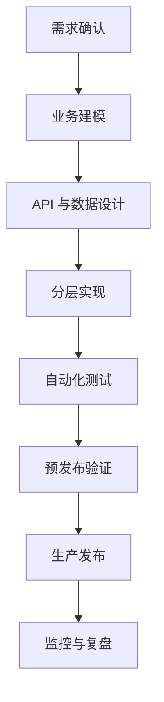

# Go 服务开发团队规范

## 一、规范目标

这套规范用于把一个业务需求稳定地交付为可维护、可测试、可观测、可回滚的 Go 服务。

核心原则：

> 服务首先对业务结果负责，HTTP、数据库、框架和目录结构都是实现业务结果的手段。

团队不要求所有代码写法完全相同，但要求所有服务经过相同的风险检查。

## 二、完整交付流程



每个阶段都必须有明确产物和通过条件：

| 阶段 | 必须产出 | 通过条件 |
| --- | --- | --- |
| 需求确认 | 用户故事、范围、验收标准 | 业务目标和边界明确 |
| 业务建模 | 状态变化、权限、失败条件、不变量 | 关键规则没有歧义 |
| API 设计 | 接口契约、错误码、幂等策略 | 客户端可以据此接入 |
| 数据设计 | 表结构、索引、迁移、事务说明 | 数据约束能保护业务事实 |
| 实现 | 分层代码、配置、错误处理 | 依赖方向清晰 |
| 测试 | 单元、集成、契约测试 | 关键成功和失败路径覆盖 |
| 预发布 | 镜像、配置、健康检查、回滚方案 | 核心链路验证通过 |
| 生产发布 | 版本、变更记录、监控面板 | 可以观察并恢复 |
| 发布后 | 指标观察、异常记录、复盘 | 结果被确认并沉淀 |

## 三、需求与业务建模

### 3.1 需求必须回答的问题

每个业务用例至少明确：

1. 谁发起操作？
2. 操作作用于什么对象？
3. 对象发生什么状态变化？
4. 哪些条件下必须失败？
5. 操作会产生哪些副作用？
6. 重试时是否必须幂等？
7. 哪些操作必须处于同一事务？

### 3.2 业务不变量

不变量是业务上必须始终成立的事实，例如：

- 已发货订单不能直接变为已取消。
- 订单号必须唯一。
- 未授权用户不能修改订单。
- 已取消订单不能再次扣减库存。
- 库存扣减和订单创建不能出现部分成功。

编码前应先写出：

```text
状态：待支付 -> 已取消
允许角色：订单所有者、管理员
失败条件：订单不存在、无权限、已发货
副作用：释放库存、记录取消事件
幂等要求：重复请求不能重复释放库存
事务要求：订单状态与库存变更必须一致
```

## 四、推荐工程结构

```text
service/
├── cmd/
│   └── api/
│       └── main.go                 # 组装依赖并启动服务
├── internal/
│   ├── domain/                     # 领域对象和核心规则
│   │   └── order.go
│   ├── app/                        # 应用服务和业务用例
│   │   └── order_service.go
│   ├── transport/
│   │   └── http/                   # HTTP 适配层
│   │       └── order_handler.go
│   ├── repository/                 # 持久化抽象
│   │   └── order_repository.go
│   ├── infrastructure/             # 外部依赖的具体实现
│   │   ├── postgres/
│   │   └── messaging/
│   ├── config/                     # 配置加载与校验
│   └── observability/              # 日志、指标、追踪
├── migrations/                    # 数据库迁移
├── tests/                          # 跨模块集成测试
├── Dockerfile
├── go.mod
└── README.md
```

### 4.1 依赖方向

```text
transport -> app -> domain
                 ↓
        repository interface
                 ↑
     repository implementation
```

职责划分：

| 层 | 负责 | 不负责 |
| --- | --- | --- |
| transport | 解析协议、认证、参数校验、错误映射 | 核心业务规则、直接写 SQL |
| app | 编排业务用例、控制事务、调用领域规则 | HTTP 细节、具体数据库实现 |
| domain | 状态、规则、不变量 | HTTP、ORM、基础设施 |
| repository | 持久化抽象和查询 | 决定业务流程 |
| infrastructure | PostgreSQL、消息队列等具体实现 | 对外暴露业务 API |

### 4.2 `main.go` 的职责

`main.go` 只负责：

- 加载并校验配置；
- 初始化日志和可观测性；
- 创建数据库和外部依赖；
- 组装 repository、service、handler；
- 启动 HTTP 服务；
- 处理优雅关闭。

不要把业务规则和查询逻辑写进 `main.go`。

## 五、API 设计规范

### 5.1 API 是公开契约

API 必须同时定义：

- 请求参数和字段约束；
- 认证和权限；
- 成功响应；
- 参数错误；
- 资源不存在；
- 业务状态冲突；
- 服务内部错误；
- 重试和幂等行为；
- 兼容和废弃策略。

### 5.2 示例

```http
POST /orders/{orderID}/cancel
Authorization: Bearer <token>
Idempotency-Key: <unique-key>
```

响应约定：

| 场景 | HTTP 状态码 | 说明 |
| --- | --- | --- |
| 取消成功 | `200` 或 `204` | 返回结果或无响应体 |
| 参数错误 | `400` | 请求格式或字段不合法 |
| 未认证 | `401` | 缺少或无效身份 |
| 无权限 | `403` | 身份有效但无操作权限 |
| 资源不存在 | `404` | 目标资源不存在 |
| 状态冲突 | `409` | 当前状态不允许该操作 |
| 服务错误 | `500` | 未预期的内部错误 |

状态码只是协议层表达，业务错误应在 service 层产生，handler 负责映射。

### 5.3 幂等性

有副作用的接口必须明确重试行为。常见方案：

- 使用 `Idempotency-Key`；
- 使用数据库唯一约束；
- 保存请求结果并在重复请求时返回原结果；
- 对状态转换使用条件更新。

不能把“客户端不会重试”当作系统设计前提。

### 5.4 兼容性

滚动发布期间新旧版本会并存。破坏性变更应遵循：

```text
扩展兼容能力 -> 迁移客户端和数据 -> 收缩旧逻辑
```

例如新增字段时，先让服务端兼容缺失字段，再逐步升级客户端，最后才把字段改为必填。

## 六、数据库与事务

### 6.1 数据库约束

业务唯一性、非空性和引用关系应尽可能由数据库约束保护：

- `NOT NULL`；
- `UNIQUE`；
- 外键或等价引用约束；
- 合适的索引；
- 合理的状态值约束。

代码中的“先查询再插入”不能单独保证唯一性，因为并发请求可能同时通过查询。必须结合数据库唯一约束并正确处理冲突。

### 6.2 事务边界

事务边界由业务用例决定，而不是由单个 SQL 决定。

```text
开始事务
  -> 检查业务状态
  -> 写入订单
  -> 扣减库存
  -> 写入 outbox 事件
提交事务
```

任一步失败，都应回滚整个业务操作。

### 6.3 数据库迁移

迁移脚本必须：

- 纳入版本控制；
- 可重复执行或明确不可重复原因；
- 包含回滚策略或补偿方案；
- 评估锁表和数据量影响；
- 兼容滚动发布顺序。

涉及旧字段或旧值时，采用 expand、migrate、contract：

1. 扩展数据库和代码，使新旧格式都能工作；
2. 迁移存量数据；
3. 删除旧逻辑和旧约束。

### 6.4 Outbox

当数据库事务和消息发布必须保持最终一致时，在同一个数据库事务中写入 outbox 记录，再由 worker 发布消息。消息发布失败时重试，消费者必须具备幂等性。

## 七、错误处理

错误应分成三类：

1. **参数错误**：请求本身不符合契约；
2. **业务错误**：请求合法，但当前业务状态不允许；
3. **系统错误**：数据库、网络或未知故障。

要求：

- 错误必须携带上下文；
- 不向客户端暴露 SQL、堆栈和密钥；
- 日志记录根因，API 返回稳定错误码；
- 使用 `%w` 保留错误链；
- 在边界处统一映射错误。

示例：

```go
if err != nil {
    return fmt.Errorf("cancel order %s: %w", orderID, err)
}
```

## 八、测试规范

### 8.1 测试分层

```text
业务单元测试       快速验证规则和状态转换
数据库集成测试     验证 SQL、约束、事务和迁移
HTTP 契约测试       验证请求、响应和错误映射
端到端测试         验证少量关键用户路径
```

### 8.2 最小覆盖要求

每个业务用例至少覆盖：

- 一个成功路径；
- 参数错误；
- 权限错误；
- 资源不存在；
- 状态冲突；
- 外部依赖失败；
- 重复请求或并发场景；
- 事务回滚。

测试验证的是业务不变量，不是单纯追求代码行覆盖率。

### 8.3 测试原则

- 单元测试优先使用内存对象和接口替身；
- 数据库行为必须通过真实数据库或等价容器测试；
- 不要 mock 被测试对象本身；
- 测试名称描述业务行为；
- 测试失败信息应说明输入、预期和实际结果；
- 对并发敏感的代码运行 race detector。

## 九、配置、日志与可观测性

### 9.1 配置

- 配置通过环境变量或配置文件注入；
- 启动时校验必填配置；
- 密钥不能写入代码和镜像；
- 区分开发、测试、预发布和生产配置；
- 配置变更应可审计。

### 9.2 日志

日志应使用结构化格式，至少包含：

- 时间；
- 日志级别；
- 服务名和版本；
- request ID 或 trace ID；
- 操作名称；
- 资源 ID；
- 错误类型和错误链。

禁止记录密码、令牌、完整身份证号和其他敏感数据。

### 9.3 健康检查

至少区分：

- **存活检查**：进程是否仍能工作；
- **就绪检查**：是否已准备好接收流量；
- **依赖检查**：数据库等关键依赖是否可用。

不要让暂时的外部依赖故障导致所有实例被错误重启。

### 9.4 指标

至少关注：

- 请求量；
- 错误率；
- 延迟分位数；
- 数据库连接池；
- 外部依赖错误和延迟；
- goroutine、内存和 CPU。

## 十、构建、发布与回滚

### 10.1 CI 门禁

推荐流水线：

```text
格式化与 lint
  -> go test ./...
  -> race detector
  -> 集成测试
  -> 安全扫描
  -> 构建二进制和镜像
  -> 预发布部署
  -> 冒烟测试
```

阻断合并的最低检查：

- 格式化和静态检查通过；
- 单元测试通过；
- 构建成功；
- 必要的集成测试通过。

阻断生产发布的检查：

- 迁移已验证；
- 健康检查可用；
- 关键指标和告警已配置；
- 回滚方案已确认；
- 变更负责人明确。

### 10.2 发布策略

根据风险选择：

- 滚动发布；
- 灰度发布；
- 金丝雀发布；
- 蓝绿发布。

发布必须记录：

- 版本号；
- 代码提交；
- 数据库迁移；
- 配置变化；
- 发布开始和结束时间；
- 观察指标；
- 回滚命令或操作步骤。

### 10.3 回滚原则

代码可以回滚，不代表数据库可以直接回滚。数据库迁移应优先设计向前兼容和补偿方案，避免发布后只能依赖破坏性降级。

## 十一、Pull Request 模板

```markdown
## 变更目标
解决什么业务问题？

## 业务规则
新增或改变了哪些不变量？

## API 变化
请求、响应、错误码、幂等行为是否变化？

## 数据变化
是否包含迁移、索引、数据修复或兼容逻辑？

## 测试计划
- [ ] 单元测试
- [ ] 数据库集成测试
- [ ] HTTP 契约测试
- [ ] 并发或重试测试
- [ ] 手工验证

## 发布计划
配置、灰度、监控指标和回滚方式是什么？

## 风险与未决问题
还有哪些已知限制？
```

## 十二、发布前检查清单

### 业务与设计

- [ ] 业务范围和验收标准明确
- [ ] 状态变化和不变量已记录
- [ ] 权限和失败条件已定义
- [ ] 幂等和重试行为已定义

### API 与数据

- [ ] API 契约已更新
- [ ] 错误码和状态码已确认
- [ ] 数据库约束和索引已检查
- [ ] 迁移脚本已评估
- [ ] 滚动发布兼容顺序已确认
- [ ] 事务边界已记录

### 代码与测试

- [ ] handler、service、repository 职责清晰
- [ ] 错误链和日志上下文完整
- [ ] 成功与失败路径有测试
- [ ] 集成测试验证真实数据库行为
- [ ] race detector 和静态检查通过

### 生产与运维

- [ ] 配置已注入且密钥未硬编码
- [ ] 存活和就绪检查可用
- [ ] 日志、指标、追踪已配置
- [ ] 告警阈值已确认
- [ ] 发布版本可追踪
- [ ] 回滚方案已验证
- [ ] 发布后观察窗口和负责人明确

## 十三、最终判断标准

一个 Go 服务是否完成，不以“代码写完”为标准，而以以下问题全部有答案为标准：

1. 它负责什么业务结果？
2. 哪些业务事实必须始终成立？
3. 客户端如何调用，失败和重试如何处理？
4. 数据库如何保护一致性？
5. 测试如何证明关键规则成立？
6. 生产环境如何发现问题？
7. 出问题后如何回滚或补偿？

只有这些问题都能被文档、代码、测试和发布流程共同回答，服务才算真正完成。
