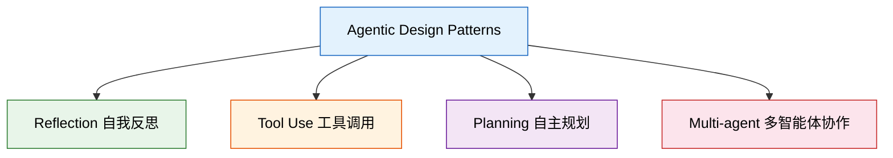

# AI Agent 2025：从概念到落地，我看了 10 个视频后的完整认知地图

最近集中看了 10 个 AI Agent 方向的视频，从 Andrew Ng 的战略演讲到 Anthropic 的官方 Workshop，从 Karpathy 的底层原理到 CrewAI 的代码实战。看完之后最大的感受是：**AI Agent 不再是论文里的概念，它正在变成每个开发者工具箱里的标配。**

这篇文章不是视频笔记的堆砌，而是我把 10 个视频的信息交叉验证后，提炼出的一张认知地图。

---

## 一、战略判断：为什么 2025 是 Agent 元年

Andrew Ng 在三场不同的演讲中反复强调同一个观点：**Agentic Workflow 比 Zero-shot Prompting 强大得多，而且这个差距会越来越大。**

他用了一个很直觉的类比：传统的 LLM 使用方式就像让人写文章但不许用退格键——从头写到尾，一次成型。而 Agentic Workflow 允许 AI 像人一样：列大纲、搜资料、写初稿、自我审阅、反复修改。

更关键的数据是：在 HumanEval 代码基准测试上，GPT-3.5 的 Zero-shot 正确率是 48%，但加上 Agentic Workflow 后飙升到 95.1%——**甚至超过了 GPT-4 的 Zero-shot 表现（67%）**。

这意味着什么？**架构比模型更重要。** 一个用了 Agent 架构的小模型，可以打败裸跑的大模型。

Andrew Ng 把 Agent 的设计模式归纳为四种：



其中 **Reflection 是最成熟、最容易落地的**——让模型生成代码后，再让同一个模型审查自己的代码，就这么简单的一步，效果立竿见影。

---

## 二、底层原理：LLM 是怎么变成 Agent 的

Karpathy 的那场一小时演讲把底层讲得很透。LLM 本质上就是一个 next word prediction 的概率模型，它被训练来预测下一个 Token。但从这个简单的机制出发，通过三个阶段的训练，它逐渐获得了「类智能」的能力：

1. **预训练**：在互联网规模的数据上学习语言模式（几千块 GPU，几个月）
2. **微调**：用高质量的问答数据教它「如何当助手」（几百块 GPU，几天）
3. **RLHF**：通过人类反馈进一步对齐（让它更有用、更安全）

关键洞见是：**LLM 不是数据库，它是一个有损压缩器。** 就像 zip 压缩文件一样，它把互联网的知识压缩进了模型参数里。这意味着它会「幻觉」——因为压缩必然有信息损失。

理解了这一点，就能理解为什么 Agent 架构如此重要：**它通过外部工具和多步验证来弥补 LLM 本身的局限性。** 模型负责推理和规划，工具负责执行和验证，两者配合才是完整的智能体。

---

## 三、框架之争：LangGraph vs CrewAI vs AG2

看完框架对比的视频后，我的判断是：**没有最好的框架，只有最适合你场景的框架。**

| 维度 | LangGraph | CrewAI | AG2 (AutoGen) |
|------|-----------|--------|---------------|
| 设计哲学 | 图结构，精确控制 | 角色扮演，高层抽象 | 对话驱动，灵活组合 |
| 学习曲线 | 陡峭 | 平缓 | 中等 |
| 适合场景 | 复杂工作流、需要精确状态管理 | 快速原型、多角色协作 | 研究实验、灵活对话 |
| 生产就绪度 | 高（LangChain 生态） | 中高 | 中 |

如果你是刚入门 Agent 开发，**CrewAI 是最好的起点**——定义几个角色、分配任务、让它们协作，几十行代码就能跑起来。

如果你需要精确控制每一步的执行逻辑，**LangGraph 是更好的选择**——它用有向图来定义工作流，每个节点是一个处理步骤，边是条件跳转。代价是代码量更大，但可控性也更强。

---

## 四、Anthropic 的野心：MCP + Agent SDK

看完 Anthropic 的两个视频（MCP 教程 + Agent SDK Workshop），我觉得他们的战略非常清晰：**不只是做最好的模型，而是要定义 Agent 时代的基础设施标准。**

**MCP（Model Context Protocol）** 解决的是工具接入的碎片化问题。以前每个 Agent 框架接工具都要写适配代码，有了 MCP 就像有了 USB-C 接口——一次开发，到处使用。

**Agent SDK** 则更进一步，提供了构建生产级 Agent 的完整工具链：

- 对话循环管理
- 工具调用编排
- 安全护栏（Guardrails）
- 人机协作（Human-in-the-loop）

Workshop 中演示的一个细节让我印象深刻：Agent SDK 内置了 **Guardrails 机制**，可以在 Agent 执行前后插入安全检查。这不是可选的——在生产环境中，没有护栏的 Agent 就是定时炸弹。

---

## 五、我的认知地图

把 10 个视频的信息综合起来，AI Agent 的全景图大概是这样的：

```
底层能力          架构模式           框架工具          生态标准
─────────       ──────────       ──────────       ──────────
LLM 推理    →   Reflection   →   LangGraph    →   MCP
Token 预测  →   Tool Use     →   CrewAI       →   Agent SDK
RLHF 对齐   →   Planning     →   AG2          →   Guardrails
             →   Multi-agent  →   Semantic Kernel
```

**从左到右是从原理到落地的路径，从上到下是从简单到复杂的递进。**

对于想入门 Agent 开发的人，我的建议路线是：

1. **先理解原理**：看 Karpathy 的 LLM 入门 + Andrew Ng 的 Agentic Workflow 演讲
2. **再上手框架**：用 CrewAI 搭一个简单的多角色协作 Agent
3. **然后深入架构**：学 LangGraph 的图结构，理解状态管理
4. **最后关注生态**：了解 MCP 和 Agent SDK，为生产部署做准备

---

## 六、一些反直觉的发现

看完这些视频后，有几个认知刷新了我的预期：

**1. 快比强更重要**

Andrew Ng 强调：在 Agentic Workflow 中，Token 生成速度比模型质量更重要。因为 Agent 需要多次迭代，一个生成快但质量稍低的模型，通过更多轮次的自我修正，最终效果可能优于一个慢但强的模型。

**2. Agent 不需要完美的模型**

GPT-3.5 + Agentic Workflow > GPT-4 Zero-shot。这个数据说明：**投资架构设计的回报率远高于等待更强的模型。**

**3. 多 Agent 协作的效果出人意料**

让 ChatGPT 和 Gemini 互相辩论，最终结论的质量优于任何一个模型单独回答。这暗示了一个趋势：**未来的 AI 应用不是单一模型，而是模型组合。**

**4. 耐心是新的竞争力**

我们习惯了搜索引擎半秒返回结果，但 Agent 完成一个复杂任务可能需要几分钟甚至几小时。Andrew Ng 说得好：别像新手管理者一样，刚分配完任务五分钟就去查岗。

---

## 写在最后

AI Agent 的发展速度比我预期的快。半年前它还是学术论文里的概念，现在已经有了成熟的框架、标准化的协议、和生产级的工具链。

对于开发者来说，现在是最好的入场时机：**门槛在降低，但天花板在升高。** 早期进入的人会积累对 Agent 架构的直觉，这种直觉在未来会越来越值钱。

下一步，我打算用这些知识搭建一个自动化的 AI 研究助手——让 Agent 帮我追踪论文、总结视频、生成周报。毕竟，**用 Agent 来研究 Agent，这本身就很 Agentic。**

---

*本文基于以下 10 个视频的系统性学习整理：*

1. [[What's next for AI agentic workflows ft. Andrew Ng of AI Fund]]
2. [[Andrew Ng On AI Agentic Workflows And Their Potential For Driving AI Progress]]
3. [[Andrew Ng Explores The Rise Of AI Agents And Agentic Reasoning BUILD 2024 Keynote]]
4. [[[1hr Talk] Intro to Large Language Models]]
5. [[AI Agents Fundamentals In 21 Minutes]]
6. [[Mastering LLM Agent Frameworks LangGraph, AG2, CrewAI, Semantic Kernel for AI Development]]
7. [[LangGraph + CrewAI Crash Course for Beginners [Source Code Included]]]
8. [[Build Claude Agents with Anthropic's NEW MCP]]
9. [[Claude Agent SDK [Full Workshop] — Thariq Shihipar, Anthropic]]
10. [[Master THESE 4 Stages of AI Agents in 2025! (Beginner to PRO)]]
