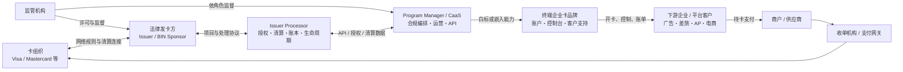

# 企业虚拟卡供应商、产业链与寻源方法

## 核心研究问题

- **主问题**：除 Corpay、光子易 PhotonPay、ONERWAY 外，还有哪些企业虚拟卡供应商；它们在产业链中扮演什么角色；如何发现并验证同类供应商？
- **子问题**：
  - “虚拟卡”“信用卡”“发卡能力”分别意味着什么？
  - 自用企业卡、平台嵌入发卡与底层处理能力应该联系哪类公司？
  - 如何确认签约法人、法律发卡方、处理商、卡组织关系和资金属性？

> [!important] 范围与安全边界
> 本文面向合规的企业支出、应付账款、差旅、广告、电商和平台嵌入场景；不提供绕过 KYC/AML、匿名开卡、规避商户或卡组织风控的方法，也不列具体 BIN 号码。

## 信息来源与证据规则

| 来源层级 | 本文采用的材料 | 可以证明什么 | 不能单独证明什么 |
|---|---|---|---|
| 卡组织一手材料 | Visa、Mastercard 官方公告、角色说明与伙伴目录 | 公开角色、伙伴关系或目录收录 | 当前项目一定可商用，或目录成员适合本企业 |
| 监管登记 | FCA、EBA、MAS、DNB、香港海关、FinCEN 等官方登记 | 特定法人、登记状态和登记所列权限 | 某个品牌下的具体卡项目一定由该法人发行 |
| 法律文件 | Cardholder Agreement、Terms、隐私与费用文件 | 签约主体、issued-by 语句、部分资金及责任安排 | 未写入文件的口头承诺 |
| 产品与开发文档 | 官方产品页、API 文档、生产接入文档 | 产品形态、接口和公开支持范围 | 商业 GA、审批结果、实际额度与隐含合作方 |

**证据口径**：重要判断尽量就近链接一手来源；“官方页面出现”只记为公开宣称，不自动升级为已验证的生产能力。凡缺少项目级法律文件或书面确认，统一标注“待商务核验”。

## 1. 结论摘要

1. **虚拟只是卡的载体，不等于信用。** 一张企业虚拟卡可能是 prepaid、debit、charge、secured credit 或 true credit；即使营销名称包含 “credit card”，也应以项目条款、资金流和授信协议为准。
2. **“能发卡”至少涉及六类角色。** 卡组织、法律 issuer/BIN sponsor、issuer processor、program manager/CaaS、终端企业卡品牌、下游企业/商户可能由不同公司承担。
3. **品牌、技术和法律责任不能混为一谈。** Corpay 的 Card API 自称 issuer and processor，但其北美虚拟卡页同时披露，具体 Mastercard 可由 Fifth Third Bank, N.A. 或其他金融机构发行；这正说明品牌/处理能力不等于每张卡的法律 issuer（[Corpay Card API](https://www.corpay.com/ap-automation/partnerships/card-api)、[Corpay 北美虚拟卡](https://na.corpay.com/virtual-card)）。
4. **牌照名称也不能替代项目级核验。** MSB、MSO、PI、EMI 或卡组织 principal membership 各自覆盖不同权限；任一登记都不自动等于在目标国家、由目标法人、以目标资金属性发行某张卡。
5. **自用与嵌入式发卡是两种采购。** 企业只是支付广告、差旅、供应商或 SaaS 费用时，优先联系终端企业卡/全栈方案；平台要给客户发卡或转售时，找 CaaS/Program Manager；只有已有 issuer/BIN sponsor 时，才适合直接采购 processor-only。
6. **供应商名单只能用于启动 RFI，不能代替准入。** 地区、签约法人、发卡方、卡种、授信、行业限制、商户接受度、API 能力和定价都可能按项目变化。
7. **最可靠的验证方式是“三角闭环”。** 监管登记确认签约法人及权限，Cardholder Agreement 的 issued-by 语句确认法律 issuer，再用银行/卡组织公告或生产 API 文档确认实际项目关系。

### 个人综合见解

> 企业虚拟卡采购的核心不是“找到更多卡”，而是把一条营销名称背后的法律责任、资金性质和技术依赖拆清。候选数量通常不是瓶颈；能否用三份相互独立的一手证据闭环，才决定方案能否进入试点。

## 2. 名词、角色分层与产业链

### 2.1 六类角色

| 角色 | 核心职责 | 采购时必须问清 |
|---|---|---|
| 卡组织（Network/Scheme） | 制定网络规则并连接发行、收单与商户 | Visa、Mastercard 或其他网络；目标地区和卡种是否获批 |
| 法律发卡方（Issuer/BIN Sponsor） | 对持卡协议、卡账户、授权责任和合规承担法律角色 | 完整法人名、监管地、issued-by 语句、项目适用地区 |
| Issuer Processor | 处理授权、清算、卡生命周期、风控和账务接口 | 是 processor-only 还是也提供 sponsor；生产 SLA、账本和迁移能力 |
| Program Manager / CaaS | 组装发卡方、处理商、合规、运营和 API | 谁签约、谁做 KYC/KYB、谁持有客户资金、能否白标/转售 |
| 终端企业卡品牌 | 向企业客户提供账户、卡、控制台、报表和支持 | 是自营全栈还是转售；卡种、资金来源、地域与行业限制 |
| 下游企业/商户 | 企业将卡用于采购；商户经收单侧接受交易 | 目标 MCC、币种、地区、周期扣款和退款是否稳定支持 |

### 2.2 “虚拟”与“信用”的正交关系

| 维度 | 常见选项 | 判断证据 |
|---|---|---|
| 载体 | 虚拟卡、实体卡、钱包 token | 产品/API 文档 |
| 资金属性 | Prepaid、debit、charge、secured credit、true credit | 持卡协议、授信协议、还款与担保条款 |
| 使用范围 | 单次、多次、固定商户、固定金额、开放消费 | 卡控制参数与项目规则 |
| 清偿方式 | 余额实时扣减、预存保证金、日/月结、循环额度 | 账单、资金流和合同 |
| 法律发行 | 银行、EMI/PI 或其他获准机构，依司法辖区而异 | issued-by 语句与监管登记 |

> [!warning] 采购口径
> “Virtual Credit Card/VCC” 在行业营销中经常泛指虚拟商业卡。总表和 RFI 必须另设“资金属性”字段；没有合同证据时写“待商务核验”，不能凭名称推断存在信用额度。

### 2.3 产业链图



现实中一家公司可兼任多层，但**角色合并不等于法律主体合并**。同一品牌在不同国家、卡组织或项目下，也可能换用另一 issuer、processor 或资金模型。

## 3. 三家锚点公司的已公开上下游

### 3.1 Corpay

**公开定位**：Corpay 提供商业卡、应付账款和平台能力；Card Issuing API 页面把其能力描述为 issuer and processor，并面向费用管理、TMC、BNPL、物流、保险/保修和配送等嵌入式场景（[Corpay Card API](https://www.corpay.com/ap-automation/partnerships/card-api)）。

| 链条位置 | 公开信息 | 采购结论 |
|---|---|---|
| 上游卡组织 | 北美虚拟卡页面披露 Mastercard 产品 | 具体网络、国家和项目待合同确认 |
| 法律 issuer | 页面脚注称卡可由 Fifth Third Bank, N.A. 或其他金融机构发行（[官方产品页](https://na.corpay.com/virtual-card)） | 必须逐项目取得完整 issued-by 语句，不能只写 “Corpay 发卡” |
| 技术/项目层 | Card API 自称 issuer and processor | 需问清该表述适用的法人、国家及外部依赖 |
| 下游 | 费用管理、TMC、BNPL、物流、保险/保修、配送 | 适合企业支出及嵌入用例初筛，行业准入仍待核验 |

**判断**：Corpay 可以同时出现在终端方案和平台能力名单中；但每个候选项目仍要拆成“Corpay 哪个法人 + 哪个 issuer + 哪个网络 + 什么资金属性”。

### 3.2 光子易 PhotonPay

**公开定位**：Mastercard 在 2024 年官方公告中确认 PhotonPay 成为香港 Mastercard issuer，并推出 Commercial Credit Card（[Mastercard 公告](https://www.mastercard.com/news/ap/en-hk/newsroom/press-releases/en-hk/2024/photonpay-becomes-a-mastercard-issuer-in-hong-kong/)）。

| 链条位置 | 公开信息 | 采购结论 |
|---|---|---|
| 卡组织/issuer | 香港 Mastercard issuer，公告对应 Commercial Credit Card | 该结论不能自动外推到香港以外或其他卡项目 |
| Issuer processor | 2025 年 PhotonPay 官方公告称 Thredd 提供 BIN 管理、实时处理和 tokenization 等底层 issuer-processing 技术（[合作公告](https://www.photonpay.com/uk/news/article/photonpay-partners-with-thredd-to-enhance-card-infrastructure)） | Thredd 是 processor，不应写成发卡银行 |
| 产品/API | API 文档公开虚拟/实体卡及 Mastercard、Discover 等能力（[PhotonPay API](https://api-doc.photonpay.com/?lang=en)） | API 可见不等于目标地区已获批或已 GA |
| CaaS/下游 | 官方提供嵌入式 Card-as-a-Service 页面（[PhotonPay CaaS](https://www.photonpay.com.cn/embedded-finance/issuing)） | 平台嵌入可进入 RFI；适用法人、issuer 和资金属性逐项目核验 |

**判断**：香港公开的 Commercial Credit Card 有卡组织一手证据；PhotonPay 其他地区、网络和项目仍需单独确认，不能将所有 PhotonPay 虚拟卡统称为信用卡。

### 3.3 ONERWAY

**公开定位**：ONERWAY About 页宣称持有多地牌照及 Visa/Mastercard 等 principal membership，但同页底部仍显示 “Card Issuing Coming soon”（[ONERWAY About](https://www.onerway.com/en-us/about/)）。

与此同时，其官方 Issuing 文档已经描述 prepaid virtual cards、Portal/API、授权、清算、退款与争议流程（[ONERWAY Issuing 文档](https://docs.onerway.com/issuing/overview)）。

| 链条位置 | 公开信息 | 采购结论 |
|---|---|---|
| 产品层 | 文档描述 prepaid virtual cards | 当前可确认的是“公开文档存在”；不是商业 GA 证明 |
| 商业状态 | About 页仍标 Card Issuing Coming soon | GA 状态、客户类型、国家和上线时间待商务核验 |
| 法律 issuer | 公开页面不足以锁定每个项目的 issuer/BIN sponsor | 必须索取项目级 Cardholder Agreement |
| 技术层 | 文档覆盖 Portal/API 与交易生命周期 | processor、账本归属和生产 SLA 待书面核验 |
| 欧洲主体线索 | 页脚披露 PayPro B.V.；DNB 登记含 issuing payment instruments 权限（[DNB 登记](https://www.dnb.nl/en/public-register/information-detail/?registerCode=WFTBI&relationNumber=F0036)） | 不能据此断言具体 ONERWAY 卡项目由 PayPro 发行 |

### 矛盾与争议

- **观点 A**：产品文档已经足够具体，说明技术准备度较高。
- **观点 B**：官网仍写 “Coming soon”，且项目级 issuer、processor 和适用法人未形成公开闭环。
- **本文判断**：列入“可询价、不可直接认定可用”组；在书面确认商业 GA 和三角闭环前，不进入生产准入。

## 4. 亚洲/跨境企业可直接联系候选表

> [!note] 使用方式
> 下表是代表性长名单，不是排名或背书。“可直接联系”表示有面向企业的产品入口，不代表一定接受目标注册地、行业或交易模式。

| 候选 | 面向企业的公开能力 | 资金属性 | 关键核验点 |
|---|---|---|---|
| Corpay | 商业卡、AP、终端方案及 Card API（[官方](https://www.corpay.com/ap-automation/partnerships/card-api)） | 按地区/项目待商务核验 | 具体 issuer、网络、授信和 Card API 适用法人 |
| PhotonPay | 企业卡 API 与 CaaS；香港项目有 Mastercard Commercial Credit Card 证据（[公告](https://www.mastercard.com/news/ap/en-hk/newsroom/press-releases/en-hk/2024/photonpay-becomes-a-mastercard-issuer-in-hong-kong/)） | 香港上述项目为 commercial credit；其他待核验 | 地区、网络、issuer、Thredd 处理范围和额度条件 |
| ONERWAY | Issuing 文档描述 prepaid virtual cards（[文档](https://docs.onerway.com/issuing/overview)） | Prepaid（按公开文档） | 商业 GA、适用法人、issuer/BIN sponsor、processor |
| Airwallex | 终端企业卡与 Issuing API；官方按地区列支持项目、地区和币种（[卡项目](https://www.airwallex.com/docs/issuing/supported-card-programs)、[地区/币种](https://www.airwallex.com/docs/issuing/supported-regions-and-currencies)、[建卡 API](https://www.airwallex.com/docs/api/issuing/cards/create)） | 按地区/项目；不可一概称信用 | 签约主体、资金来源、卡种、网络和目标地区 GA |
| SUNRATE | 商业虚拟卡、平台/API，公开覆盖旅游等场景（[旅游 VCC](https://www.sunrate.com/newsroom/sunrate-enhances-its-online-travel-solution-with-new-virtual-commercial-card/)、[API](https://www.sunrate.com/api/global-payments-vcc-docs/)）；官方称为 Visa/Mastercard principal member（[公告](https://www.sunrate.com/newsroom/sunrate-secured-mastercard-partners-annual-award/)） | 待商务核验 | principal 身份适用法人、具体 issuer、资金模型与行业规则 |
| WorldFirst World Card | 企业账户内多币种 World Card 与开发能力（[产品页](https://www.worldfirst.com/global/product/pay/world-card/)、[开发文档](https://developers.worldfirst.com/docs/alipay-worldfirst/worldcard_solution/introduction)） | 账户余额驱动，不是信用额度 | 支持注册地、卡网络、issuer、余额与退款处理 |
| PingPong Card | 终端企业卡及 API（[企业卡](https://pingpongx.sg/enterprise/pingpong-card)、[API](https://api.pingpongx.com/)） | 按地区/项目待商务核验 | 不同地区的 Visa/Mastercard、issuer、卡种和 API 权限 |
| Qbit | 企业虚拟卡与卡生命周期 API（[产品](https://www.qbitnetwork.com/en/virtual-card)、[开发文档](https://developer.qbitnetwork.com/docs/%E5%8D%A1%E7%89%87%E7%94%9F%E5%91%BD%E5%91%A8%E6%9C%9F)） | 待商务核验 | 条款把 Qbit 与 “Service Provider” 分开，需锁定 issuer、处理商和资金持有人（[卡协议](https://www.qbitnetwork.com/terms?type=QbitCardAgreement)） |
| 连连 LianLian | 面向跨境企业的多币种余额卡，与 Visa 等合作（[官方产品页](https://lianlianglobal.com/en/vcc)） | 余额驱动；是否存在其他卡种待核验 | 目标地区 issuer、卡种、API、币种和清算路径 |
| Oceanpayment | 官方提供 issuing 产品入口（[官方](https://www.oceanpayment.com/issuing/)） | 待商务核验 | 是终端产品还是嵌入能力、签约法人、issuer 与生产 API |
| Reap | 官方提供 card issuing 方案（[官方](https://reap.global/products/card-issuing)） | 待商务核验 | 终端/平台边界、地区、issuer、授信或预存要求 |
| Currenxie | 香港卡条款可作为法律核验入口（[Card Terms](https://currenxie.com/hk/legal/currenxie-card-terms-and-conditions)） | 以最新条款及合同为准 | issued-by、可用地区、费用、行业和卡控制 |
| Aspire | 面向企业的 corporate card（[官方](https://aspireapp.com/corporate-card)） | 按地区与审批待商务核验 | 签约法人、issuer、额度/余额机制、API 与目标商户适配 |

**首轮建议**：先从注册地、资金属性和采购模式三项硬门槛筛掉不适用者，再比较价格。若明确要求 true credit，应要求对方提供授信合同、还款周期、担保/保证金、循环额度与违约责任，而不是接受 “VCC” 名称作为证据。

## 5. 平台嵌入、白标与 Issuer Processor 候选表

> [!warning] 不要混作普通企业开户
> 下列多数方案面向平台发卡、项目管理或底层处理。它们未必直接向只想支付自身费用的普通企业提供一张可立即使用的卡。

| 候选 | 公开角色与范围 | 更适合谁 | 关键依赖/核验 |
|---|---|---|---|
| Stripe Issuing | US、UK、EEA 等地区的嵌入式发卡，卡由银行伙伴发行（[产品](https://stripe.com/issuing)、[全球文档](https://docs.stripe.com/issuing/global)） | 已用 Stripe、要快速嵌入的平台 | 国家/主体可用性、银行伙伴、资金属性和行业准入 |
| Adyen Issuing | EEA、UK、US 等发行能力（[官方文档](https://docs.adyen.com/issuing/)） | 需要支付、发卡与统一数据的平台 | 目标地区、签约主体、issuer 安排与项目门槛 |
| Nium | 官方称可在 30+ 市场发行卡（[官方](https://www.nium.com/products/issue-cards)） | 多市场平台或跨境项目 | 每个市场的 issuer、网络、卡种、资金与上线范围 |
| Marqeta | Issuer processor / program manager 平台，本身不是银行并依赖银行伙伴（[平台](https://www.marqeta.com/platform/overview)、[系统与服务](https://www.marqeta.com/services_and_system)） | 北美等市场的定制化卡项目 | Sponsor bank、项目管理责任、地区和迁移安排 |
| Thredd | Issuer processor，不是 issuer/BIN sponsor（[卡支付介绍](https://docs.thredd.com/pdf/Introduction_to_Card_Payments_Abridged_1.2.pdf)） | 已有或另行取得 issuer/BIN sponsor 的项目 | Sponsor、Program Manager、账本、合规和运营需另配 |
| Paymentology | 全球 issuer processor（[官方](https://www.paymentology.com/en/)） | 多地区发行机构、银行或成熟项目方 | 是否接受非金融机构直签、Sponsor、地区和项目门槛 |
| Enfuce | 欧洲/英国 issuer processor；也公开提供 EMI/BIN sponsorship 组合能力（[虚拟卡](https://enfuce.com/blog/virtual-card-issuing/)、[平台](https://enfuce.com/payment-solutions/platform/)） | 希望在欧洲减少多供应商拼装的平台 | EMI/BIN sponsor 的具体法人、适用国家及责任边界 |
| Wallester | EEA/UK 的 Business 与 White Label，官方称 Visa principal member（[官网](https://wallester.com/)、[白标](https://wallester.com/white-label)） | 欧洲企业自用或平台白标初筛 | Business 与白标不是同一采购；issuer、卡种及地域待合同确认 |

**Processor-only 采购前置条件**：已经确定法律 issuer/BIN sponsor、项目经理、KYC/KYB、资金保管、争议运营和卡组织批准。若这些尚未具备，直接找 processor 往往只会得到一份不完整的技术报价。

## 6. 按需求选择

### 6.1 决策路径

1. **只给自己企业付费**
   优先终端企业卡/全栈候选：Corpay、PhotonPay、Airwallex、SUNRATE、WorldFirst、PingPong、Qbit、连连、Aspire 等。先看注册地和资金属性，再看卡控制、账单和 API。
2. **SaaS、TMC、费用管理或电商平台要给客户发卡**
   优先 CaaS/Program Manager/白标：Corpay Card API、PhotonPay CaaS、Stripe Issuing、Adyen、Nium、Marqeta、Enfuce、Wallester White Label 等。
3. **已有银行或 BIN sponsor，只缺授权清算技术**
   优先 issuer processor：Thredd、Paymentology、Marqeta、Enfuce 等；要求说明账本、授权延迟、清算文件、网络 token、3DS、争议和迁移能力。
4. **必须使用信用额度**
   将 prepaid、balance-funded、secured credit、charge 与 true credit 分栏；未提供授信协议者一律按“待核验”，不能用虚拟卡数量或开卡速度替代授信能力。
5. **目标是差旅、广告、电商或供应商付款**
   用真实商户组合做受控试点；询问 MCC/国家/币种限制、周期扣款、部分退款、撤销、增量授权和拒付处理，不寻求规避商户风控。

### 6.2 硬门槛优先级

| 优先级 | 硬门槛 | 通过标准 |
|---|---|---|
| P0 | 合法主体与项目闭环 | 签约法人、issuer、processor、网络均有书面证据 |
| P0 | 注册地和行业准入 | 明确接受本企业法人、UBO 和真实业务模型 |
| P0 | 资金属性 | 与财务需求一致，授信/预存/保证金条款可审查 |
| P1 | 商户与币种适配 | 目标 MCC、国家、币种及退款场景通过测试 |
| P1 | 风控与运营 | 冻卡、盗刷、争议、紧急支持和 SLA 可执行 |
| P1 | 技术能力 | API、Webhook、幂等、对账、沙箱与生产边界清楚 |
| P2 | 商务条件 | 总成本、最低量、储备金、退出和迁移成本可接受 |

## 7. 供应商发现与验证 SOP

### 7.1 可执行 SOP

1. **写需求卡**：目标国家、企业注册地、下游客户地、用途、月交易额、单笔范围、币种、MCC、实体/虚拟、是否必须信用、是否嵌入/白标。
2. **先选角色，不先搜品牌**：自用找终端/全栈，嵌入找 CaaS/Program Manager，已有 sponsor 才找 processor-only。
3. **从卡组织目录建长名单**：使用 Visa 伙伴类型和目录（[角色](https://partner.visa.com/site/partner-types.html)、[目录](https://partner.visa.com/site/partner-directory.html)），以及 Mastercard Engage Issuance 和目录（[Issuance](https://engagepartners.mastercard.com/English/solutions/domain/Issuance)、[目录](https://engagepartners.mastercard.com/English/directory/)）。
4. **记录精确法人**：不要只抄品牌；保存官网页脚、条款、隐私政策、公司编号、注册地址和拟签约实体。
5. **核对监管登记**：确认登记状态、权限、司法辖区、分支/代理关系及更新时间；截图或导出当日证据。
6. **定位 Cardholder Agreement**：搜索 “issued by”“issuer”“cardholder agreement”“sponsor bank”；没有项目级法律文件就保持“待商务核验”。
7. **核对实际项目关系**：寻找发卡银行、卡组织或 processor 的官方公告，以及生产 API/上线文档；不能只引用供应商新闻稿。
8. **发送统一 RFI**：要求对方逐项回答并附文件链接；营销演示与法律/技术回答分开归档。
9. **做受控试点**：只用获批的真实场景测试授权、撤销、退款、清算、对账、3DS、token、限额和支持工单。
10. **形成决策记录**：将事实、推断、待核验、否决理由和证据日期分栏；上线前复核所有会变化的网页和登记。

### 7.2 三角闭环

```text
监管登记
  └─确认：拟签约法人存在、状态正常、登记权限与司法辖区匹配

Cardholder Agreement / issued-by 语句
  └─确认：谁是具体卡项目的法律 issuer，谁对持卡关系负责

银行 / 卡组织公告 + 生产 API 文档
  └─确认：issuer、processor、program manager 和品牌在实际项目中的关系
```

**判定规则**：三角中任一边缺失，就把对应结论标为“待商务核验”；监管登记中的相似名称、集团关系或一般权限不能替代 issued-by 证据。

### 7.3 可直接复制的搜索式

```text
site:供应商域名 ("cardholder agreement" OR "issued by" OR issuer) (virtual card OR commercial card)
site:供应商域名 (API OR webhook OR sandbox) (issuing OR card lifecycle)
site:供应商域名 ("BIN sponsor" OR "sponsor bank" OR "issuer processor")
"供应商品牌" ("issued by" OR "cardholder agreement" OR "terms and conditions")
"供应商法人全名" (issuer OR payment institution OR electronic money institution)
site:visa.com "供应商品牌" issuing
site:mastercard.com "供应商品牌" issuer
site:处理商域名 "供应商品牌" (partnership OR issuing)
```

搜索结果只用于定位一手页面；二手榜单、联盟营销文章、数据库聚合页和销售转述不能作为最终 issuer 或牌照证据。

### 7.4 卡组织与监管入口

| 入口 | 用途 | 重要限制 |
|---|---|---|
| [Visa Partner Types](https://partner.visa.com/site/partner-types.html) / [Directory](https://partner.visa.com/site/partner-directory.html) | 理解伙伴角色、发现候选 | 收录不等于背书、当前 GA 或适合本项目 |
| [Mastercard Engage Issuance](https://engagepartners.mastercard.com/English/solutions/domain/Issuance) / [Directory](https://engagepartners.mastercard.com/English/directory/) | 查找发行生态伙伴 | 仍需核对具体法人和地区 |
| [FCA Register](https://register.fca.org.uk/s/) | 核对英国受监管法人及权限 | 注意 appointed representative、代理和旧名 |
| [EBA PSD2 Register](https://www.eba.europa.eu/risk-and-data-analysis/data/registers/payment-institutions-register) | 跨 EEA 检索 PI/EMI 信息 | 以本国主管机构和最新登记交叉核对 |
| [MAS Financial Institutions Directory](https://eservices.mas.gov.sg/fid/) | 核对新加坡金融机构与许可 | 许可活动需与目标卡项目逐项匹配 |
| [香港 MSO Register](https://eservices.customs.gov.hk/MSOS/wsrh/001s1?request_locale=en) | 核对香港找换/汇款经营者登记 | **MSO 是找换/汇款登记，不等于卡发行许可** |
| [FinCEN MSB Registrant Search](https://www.fincen.gov/resources/msb-state-selector) | 检查美国 MSB 注册线索 | **注册不等于政府推荐、银行牌照或发卡许可** |

## 8. 精简 RFI 与尽调红旗

### 8.1 可直接发送的 15 问 RFI

1. 请列出与我方签约、开户、持有资金及提供卡服务的全部法人全名、注册地、公司编号和监管编号。
2. 对目标国家、卡组织和卡项目，法律 issuer/BIN sponsor 分别是谁？请提供最新 Cardholder Agreement 及完整 issued-by 原文。
3. 贵司在该项目中分别承担 issuer、processor、program manager、distributor 或技术服务商中的哪些角色？
4. 使用哪个卡组织、卡产品类型和适用地区？相关项目是否已商业 GA，而不是测试、候补或 coming soon？
5. 卡的资金属性是 prepaid、debit、charge、secured credit 还是真正循环信用？请说明充值、保证金、授信、还款和违约安排。
6. 可接受哪些企业注册地、UBO 国籍、行业、业务模式和下游客户地区？有哪些明确禁止或需预审的用途？
7. KYC/KYB、制裁筛查、交易监控和持续审查分别由谁负责？我方与贵司的数据责任如何划分？
8. 客户资金存放在哪里、是否隔离/保障、破产时如何处理？请提供对应法律条款。
9. 支持哪些币种、结算账户、换汇路径和跨境费用？授权汇率、清算汇率与退款汇率如何确定？
10. 对目标 MCC、国家、线上/线下、周期扣款、增量授权、部分退款和钱包 token 有何限制？
11. API 是否支持开卡、暂停/销卡、限额、商户/地区控制、授权 Webhook、清算、退款、争议和完整对账？请提供生产文档及版本政策。
12. 是否支持 3DS、network tokenization、Apple Pay/Google Pay（如需要）及敏感数据合规？各功能在哪些地区已上线？
13. 授权可用性、Webhook 延迟、数据恢复、事故通知、支持响应和争议处理的 SLA 是什么？
14. 请提供完整价格表：开户、月费、开卡、交易、FX、跨境、拒卡、退款、争议、最低量、储备金及提前终止费用。
15. 若 issuer、processor 或贵司退出项目，卡和余额如何迁移/返还？数据导出、终止协助、分包商变更及提前通知条款是什么？

### 8.2 尽调红旗

- 只给品牌名，不给签约法人全名和监管编号。
- 用 MSB、MSO、PI、EMI 或 principal membership 一句话替代具体项目的 issued-by 说明。
- 把 processor、program manager 或品牌描述成“发卡银行”，却拿不出 Cardholder Agreement。
- 宣传 “credit”，但实际要求全额预存或保证金，且不提供授信协议。
- 官网、API 文档、销售邮件和法律条款对 GA 状态、地区或卡种互相冲突。
- 拒绝披露 issuer/BIN sponsor、processor 或资金存放主体，理由仅为“商业机密”。
- 承诺“全球可用”“不限行业”“百分百通过”或暗示可绕过 KYC、商户/卡组织风控。
- 只展示沙箱，不提供生产 API 文档、状态页、SLA、版本和停机通知机制。
- 无法解释授权、清算、撤销、退款和争议在各主体间如何入账。
- 价格只报开卡费，隐藏 FX、跨境、拒卡、退款、争议、储备金和最低量。
- 合同允许无通知替换 issuer/processor，或终止后余额返还、数据导出和卡迁移不清。
- 客户评价或媒体榜单很好，但三角闭环的任一边始终缺失。

## 9. 局限、待探索方向与相关笔记

### 局限

- 本文是截至 **2026-07-28** 的公开一手材料快照，不是法律意见、监管意见或供应商背书。
- 发卡合作、支持国家、网络、资金属性和商业 GA 会变化；最终以拟签约项目的最新合同、监管登记和书面答复为准。
- 部分候选仅能确认存在产品页或文档，无法从公开材料确认目标企业一定能开户；已统一写“待商务核验”。
- 本文不列具体 BIN，也不通过卡号测试推断发卡关系；issuer 以法律文件和项目级证据为准。
- 未在真实生产环境比较授权成功率、退款速度、客服质量或总成本，这些应在合规试点中验证。

### 待探索方向

- [ ] 用实际注册地、行业、月交易额和目标 MCC 填写需求卡，筛出 5–8 家首轮 RFI 对象。
- [ ] 向候选索取目标项目 Cardholder Agreement、issued-by 语句、价格表和生产 SLA。
- [ ] 建立“品牌—签约法人—issuer—processor—network—资金属性—地区”的证据矩阵。
- [ ] 对通过硬门槛的 2–3 家做小额、真实商户、可回滚的受控试点。
- [ ] 每季度复核监管登记、法律条款、合作公告和 API 变更。

### 应用场景

- 企业广告、差旅、软件订阅、供应商和应付账款支付的卡方案采购。
- 费用管理、TMC、物流、保险、电商或 SaaS 平台的嵌入式发卡选型。
- 对销售口径中的“全球发卡”“信用卡”“自有 BIN”“全栈”进行可审计核验。
- 建立供应商准入、年度复审、退出与迁移预案。

## 🔗 相关笔记

- [[资源中心]]
